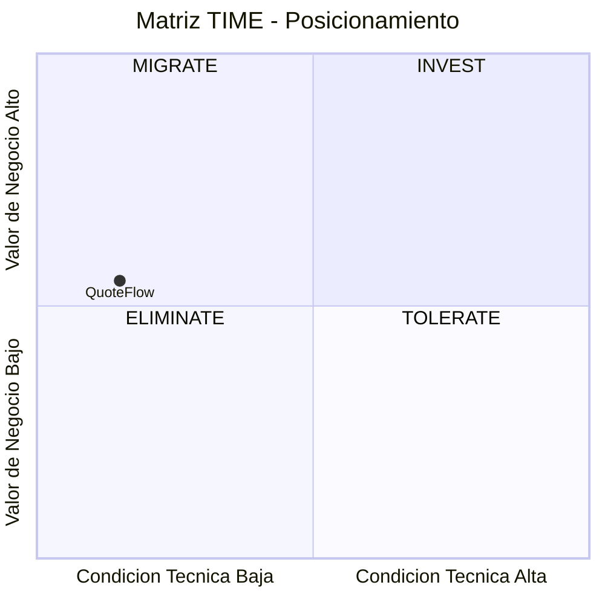

# Resumen Ejecutivo Técnico — QuoteFlow

---

## Ficha de la Aplicación

| Campo | Valor |
|---|---|
| Aplicación | QuoteFlow |
| Cliente | SoftwareOne |
| Sector / Dominio | Tecnología / Cotización y gestión comercial |
| Stack principal | TypeScript 4.3/3.9 + Angular 12 + Express 4.16 + In-memory |
| LOC | 19,544 (efectivo: 1,578 TS+CSS) en 33 archivos |
| Nivel de input | Enriquecido (Score 8/10) |

---

## Diagnóstico de Salud

| Indicador | Estado | Detalle |
|---|---|---|
| Deuda Técnica | 🔴 | Score deuda: 85 — Complexity: 1.5 |
| Seguridad | 🔴 | 7 categorías OWASP vulnerables, 0 mecanismos implementados de 5 |
| Dependencias | 🔴 | 2 SPOFs al 100% (app.ts, AppService), 0 componentes sin fuente |
| Obsolescencia | 🔴 | 5 componentes EOL, runtime EOL desde 2022 |
| Testing | 🔴 | Cobertura: 0%, CI/CD: No |
| Documentación | 🟡 | Score dimensión 8: 2.0/5 — código auto-declara prácticas intencionalmente malas |

---

## Veredicto de Elegibilidad

| Campo | Valor |
|---|---|
| Score Final | **36.4 / 100** |
| Banda | **No Elegible** |
| Condiciones mandatorias cumplidas | 3 de 9 |
| Condiciones no verificables | 4 (supuestos pendientes) |
| Veredicto | No Elegible para QAM — aplicación es prototipo/demo sin producción activa |

### Condiciones pendientes de validación

| # | Condición | Estado | Acción requerida para validar |
|---|---|---|---|
| 3 | SME técnico disponible | ⚠️ Supuesto | Confirmar con el cliente si hay desarrollador asignado |
| 4 | Sponsor activo del proyecto | ⚠️ Supuesto | Validar si existe presupuesto y decisor asignado |
| 7 | Presupuesto mínimo asignado | ⚠️ Supuesto | Confirmar presupuesto compatible con talla S mínima |
| 9 | Timeline compatible con QAM | ⚠️ Supuesto | Validar disponibilidad de 8+ semanas |

> **Nota:** Si estas condiciones se validan positivamente y la aplicación deja de ser un prototipo (se confirma intención de producción), la elegibilidad podría elevarse a banda "Advisory Recomendado".

---

## Hallazgos Críticos

| ID | Tipo | Descripción |
|---|---|---|
| A-10 | otro | Aplicación declarada como prototipo educativo — elegibilidad QAM cuestionable |
| A-04 | seguridad | Autenticación simulada con tokens fake — zero seguridad real |
| A-06 | infraestructura | Sin persistencia de datos — arrays in-memory se pierden al reiniciar |
| A-01 | eol | Angular 12 EOL desde diciembre 2022 — sin parches de seguridad |
| A-07 | infraestructura | Sin CI/CD, sin Docker, sin pipeline — solo desarrollo local |

---

## Estrategia Recomendada

**Rebuild Modular** — Dado que la aplicación es un prototipo de ~1,578 LOC efectivas con 0% tests, 0 seguridad, 0 persistencia y Legacy Readiness D en componentes core, un rebuild desde cero con stack moderno es significativamente más eficiente y seguro que intentar refactorizar código que se auto-declara intencionalmente obsoleto. El costo de characterization tests + dependency breaking + strangler fig superaría el costo de reescritura.

### Matriz TIME — Posicionamiento de la Aplicación

### Justificación de la R seleccionada

| Criterio | Valor | Implicación |
|---|---|---|
| Cuadrante TIME | Migrate (borde Eliminate) | Rebuild o Retire aplican |
| Runtime principal | EOL (Angular 12, TS 3.9) | Rebuild necesario — no hay path incremental |
| Arquitectura | Monolítica God File | Reescritura — no hay módulos para extraer |
| Target stack definido | No | Propuesta nueva requerida |
| Score deuda | 85 (Muy Alta) | Complejidad máxima si se intenta refactorizar |

---

## Dimensionamiento

| Concepto | Valor |
|---|---|
| Total WU | 5,200 |
| Créditos | 1,040 |
| Talla del proyecto | S |
| Duración estimada | 8–10 semanas |
| Valor contrato | USD 10,400 |

---

## Riesgos Top-3

| # | Riesgo | Impacto | Mitigación |
|---|---|---|---|
| 1 | Aplicación es prototipo — sin usuarios reales ni producción activa | Alto | Validar con cliente si existe intención real de producción |
| 2 | Sin SMEs identificados — conocimiento del dominio puede ser superficial | Medio | Workshop de descubrimiento funcional en semana 1 |
| 3 | Reglas de negocio no documentadas fuera del código | Medio | Event Storming con stakeholders para capturar reglas |

---

## Próximos Pasos

1. Validar con el cliente si QuoteFlow tiene intención real de producción — semana 1
2. Confirmar disponibilidad de SME técnico y funcional — semana 1
3. Definir target stack (Angular 17+/React, NestJS/Fastify, PostgreSQL) — semana 2
4. Workshop de Event Storming para capturar reglas de negocio — semana 2
5. Iniciar Rebuild con Sprint 0 (setup + auth + BD) si se confirma elegibilidad — semana 3

---

## Diagrama Resumen

```mermaid
flowchart LR
    SCORE["Score: 36.4"] --> BANDA["No Elegible"]
    BANDA --> VARIANTE["Rebuild Modular"]
    VARIANTE --> WU["5,200 WU"]
    WU --> CREDITOS["1,040 Creditos"]
    CREDITOS --> TALLA["Talla S"]
    TALLA --> USD["USD 10,400"]

    style SCORE fill:#ff6b6b,color:#fff
    style BANDA fill:#d63031,color:#fff
    style VARIANTE fill:#4ecdc4,color:#fff
    style WU fill:#45b7d1,color:#fff
    style CREDITOS fill:#6c5ce7,color:#fff
    style TALLA fill:#2ecc71,color:#fff
    style USD fill:#2ecc71,color:#fff
```

Este diagrama resume el flujo completo del QuickScan: desde la evaluación cuantitativa hasta la oferta comercial en una sola línea visual.

---

Análisis elaborado por SoftwareOne · 2026-07-22
