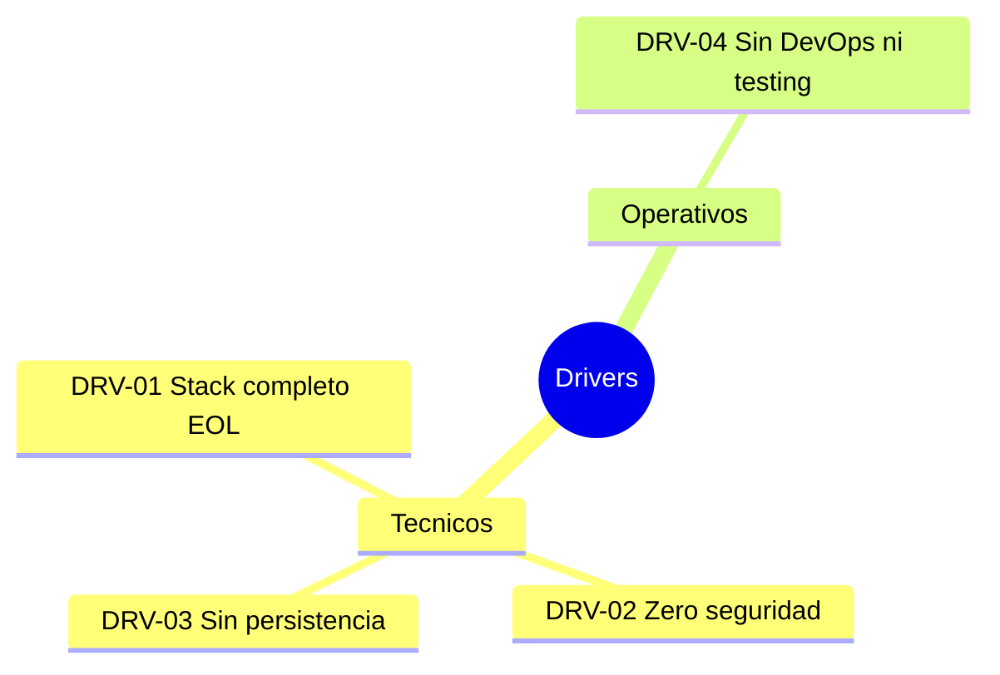

# Alcance — QuoteFlow

---

> **Aplicación:** QF-001 — QuoteFlow  
> **Cliente:** SoftwareOne  
> **Fecha:** 2026-07-22

---

## 1. Resumen ejecutivo

### 1.1 Problema que se busca resolver

QuoteFlow es un prototipo educativo de gestión de cotizaciones comerciales que no está en producción ni es operativo. El problema principal es que la organización necesita determinar si este concepto funcional merece inversión real para convertirse en una aplicación productiva con seguridad, persistencia y capacidad operativa empresarial.

### 1.2 Motivadores (Drivers)

| ID | Driver | Tipo | Urgencia |
|---|---|---|---|
| DRV-01 | Stack completo en EOL — Angular 12, TypeScript 3.9/4.3, Express 4.16 sin parches de seguridad | Técnico | Alta |
| DRV-02 | Zero seguridad implementada — autenticación fake, CORS abierto, sin protección OWASP | Técnico | Alta |
| DRV-03 | Sin persistencia de datos — imposibilidad de operar en producción real | Técnico | Alta |
| DRV-04 | Sin CI/CD, sin tests, sin observabilidad — inoperable en entorno empresarial | Operativo | Media |

### 1.3 Beneficio esperado

Convertir el concepto funcional de QuoteFlow en una aplicación empresarial productiva que permita a equipos comerciales gestionar cotizaciones con seguridad, persistencia, trazabilidad y cumplimiento de estándares operativos.

---

## 2. Objetivos

### 2.1 Objetivo general

Modernizar QuoteFlow desde prototipo educativo a aplicación empresarial productiva, implementando seguridad real, persistencia de datos, y prácticas DevOps que habiliten operación en cloud.

### 2.2 Objetivos específicos

1. Implementar autenticación y autorización real (JWT + RBAC server-side)
2. Migrar datos de arrays in-memory a base de datos relacional con esquema normalizado
3. Establecer pipeline CI/CD con tests automatizados (>60% cobertura)

---

## 3. Alcance Funcional

### 3.1 Procesos de Negocio Incluidos

| # | Proceso | Criticidad |
|---|---|---|
| 1 | Gestión del ciclo de vida de cotizaciones (borrador → aprobación → aceptación) | Alta |
| 2 | Gestión de clientes corporativos (CRUD + historial) | Alta |
| 3 | Catálogo de productos y listas de precios | Media |
| 4 | Flujo de aprobación por supervisores | Alta |
| 5 | Dashboard de KPIs comerciales | Media |

### 3.2 Funcionalidades Baseline (AS-IS)

| ID | Funcionalidad | Descripción | Criticidad |
|---|---|---|---|
| F001 | Autenticación y sesión | Login con roles (asesor/supervisor/admin) | Alta |
| F002 | CRUD Clientes | Crear, listar, editar, eliminar clientes corporativos | Alta |
| F003 | Catálogo de productos | Gestión de productos con precios por segmento | Media |
| F004 | Creación de cotizaciones | Selección de cliente + items + cálculo de totales | Alta |
| F005 | Flujo de aprobación | Envío a aprobación, aprobación/rechazo por supervisor | Alta |
| F006 | Máquina de estados | Transiciones de estado de cotizaciones (9 estados) | Alta |
| F007 | Dashboard comercial | KPIs: tasa conversión, valor cotizado, actividad reciente | Media |
| F008 | Listas de precios | Precios por segmento con descuento máximo | Media |

---

## 4. Integraciones Incluidas

| Sistema / Servicio | Tipo | Descripción | Criticidad |
|---|---|---|---|
| (Ninguna detectada) | — | El sistema opera completamente aislado sin integraciones externas | — |

> [PENDIENTE: Validar con el cliente si existen integraciones requeridas para la versión productiva (ERP, CRM, facturación)]

---

## 5. Restricciones Técnicas del Target

[PENDIENTE: Target stack no definido — se propondrá en la recomendación técnica]

### Restricciones no negociables:

1. **Backend:** [PENDIENTE: requiere definición con el cliente]
2. **Frontend:** [PENDIENTE: requiere definición con el cliente]
3. **Autenticación:** JWT real con OAuth2/OIDC
4. **Infraestructura:** Cloud (AWS/Azure — por definir)
5. **CI/CD:** GitHub Actions o equivalente
6. **Base de datos:** PostgreSQL (sugerido) — requiere confirmación

---

## 6. Exclusiones

- Migración de datos históricos — no existen datos persistidos (arrays in-memory se pierden)
- Reportería avanzada (BI, exportación masiva) — no existe en el AS-IS
- Integración con sistemas externos — no hay integraciones actuales
- App mobile nativa — el prototipo es solo web desktop

---

## 7. Supuestos

| ID | Supuesto | Impacto si no se cumple |
|---|---|---|
| S001 | El cliente tiene intención real de llevar QuoteFlow a producción | El proyecto no tiene justificación — recomendación cambia a Retain/Retire |
| S002 | Existe al menos 1 SME funcional que conoce las reglas de negocio | Reglas de negocio solo pueden inferirse del código — riesgo de incompletitud |
| S003 | El target cloud (AWS/Azure) estará disponible con landing zone básica | Sin landing zone no se puede desplegar — requiere preparación previa |
| S004 | El presupuesto cubre al menos una talla S de QAM (~1,040 créditos) | Si no hay presupuesto mínimo, la modernización no es viable |

---

## 8. Dependencias

| ID | Dependencia | Responsable | Estado |
|---|---|---|---|
| D001 | Confirmación de intención productiva (no es solo un ejercicio educativo) | Cliente / Sponsor | Pendiente |
| D002 | Definición de target stack y cloud provider | Arquitecto SoftwareOne + Cliente | Pendiente |
| D003 | Asignación de SME funcional para workshops | Cliente | Pendiente |
| D004 | Provisión de landing zone cloud con permisos básicos | Cloud team cliente | Pendiente |

---

## Conclusiones

1. **Alcance funcional compacto:** QuoteFlow tiene 8 funcionalidades bien definidas en ~1,578 LOC efectivas — es un proyecto de talla S con alcance manejable en 8-10 semanas.
2. **Validación bloqueante pendiente:** La condición más crítica es confirmar que existe intención real de producción. Sin esta confirmación, la modernización no tiene justificación de negocio.
3. **Sin integraciones:** La ausencia de integraciones externas simplifica significativamente la modernización — no hay dependencias que coordinar ni anti-corruption layers que construir.

---

Generado por SoftwareOne X-Ray QuickScan · 2026-07-22
