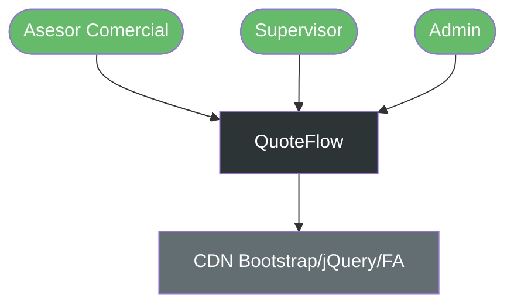

# Event Storming del AS-IS — QuoteFlow (Gestion de Cotizaciones Comerciales)

---

> **Aplicación:** QF-001 — QuoteFlow  
> **Cliente:** SoftwareOne  
> **Tipo de análisis:** X-Ray QuickScan  
> **Fecha de análisis:** 2026-07-22

---

## Dominios Funcionales Identificados

| # | Dominio | Descripción | Eventos principales |
|---|---|---|---|
| 1 | Identidad y Acceso | Autenticación de usuarios y gestión de sesión | SesionIniciada, SesionCerrada |
| 2 | Gestión de Clientes | CRUD de clientes corporativos | ClienteCreado, ClienteActualizado, ClienteEliminado |
| 3 | Catálogo y Precios | Gestión de productos y listas de precios | ProductoCreado, ListaPreciosCreada |
| 4 | Cotizaciones | Ciclo de vida completo de cotizaciones | CotizacionCreada, CotizacionEnviada, CotizacionAprobada, CotizacionRechazada |
| 5 | Dashboard | Métricas comerciales agregadas | DashboardConsultado |

---

## Dominio 1: Identidad y Acceso (Generic)

### Eventos de Dominio

| ID | Evento | Descripción | Disparado por |
|----|--------|-------------|---------------|
| EV01 | SesionIniciada | Usuario autenticado y token generado | CM01 |
| EV02 | SesionFallida | Credenciales incorrectas rechazadas | CM01 |
| EV03 | SesionCerrada | Token removido de localStorage | CM02 |

### Comandos

| ID | Comando | Actor | Sistema externo |
|----|---------|-------|-----------------|
| CM01 | IniciarSesion | Asesor/Supervisor/Admin | — |
| CM02 | CerrarSesion | Cualquier usuario | — |

### Actores

| Actor | Rol | Acciones principales |
|-------|-----|----------------------|
| Asesor | Vendedor comercial | Crear cotizaciones, gestionar clientes |
| Supervisor | Aprobador | Aprobar/rechazar cotizaciones |
| Admin | Administrador | Todas las operaciones |

### Políticas y Reglas de Negocio

| ID | Política | Descripción |
|----|----------|-------------|
| PL01 | CredencialesValidas | Email y password deben coincidir con usuario registrado |
| PL02 | TokenObligatorio | Toda operación posterior requiere token válido (no implementado en backend) |

### Entidades

| ID | Entidad | Atributos clave |
|----|---------|-----------------|
| EN01 | Usuario | id, nombre, email, password, rol |

---

## Dominio 2: Gestión de Clientes (Supporting)

### Eventos de Dominio

| ID | Evento | Descripción | Disparado por |
|----|--------|-------------|---------------|
| EV04 | ClienteCreado | Nuevo cliente corporativo registrado | CM03 |
| EV05 | ClienteActualizado | Datos del cliente modificados | CM04 |
| EV06 | ClienteEliminado | Cliente removido permanentemente | CM05 |

### Comandos

| ID | Comando | Actor | Sistema externo |
|----|---------|-------|-----------------|
| CM03 | CrearCliente | Asesor | — |
| CM04 | ActualizarCliente | Asesor | — |
| CM05 | EliminarCliente | Asesor | — |
| CM06 | ConsultarClientes | Asesor | — |

### Políticas y Reglas de Negocio

| ID | Política | Descripción |
|----|----------|-------------|
| PL03 | NITUnico | No se permite duplicación de identificación (NIT) entre clientes |
| PL04 | RazonSocialRequerida | Razón social y NIT son campos obligatorios |

### Entidades

| ID | Entidad | Atributos clave |
|----|---------|-----------------|
| EN02 | Cliente | id, identificacion, razonSocial, contactoPrincipal, email, telefono, direccion, ciudad, sector, totalCotizado |

---

## Dominio 3: Catálogo y Precios (Supporting)

### Eventos de Dominio

| ID | Evento | Descripción | Disparado por |
|----|--------|-------------|---------------|
| EV07 | ProductoCreado | Nuevo producto/servicio registrado | CM07 |
| EV08 | ProductoActualizado | Datos del producto modificados | CM08 |
| EV09 | ListaPreciosCreada | Nueva lista de precios definida | CM09 |

### Comandos

| ID | Comando | Actor | Sistema externo |
|----|---------|-------|-----------------|
| CM07 | CrearProducto | Admin | — |
| CM08 | ActualizarProducto | Admin | — |
| CM09 | CrearListaPrecios | Admin | — |

### Políticas y Reglas de Negocio

| ID | Política | Descripción |
|----|----------|-------------|
| PL05 | CodigoProductoUnico | No se permite duplicación de código de producto |
| PL06 | DescuentoMaximoPorLista | Cada lista define un descuento máximo (no implementado como validación) |

### Entidades

| ID | Entidad | Atributos clave |
|----|---------|-----------------|
| EN03 | Producto | id, codigo, nombre, descripcion, precioBase, impuesto, categoria, unidad |
| EN04 | ListaPrecios | id, nombre, segmento, descuentoMaximo, margenMinimo, items[] |

---

## Dominio 4: Cotizaciones (Core)

### Eventos de Dominio

| ID | Evento | Descripción | Disparado por |
|----|--------|-------------|---------------|
| EV10 | CotizacionCreada | Cotización generada con número COT-YYYY-NNN | CM10 |
| EV11 | CotizacionEnviadaAprobacion | Estado cambiado a "Pendiente de aprobación" | CM11 |
| EV12 | CotizacionAprobada | Supervisor aprobó la cotización | CM12 |
| EV13 | CotizacionRechazada | Supervisor rechazó la cotización | CM13 |
| EV14 | CotizacionRequiereAjustes | Supervisor solicitó cambios | CM14 |
| EV15 | CotizacionEnviadaCliente | Cotización enviada al cliente final | CM15 |
| EV16 | CotizacionAceptada | Cliente aceptó la cotización | CM16 |
| EV17 | CotizacionVencida | Cotización expiró sin respuesta | CM17 |

### Comandos

| ID | Comando | Actor | Sistema externo |
|----|---------|-------|-----------------|
| CM10 | CrearCotizacion | Asesor | — |
| CM11 | EnviarAprobacion | Asesor | — |
| CM12 | AprobarCotizacion | Supervisor | — |
| CM13 | RechazarCotizacion | Supervisor | — |
| CM14 | SolicitarAjustes | Supervisor | — |
| CM15 | EnviarAlCliente | Asesor | — |
| CM16 | RegistrarAceptacion | Asesor | — |
| CM17 | MarcarVencida | Sistema (timer) | — |

### Políticas y Reglas de Negocio

| ID | Política | Descripción |
|----|----------|-------------|
| PL07 | ClienteRequerido | Toda cotización debe tener un cliente asociado |
| PL08 | MinimoUnItem | Toda cotización debe tener al menos 1 item |
| PL09 | CalculoTotales | subtotal = Σ(cantidad × precio - descuento); total = subtotal - descuentoGeneral + impuestos |
| PL10 | NumeracionSecuencial | Formato COT-YYYY-NNN con consecutivo global |
| PL11 | SoloSupervisorAprueba | Solo supervisor/admin pueden aprobar (implementado solo en frontend) |
| PL12 | MotivoRechazoObligatorio | Al rechazar, el comentario es obligatorio (validado solo en frontend) |

### Entidades

| ID | Entidad | Atributos clave |
|----|---------|-----------------|
| EN05 | Cotizacion | id, numero, clienteId, items[], subtotal, descuento, impuestos, total, estado, vigencia, historialEstados[] |
| EN06 | ItemCotizacion | productoId, nombre, cantidad, precioUnitario, descuento, impuesto, subtotal |

---

## Dominio 5: Dashboard (Generic)

### Eventos de Dominio

| ID | Evento | Descripción | Disparado por |
|----|--------|-------------|---------------|
| EV18 | DashboardConsultado | Métricas recalculadas y presentadas | CM18 |

### Comandos

| ID | Comando | Actor | Sistema externo |
|----|---------|-------|-----------------|
| CM18 | ConsultarDashboard | Cualquier usuario | — |

### Entidades

| ID | Entidad | Atributos clave |
|----|---------|-----------------|
| EN07 | MetricasDashboard | totalCotizaciones, valorTotal, valorAceptado, tasaConversion, actividadReciente[] |

---

## Diagrama de Contexto General

---

## Flujo de Eventos (Event Flow)

```mermaid
flowchart LR
    %% === ACTORES ===
    ACT1(["\nAsesor\n"]):::actor
    ACT2(["\nSupervisor\n"]):::actor

    %% === DOMINIO 1: Identidad ===
    CM01["CM01\nIniciarSesion"]:::command
    EV01>"EV01\nSesionIniciada"]:::event

    %% === DOMINIO 4: Cotizaciones ===
    CM10["CM10\nCrearCotizacion"]:::command
    EV10>"EV10\nCotizacionCreada"]:::event
    PL09{{"PL09\nCalculoTotales"}}:::policy
    CM11["CM11\nEnviarAprobacion"]:::command
    EV11>"EV11\nEnviadaAprobacion"]:::event
    CM12["CM12\nAprobarCotizacion"]:::command
    EV12>"EV12\nCotizacionAprobada"]:::event
    CM13["CM13\nRechazarCotizacion"]:::command
    EV13>"EV13\nCotizacionRechazada"]:::event

    %% === FLUJO PRINCIPAL ===
    ACT1 --> CM01
    CM01 --> EV01
    EV01 --> CM10
    ACT1 --> CM10
    CM10 --> PL09
    PL09 -->|"Items validos"| EV10
    EV10 --> CM11
    CM11 --> EV11
    EV11 --> CM12
    ACT2 --> CM12
    CM12 -->|"Aprueba"| EV12
    EV11 --> CM13
    ACT2 --> CM13
    CM13 -->|"Rechaza"| EV13

    %% === ESTILOS EVENT STORMING ===
    classDef event fill:#FF8C00,color:#000,stroke:#E07000,stroke-width:2px
    classDef command fill:#468FE0,color:#fff,stroke:#2E6BBF,stroke-width:2px
    classDef policy fill:#FFEB3B,color:#000,stroke:#FBC02D,stroke-width:2px
    classDef actor fill:#66BB6A,color:#fff,stroke:#43A047,stroke-width:2px
```

---

## Conclusiones

1. **Dominio Core claro:** Las Cotizaciones son el dominio core con 8 eventos y la lógica de negocio más rica (máquina de estados, cálculos, aprobación).
2. **Complejidad baja:** 5 dominios con 18 eventos totales — sistema compacto, apto para rebuild en 8-10 semanas.
3. **Sin sistemas externos:** La ausencia total de integraciones reduce significativamente el riesgo de la modernización.
4. **Reglas de negocio parcialmente implementadas:** PL06 (descuento máximo) y PL11 (solo supervisor aprueba) están definidas pero no enforced en backend — el rebuild debe implementarlas correctamente.
5. **Bounded contexts naturales:** Los 5 dominios mapean directamente a bounded contexts para una arquitectura modular.

---

Análisis elaborado por SoftwareOne · 2026-07-22
