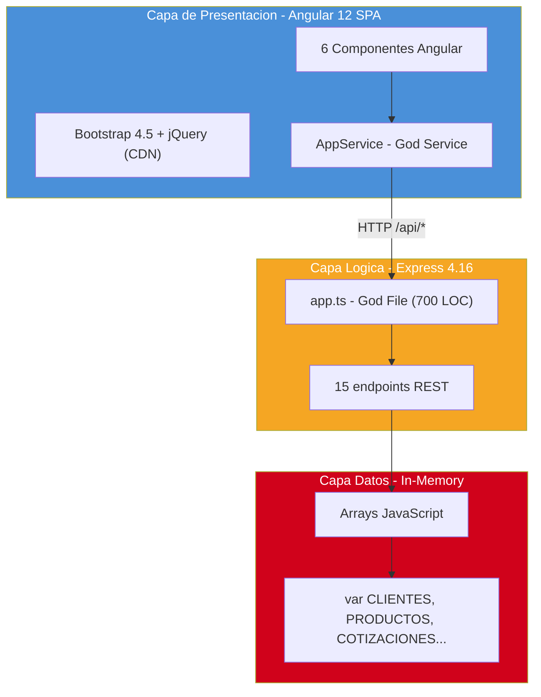

# Inventario Tecnológico

---

> **Aplicación:** QF-001 — QuoteFlow  
> **Cliente:** SoftwareOne  
> **Tipo:** TypeScript SPA + REST API (Prototipo educativo)  
> **LOC:** 19,544 (efectivo: 1,578) | **Archivos fuente:** 33  
> **Fecha de análisis:** 2026-07-22

---

## 1. Runtime y Lenguaje

| Tecnología | Versión | Propósito | Estado | Alerta Vinculada |
|---|---|---|---|---|
| TypeScript | ~4.3.5 (frontend) | Lenguaje principal frontend | ❌ EOL / Descontinuado | A-02 |
| TypeScript | ~3.9.10 (backend) | Lenguaje principal backend | ❌ EOL / Descontinuado | A-02 |
| Node.js | (no especificada) | Runtime del backend | ⚠️ Legacy funcional | — |

---

## 2. Frameworks y Modelo de Aplicación

| Tecnología | Versión | Propósito | Estado | Alerta Vinculada |
|---|---|---|---|---|
| Angular | 12.2.13 | Framework SPA frontend | ❌ EOL (dic-2022) | A-01 |
| Angular CLI | ~12.2.13 | Herramienta de build frontend | ❌ EOL | A-01 |
| Express | 4.16.4 | Framework REST API backend | ❌ EOL (~4 major behind) | A-03 |
| RxJS | ~6.6.0 | Programación reactiva Angular | ⚠️ Legacy funcional | — |

---

## 3. Bases de Datos

| Tecnología | Versión | Propósito | Estado | Alerta Vinculada |
|---|---|---|---|---|
| Arrays JavaScript in-memory | N/A | "Persistencia" de datos (se pierde al reiniciar) | 🚫 Ausente (no es BD real) | A-06 |

---

## 4. Controles / Componentes UI (3)

| Tecnología | Versión | Propósito | Estado | Alerta Vinculada |
|---|---|---|---|---|
| Bootstrap | 4.5.2 (CDN) | Framework CSS responsive | ❌ Obsoleto (2020, serie 4.x) | A-03 |
| jQuery | 3.5.1 (CDN) | Manipulación DOM (innecesario con Angular) | ❌ Obsoleto / Innecesario | — |
| Font Awesome | 5.15.4 (CDN) | Iconografía | ⚠️ Legacy funcional | — |

---

## 5. Bibliotecas y Dependencias (19)

| Tecnología | Versión | Propósito | Estado | Alerta Vinculada |
|---|---|---|---|---|
| @angular/core | 12.2.13 | Core Angular | ❌ EOL | A-01 |
| @angular/forms | 12.2.13 | Formularios reactivos/template | ❌ EOL | A-01 |
| @angular/router | 12.2.13 | Routing SPA | ❌ EOL | A-01 |
| @angular/common/http | 12.2.13 | HttpClient para REST | ❌ EOL | A-01 |
| zone.js | ~0.11.4 | Change detection Angular | ❌ EOL | — |
| tslib | ^2.3.0 | Helpers TypeScript | ✅ Vigente | — |
| express | 4.16.4 | Servidor REST | ❌ Descontinuado | A-03 |
| cors | 2.8.5 | Middleware CORS | ⚠️ Legacy funcional | — |
| body-parser | 1.19.0 | Parsing request body (deprecated) | ❌ Deprecated | — |
| ts-node | 8.10.2 | Ejecución TypeScript en runtime | ⚠️ Legacy funcional | — |
| nodemon | 2.0.7 | Hot-reload desarrollo | ⚠️ Legacy funcional | — |
| typescript (backend) | 3.9.10 | Compilador TS backend | ❌ EOL | A-02 |
| typescript (frontend) | ~4.3.5 | Compilador TS frontend | ❌ EOL | A-02 |

---

## 6. Herramientas de Build / CI

| Tecnología | Versión | Propósito | Estado | Alerta Vinculada |
|---|---|---|---|---|
| Angular CLI (ng build) | 12.2.13 | Build frontend | ❌ EOL | A-01 |
| tsc + ts-node | 3.9.10 | Build backend | ❌ EOL | — |
| nodemon | 2.0.7 | Dev server backend | ⚠️ Legacy funcional | — |
| No se detectan herramientas de CI/CD | — | — | 🚫 Ausente | A-07 |

---

## 7. Componentes Propietarios Sin Código Fuente (0)

| Componente | Tipo | Propósito | Riesgo |
|---|---|---|---|
| (Ninguno detectado) | — | — | — |

> No se identificaron componentes propietarios sin código fuente. Todas las dependencias son open-source y disponibles vía npm.

---

## 8. Diagrama de Stack Tecnológico

---

## 9. Conclusiones

1. **Stack completamente EOL:** El 100% de los frameworks principales (Angular 12, Express 4.16, TypeScript 3.9/4.3) están fuera de soporte desde 2022 — sin parches de seguridad disponibles.
2. **Sin base de datos real:** La "persistencia" son arrays JavaScript en memoria — los datos se pierden al reiniciar el servidor. Esto hace la aplicación inoperable en producción.
3. **Sin dependencias propietarias:** Todas las dependencias son open-source vía npm — no hay vendor lock-in ni componentes sin fuente. Esto simplifica significativamente el rebuild.
4. **Toolchain de desarrollo minimal:** Sin CI/CD, sin Docker, sin linting, sin testing framework. El ecosistema de herramientas requiere construcción desde cero.
5. **CDN como único punto externo:** Bootstrap, jQuery y Font Awesome se cargan desde CDN público — sin control de versiones ni integridad (SRI ausente).

---

Análisis elaborado por SoftwareOne · 2026-07-22
