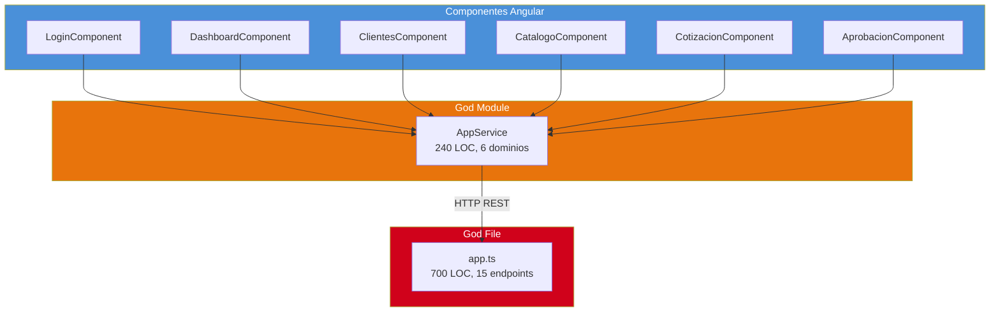
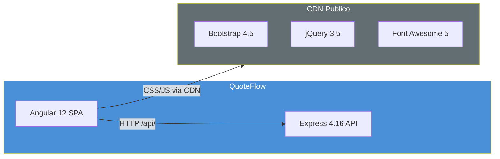
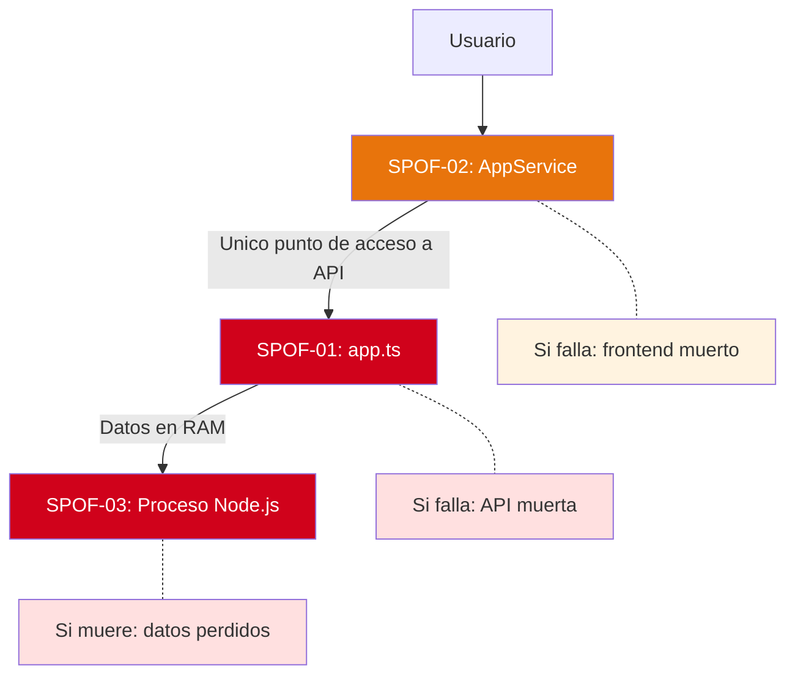

# Analisis de Dependencias

---

> **Aplicacion:** QF-001 — QuoteFlow  
> **Cliente:** SoftwareOne  
> **Tipo:** TypeScript SPA + REST API (Prototipo educativo)  
> **LOC:** 19,544 (efectivo: 1,578) | **Archivos fuente:** 33  
> **Fecha de analisis:** 2026-07-22

---

## 1. Analisis Fan-in / Fan-out de Componentes Clave

| Componente | Fan-in (quien lo usa) | Fan-out (que usa) | Clasificacion |
|---|---|---|---|
| AppService (frontend) | 6 componentes (100% del frontend) | 1 (HttpClient) | 🔴 SPOF CRITICO — God Module |
| app.ts (backend) | Todos los requests HTTP (100% del trafico) | 0 (sin deps externas) | 🔴 SPOF CRITICO — God File |
| HttpClient (Angular) | 1 (AppService) | 0 (nativo Angular) | 🟢 Componente normal |
| LoginComponent | 0 (entry point) | 1 (AppService) | 🟢 Componente normal |
| CotizacionComponent | 0 (entry point) | 1 (AppService) | 🟡 Concentrador (logica UI mas densa) |

### Interpretacion

- **AppService (fan-in=6):** Punto unico de fallo del frontend. Si AppService tiene un bug, 100% de la funcionalidad se degrada. Es un God Module con 6 dominios.
- **app.ts (fan-in=100%):** Todo el trafico HTTP pasa por un unico archivo de 700 LOC. Sin separacion en modulos, sin middleware de error, sin escalabilidad.

---

## 2. Dependencias Externas — Radio de Impacto

| Dependencia Externa | Tipo | Radio de Impacto | Componentes Afectados | Criticidad |
|---|---|---|---|---|
| CDN stackpath (Bootstrap) | Infraestructura UI | 100% del frontend | Todos los componentes visuales | 🟡 Media — degradacion visual si CDN cae |
| CDN cdnjs (Font Awesome) | Infraestructura UI | 80% del frontend | Iconos en todos los componentes | 🟢 Baja — solo iconos |
| CDN code.jquery.com | Infraestructura UI | 0% funcional (innecesario) | Ninguno real (Angular no lo usa) | 🟢 Baja — peso muerto |

### Observaciones

- El sistema NO tiene dependencias de sistemas externos funcionales (BD, APIs, servicios). Opera completamente aislado.
- Las unicas dependencias externas son CDN de librerias de presentacion — impacto limitado a visuales.

---

## 3. Cadenas de Dependencia Transitiva

### Cadena Critica 1: Request HTTP completo

```
Usuario Browser → Angular Component → AppService → HttpClient → Express app.ts → Array in-memory
```

- **Riesgo:** Toda la cadena es single-threaded, single-process. Un error en app.ts (unhandled exception) mata todo el backend.
- **Mitigacion posible:** Ninguna dentro del stack actual — requiere separacion de responsabilidades.

### Cadena Critica 2: Persistencia efimera

```
POST /api/cotizaciones → app.ts handler → COTIZACIONES.push() → RAM del proceso Node.js
```

- **Riesgo:** Reinicio del proceso (crash, deploy, OOM) destruye permanentemente todos los datos.
- **Mitigacion posible:** Ninguna — no hay BD, no hay backup, no hay replicacion.

---

## 4. Puntos Unicos de Fallo (SPOFs)

| ID | Componente | Tipo | Impacto si Falla | Dominios Afectados | Mitigacion Existente |
|---|---|---|---|---|---|
| SPOF-01 | app.ts (backend) | God File | Sistema completo inoperante — 0 funcionalidad disponible | 100% — todos los dominios | ❌ Ninguna |
| SPOF-02 | AppService (frontend) | God Module | Frontend completo no funcional — 0 operaciones posibles | 100% — todos los componentes | ❌ Ninguna |
| SPOF-03 | Proceso Node.js | Infraestructura | Datos permanentemente perdidos + servicio caido | 100% + datos | ❌ Ninguna |

### Analisis de Impacto SPOF-01

app.ts encapsula:
- 15 endpoints REST (100% de la API)
- Toda la logica de negocio del backend
- Todos los datos (arrays in-memory)
- Configuracion CORS y middleware
- Calculo de cotizaciones, validaciones, autenticacion

No existe:
- Separacion en modulos/servicios
- Error handler global (errores matan el proceso)
- Graceful shutdown (SIGTERM no manejado)
- Health check endpoint
- Circuit breaker ni retry

### Analisis de Impacto SPOF-02

AppService contiene:
- 15 metodos que cubren 6 dominios funcionales
- Gestion de sesion (localStorage)
- Todas las llamadas HTTP al backend
- Calculos de totales de cotizacion (duplicados del backend)

Si AppService falla, ningun componente puede operar.

---

## 5. Diagrama de Dependencias Internas



---

## 6. Diagrama de Dependencias Externas



---

## 7. Diagrama de Mapa de SPOFs



---

## 8. Conclusiones

1. **Patron estrella extremo:** Toda la aplicacion converge en 2 puntos unicos (AppService y app.ts). No hay resiliencia posible.
2. **Zero dependencias funcionales externas:** La ausencia de BD, APIs y servicios externos simplifica enormemente la modernizacion — no hay integraciones que migrar.
3. **SPOFs con impacto 100%:** Los 3 SPOFs afectan al 100% del sistema. No hay degradacion graceful posible.
4. **CDN como unica dependencia externa:** Solo libreria de estilos depende de internet. Impacto limitado a presentacion.
5. **Rebuild es mas simple que desacoplamiento:** Dado que el 100% del sistema pasa por 2 god modules, es mas eficiente reconstruir con separacion correcta que intentar desgajar el monolito.

---

Analisis elaborado por SoftwareOne · 2026-07-22
