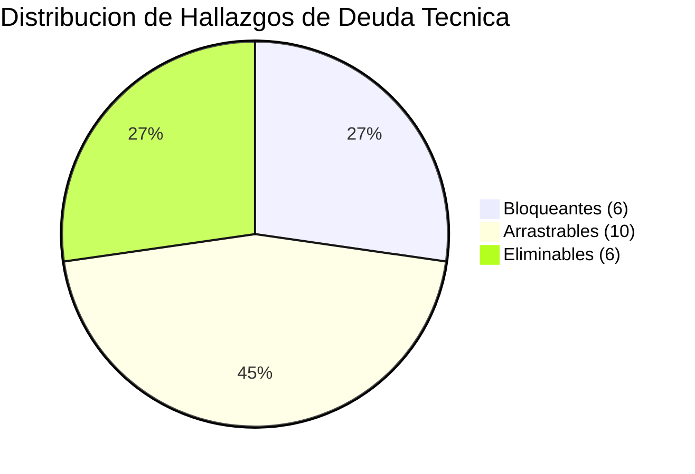
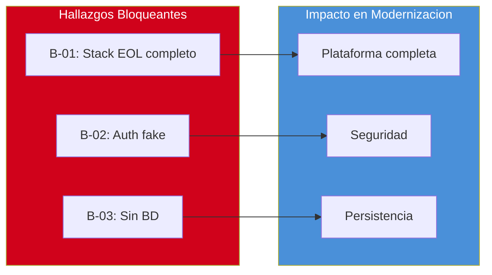

# Deuda Tecnica Detallada

---

> **Aplicacion:** QF-001 — QuoteFlow  
> **Cliente:** SoftwareOne  
> **Tipo:** TypeScript SPA + REST API (Prototipo educativo)  
> **LOC:** 19,544 (efectivo: 1,578) | **Archivos fuente:** 33  
> **Fecha de analisis:** 2026-07-22

---

## 1. Clasificacion de Hallazgos de Deuda Tecnica

Se identificaron **22** hallazgos de deuda tecnica, clasificados en tres categorias segun su impacto en una eventual modernizacion:

| Clasificacion | Cantidad | Descripcion |
|---|---|---|
| 🔴 **Bloqueante** | 6 | Impide la modernizacion si no se resuelve. Requiere accion inmediata o diseno especifico de mitigacion. |
| 🟡 **Arrastrable** | 10 | Puede coexistir temporalmente durante la migracion, pero debe resolverse antes de produccion. |
| 🟢 **Eliminable** | 6 | Se elimina automaticamente al modernizar (componentes que desaparecen con la nueva plataforma). |

---

## 2. Hallazgos Bloqueantes (6)

| # | Hallazgo | Impacto | Componente(s) | Alerta |
|---|---|---|---|---|
| B-01 | Angular 12 + TS 3.9/4.3 completamente EOL | Sin parches de seguridad, sin soporte, sin path de upgrade viable | Frontend + Backend completo | A-01, A-02 |
| B-02 | Autenticacion fake (token=FAKE_TOKEN+timestamp) | Imposible exponer a internet — zero seguridad | app.ts:165, app.service.ts:62 | A-04 |
| B-03 | Sin persistencia de datos (arrays in-memory) | Datos se pierden al reiniciar — inoperable en produccion | app.ts:32-156 | A-06 |
| B-04 | Passwords en texto plano | CWE-256 — violacion critica de seguridad | app.ts:153 | A-04 |
| B-05 | 0% cobertura de tests | Ningun cambio es verificable — riesgo de regresion total | Global | A-08 |
| B-06 | God File backend (700 LOC, 8+ responsabilidades) | Imposible de mantener, testear o escalar por mas de 1 persona | app.ts | A-09 |

---

## 3. Hallazgos Arrastrables (10)

| # | Hallazgo | Impacto | Componente(s) | Alerta |
|---|---|---|---|---|
| A-01 | God Service frontend (240 LOC, 6 dominios) | SRP violado — acoplamiento extremo | app.service.ts | A-09 |
| A-02 | Maquina de estados sin validacion de transiciones | Bug de negocio — cualquier estado es posible | app.ts:287-295 | — |
| A-03 | Logica de calculo triplicada (backend+service+component) | Inconsistencias entre capas — DRY violation | 3 archivos | — |
| A-04 | CORS origin: * abierto | Cualquier sitio puede consumir la API | app.ts:158 | A-04 |
| A-05 | Autorizacion solo en frontend (puedeAprobar()) | Backend no verifica roles — bypass trivial | cotizacion.component.ts:250 | A-05 |
| A-06 | rxjs subscriptions sin unsubscribe | Memory leaks — degradacion progresiva | app.service.ts | — |
| A-07 | 0 interfaces TypeScript — todo es `any` | Sin type safety — bugs ocultos | Global | — |
| A-08 | Sin error handler global (Express ni Angular) | Errores silenciosos — failures no detectados | Global | — |
| A-09 | formatearMoneda() duplicado en 5 archivos | Cambio requiere editar 5 archivos | 5 componentes | — |
| A-10 | Descuento maximo definido pero no validado | Regla de negocio no implementada | app.ts:90-92 | — |

---

## 4. Hallazgos Eliminables (6)

| # | Hallazgo | Razon de Eliminacion | Componente(s) |
|---|---|---|---|
| E-01 | jQuery incluido via CDN (innecesario con Angular) | Se elimina al reconstruir frontend moderno | index.html |
| E-02 | body-parser deprecated | Express moderno incluye parsing nativo | backend/package.json |
| E-03 | Bootstrap 4 via CDN sin SRI | Se reemplaza por Angular Material o Tailwind | index.html |
| E-04 | proxy.conf.json (solo para dev local) | Se reemplaza por configuracion cloud | frontend/ |
| E-05 | nodemon + ts-node (tooling obsoleto) | Se reemplaza por vite/esbuild o NestJS CLI | backend/package.json |
| E-06 | var en lugar de const/let | TypeScript estricto lo elimina automaticamente | Global |

---

## 5. Score de Deuda Tecnica

### Calculo

| Parametro | Valor | Justificacion |
|---|---|---|
| LOC afectado por deuda | 1,340 | 700 LOC app.ts + 240 LOC AppService + 400 LOC componentes con DRY violations |
| LOC total (efectivo) | 1,578 | TypeScript + CSS medidos por cloc |
| Ratio LOC | 85% | 1,340 / 1,578 x 100 |
| SPOFs con impacto 100% | 3 | app.ts, AppService, proceso Node.js |
| Ajuste SPOF | +0 | Ratio ya captura el impacto (>70% cap) |
| **Score Deuda** | **85** | Min(85, 100) — cap aplicado |

### Interpretacion del Score

| Rango | Clasificacion | Accion Recomendada |
|---|---|---|
| 0-30 | Deuda baja | Mantenimiento normal |
| 31-50 | Deuda moderada | Plan de remediacion gradual |
| 51-70 | Deuda alta | Modernizacion prioritaria |
| **71-100** | **Deuda muy alta** | **Reescritura o reemplazo recomendado** |

> **Resultado: Score 85 → Deuda Muy Alta**  
> **Complexity Multiplier resultante: 1.5**

---

## 6. Distribucion de Hallazgos

---

## 7. Carga de Mantenimiento (Maintenance Burden)

### Areas de Mayor Costo Operativo

| Area | Costo Relativo | Causa Principal | Frecuencia de Incidentes |
|---|---|---|---|
| Perdida de datos | 🔴 Alto | Reinicio del servidor pierde todo | Cada reinicio (diario en dev) |
| Errores silenciosos | 🔴 Alto | Sin error handling ni logging estructurado | Continuo |
| Inconsistencia de calculos | 🟡 Medio | Logica triplicada sin tests | Con cada cambio en calculos |
| Bypass de seguridad | 🟡 Medio | Auth solo en frontend | Cada request directo a API |
| Cambios de formato/estilo | 🟡 Medio | formatearMoneda en 5 archivos | Cada cambio de presentacion |

### Estimacion de Esfuerzo de Mantenimiento

- **Tiempo dedicado a workarounds vs. desarrollo nuevo:** ~80% workarounds / 20% features (estimado basado en la naturaleza del prototipo)
- **Velocidad de degradacion:** Cada funcionalidad nueva en app.ts agrava el God File — complejidad crece exponencialmente
- **Riesgo de ruptura silenciosa:** Sin tests, cualquier cambio puede romper funcionalidad sin que nadie se entere hasta runtime

---

## 8. Mapa de Impacto por Tipo de Deuda

---

## 9. Conclusiones

1. **Score 85 = Deuda Muy Alta:** El 85% del codigo efectivo esta impactado por deuda tecnica. La reescritura es mas eficiente que la remediacion.
2. **6 bloqueantes impiden produccion:** Sin BD, sin auth, sin tests — la aplicacion no puede exponerse a internet en su estado actual.
3. **6 eliminables son buena noticia:** jQuery, body-parser, Bootstrap CDN desaparecen automaticamente al reconstruir con stack moderno.
4. **Complexity Multiplier = 1.5:** El nivel maximo de complejidad se aplica a las estimaciones — cualquier trabajo sobre este codebase requiere 50% mas esfuerzo del estandar.
5. **Rebuild > Remediation:** Con 1,578 LOC efectivas y 85% de deuda, reescribir desde cero es significativamente menos riesgoso y costoso que intentar remediar 22 hallazgos sobre codigo que se auto-declara como intencionalmente malo.

---

Analisis elaborado por SoftwareOne · 2026-07-22
