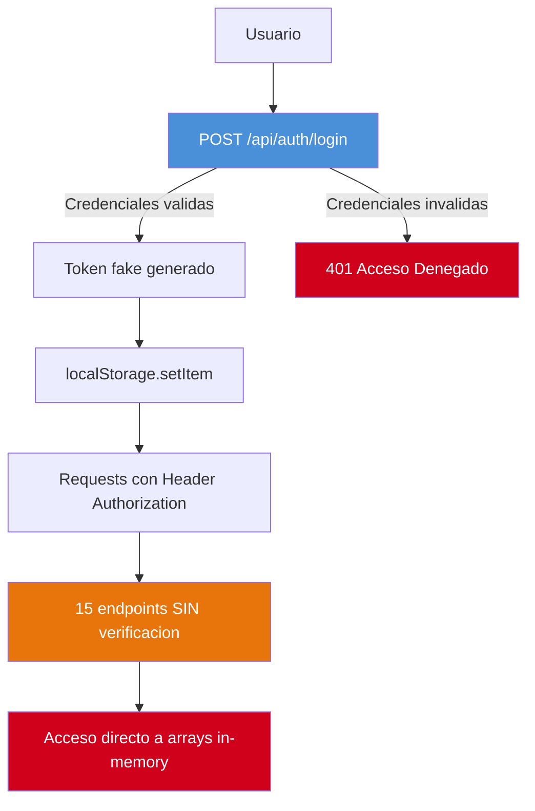

# Análisis de Seguridad

---

> **Aplicación:** QF-001 — QuoteFlow  
> **Cliente:** SoftwareOne  
> **Tipo:** TypeScript SPA + REST API (Prototipo educativo)  
> **LOC:** 19,544 (efectivo: 1,578) | **Archivos fuente:** 33  
> **Fecha de análisis:** 2026-07-22

---

## 1. Postura de Seguridad General

| Área de Seguridad | Estado | Implementación | Observaciones |
|---|---|---|---|
| **Autenticación** | ❌ Débil / Ausente | Token fake: `"FAKE_TOKEN_" + id + "_" + Date.now()` | No es JWT, no tiene firma, no se verifica |
| **Autorización** | ❌ Débil / Ausente | Solo cosmética en frontend (`puedeAprobar()`) | Backend acepta cualquier request sin verificar roles |
| **Cifrado** | ❌ Débil / Ausente | Passwords en texto plano, sin HTTPS, sin hashing | Zero criptografía en todo el sistema |
| **Auditoría** | ❌ Débil / Ausente | Solo `console.log` — incluye datos sensibles | No es auditoría real, loguea passwords |
| **Validación de inputs** | ⚠️ Parcial | Campos requeridos validados, pero sin sanitización | XSS posible, sin límite de tamaño |

### Resumen de Postura

- **Fortalezas:** Ninguna identificable en seguridad. El sistema no implementa ningún control de seguridad real.
- **Debilidades críticas:** Autenticación simulada, passwords en texto plano, CORS abierto, sin autorización backend, sin HTTPS.
- **Riesgo principal:** Cualquier actor puede realizar cualquier operación sin autenticación — el sistema es completamente abierto.

---

## 2. Vulnerabilidades Identificadas

| ID | Vulnerabilidad | CWE | Severidad | Ubicación | Descripción |
|---|---|---|---|---|---|
| V-01 | Passwords almacenados en texto plano | CWE-256 | 🔴 High | app.ts:153 | `password: '1234'` hardcodeado sin hash |
| V-02 | Token predecible sin firma criptográfica | CWE-330 | 🔴 High | app.ts:165 | `"fake-jwt-token-" + Date.now()` — trivial de forjar |
| V-03 | CORS completamente abierto | CWE-942 | 🔴 High | app.ts:158 | `cors({ origin: '*' })` — cualquier origen |
| V-04 | Sin middleware de autenticación en endpoints | CWE-306 | 🔴 High | app.ts (global) | 15 endpoints sin verificación de token |
| V-05 | Logging de datos sensibles | CWE-532 | 🔴 High | app.ts:163 | `console.log(JSON.stringify(req.body))` incluye passwords |
| V-06 | Token en localStorage (XSS vulnerable) | CWE-922 | 🟡 Medium | app.service.ts:65 | localStorage es accesible por scripts XSS |
| V-07 | Autorización solo client-side | CWE-602 | 🔴 High | cotizacion.component.ts:250 | Backend no verifica roles — bypass con curl |

### Detalle de Impacto por Vulnerabilidad

#### V-01: Passwords en texto plano (CWE-256)

- **Vector de ataque:** Lectura directa del array USUARIOS en memoria o intercepción de response de login
- **Impacto:** Compromiso total de credenciales de todos los usuarios
- **Probabilidad:** Alta — acceso trivial si el servidor es accesible
- **Remediación:** Implementar bcrypt/argon2 para hashing, nunca retornar password en responses

#### V-04: Sin auth middleware (CWE-306)

- **Vector de ataque:** Llamada directa a cualquier endpoint con curl sin headers de auth
- **Impacto:** Acceso completo a todos los datos y operaciones del sistema
- **Probabilidad:** Alta — trivial de explotar
- **Remediación:** Implementar middleware JWT que valide token en cada request protegido

#### V-07: Autorización solo client-side (CWE-602)

- **Vector de ataque:** Un asesor puede aprobar cotizaciones llamando directamente a `PUT /api/cotizaciones/:id/estado`
- **Impacto:** Violación del flujo de aprobación — asesor actúa como supervisor
- **Probabilidad:** Alta — bypass trivial
- **Remediación:** Implementar verificación de roles en middleware backend

---

## 3. Mapeo OWASP Top 10 (2021)

| OWASP ID | Categoría | Vulnerabilidad Local | Severidad |
|---|---|---|---|
| A01:2021 | Broken Access Control | V-04, V-07 — endpoints sin auth, roles sin verificar | 🔴 High |
| A02:2021 | Cryptographic Failures | V-01 — passwords texto plano, sin HTTPS | 🔴 High |
| A03:2021 | Injection | No detectada — mitigada accidentalmente por arrays in-memory | 🟡 Medium (al migrar a BD) |
| A04:2021 | Insecure Design | Máquina de estados sin validación server-side | 🔴 High |
| A05:2021 | Security Misconfiguration | V-03 — CORS *, sin helmet, sin headers | 🔴 High |
| A06:2021 | Vulnerable and Outdated Components | Angular 12 + Express 4.16 EOL | 🔴 High |
| A07:2021 | Identification and Authentication Failures | V-02 — token fake, sin firma | 🔴 High |
| A08:2021 | Software and Data Integrity Failures | CDN scripts sin SRI | 🟡 Medium |
| A09:2021 | Security Logging and Monitoring Failures | V-05 — solo console.log, loguea PII | 🟡 Medium |
| A10:2021 | Server-Side Request Forgery | No aplica — sin llamadas HTTP server-side | ℹ️ N/A |

---

## 4. Limitaciones del Análisis Estático

| Aspecto | Limitación | Impacto en Evaluación |
|---|---|---|
| Red/TLS | Sin acceso a configuración de red | No se verificó si hay proxy/TLS terminador |
| Runtime CVEs | Sin ejecución de `npm audit` | CVEs específicos de dependencias transitivas no verificados |
| Entorno deployment | No existe deployment | Evaluación limitada a código fuente local |

---

## 5. Flujo de Autenticación y Autorización

### Observaciones del Flujo

1. El token se genera pero NUNCA se verifica — los endpoints no tienen middleware de auth.
2. La "autorización" existe solo en el componente Angular (frontend) — bypass trivial con llamada HTTP directa.
3. No hay segregación de datos por usuario — un asesor puede ver/modificar cotizaciones de otros.

---

## 6. Recomendaciones Prioritarias

| Prioridad | Acción | Vulnerabilidad | Esfuerzo |
|---|---|---|---|
| 🔴 1 | Implementar JWT real con firma (RS256/HS256) + middleware de verificación | V-02, V-04 | Medio |
| 🔴 2 | Hash de passwords con bcrypt/argon2 | V-01 | Bajo |
| 🔴 3 | Implementar RBAC server-side con middleware de roles | V-07 | Medio |
| 🟡 4 | Restringir CORS a dominios específicos + agregar helmet | V-03 | Bajo |
| 🟡 5 | Implementar structured logging sin PII + audit trail | V-05 | Medio |

---

## 7. Conclusiones

1. **Postura de seguridad inexistente:** 0 de 5 controles de seguridad implementados. El sistema es completamente abierto.
2. **7 de 10 categorías OWASP vulnerables:** Con 5 vulnerabilidades de severidad High, la aplicación no puede exponerse a ninguna red sin remediación completa.
3. **Rebuild elimina todas las vulnerabilidades:** Dado que la modernización implica reescritura, la seguridad se implementa by-design en el nuevo stack (JWT real, bcrypt, RBAC middleware, helmet, CORS restrictivo).
4. **Quick win inexistente:** No hay "parche rápido" viable — la autenticación fake requiere reemplazo completo, no ajuste.
5. **Sin datos sensibles reales en riesgo:** Como es un prototipo con datos demo in-memory, el riesgo actual es conceptual. El riesgo se materializa si se intenta usar en producción sin remediación.

---

Análisis elaborado por SoftwareOne · 2026-07-22
