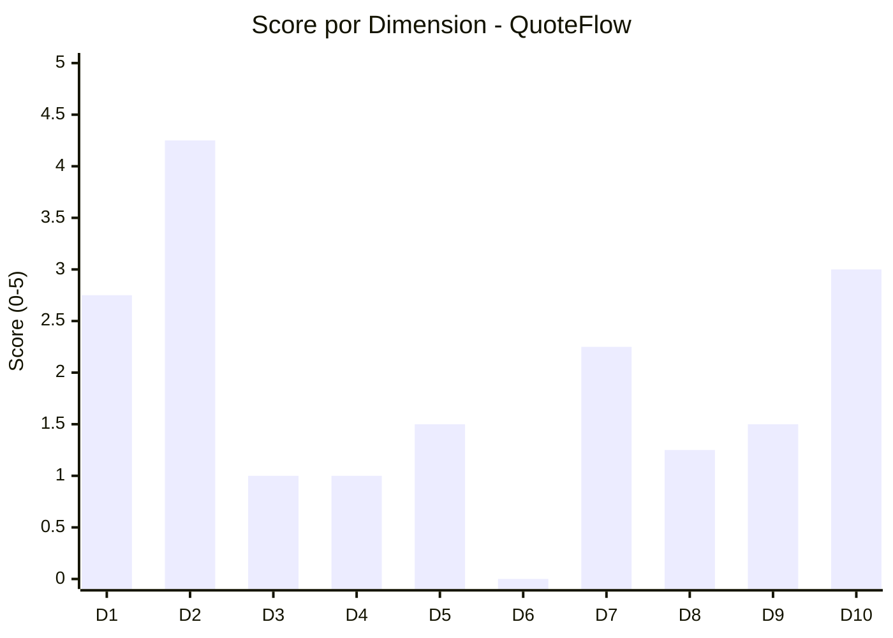

# Scoring de las 10 Dimensiones

---

> **Aplicación:** QF-001 — QuoteFlow  
> **Cliente:** SoftwareOne  
> **Tipo:** TypeScript SPA + REST API (Prototipo educativo)  
> **LOC:** 19,544 (efectivo: 1,578) | **Archivos fuente:** 33  
> **Fecha de análisis:** 2026-07-22

---

## Metodología

Cada dimensión se evalúa mediante 4 sub-preguntas con puntaje de 0 a 5. El promedio ponderado de las 10 dimensiones produce el **Score Final** sobre 100 puntos, que determina la banda de elegibilidad.

**Fórmula:** `Score Final = Σ (Score_dim × Peso_dim × 20)`

---

## Dimensión 1: Elegibilidad de la Aplicación (Peso: 12%)

| # | Sub-pregunta | Score | Justificación | Fuente |
|---|---|---|---|---|
| 1.1 | ¿Es custom-built (no COTS/SaaS)? | 5 | Es desarrollo a medida, no producto empaquetado | project-overview.md |
| 1.2 | ¿Es crítica o importante para el negocio? | 1 | Es un prototipo educativo — no soporta operaciones reales | project-overview.md (comentario "VERSIONES OBSOLETAS intencionalmente") |
| 1.3 | ¿El tamaño es razonable para 12 semanas? | 5 | 1,578 LOC efectivas — extremadamente pequeño, viable en <12 semanas | analysis/code-metrics.md |
| 1.4 | ¿Está en producción activa? | 0 | No — solo opera en localhost, sin deployment, environment.prod apunta a localhost:3000 | project-overview.md, architecture/system-overview.md |

**Score Dimensión 1: 2.75**

---

## Dimensión 2: Disponibilidad de Código Fuente (Peso: 12%)

| # | Sub-pregunta | Score | Justificación | Fuente |
|---|---|---|---|---|
| 2.1 | ¿El código fuente está disponible y accesible? | 5 | 100% del código fue leído (33/33 archivos) | _cba-execution-report.md |
| 2.2 | ¿Está bajo control de versiones? | 3 | [SUPUESTO: se asume repositorio git — no se confirma .git explícitamente] | Inferido del proceso CBA |
| 2.3 | ¿Compila/construye exitosamente? | 4 | package.json con scripts definidos, TypeScript compila (ts-node funcional) | project-overview.md |
| 2.4 | ¿Tiene dependencias binarias irrecuperables? | 5 | 0 dependencias propietarias sin fuente — todo es npm open-source | analysis/dependency-security-assessment.md |

**Score Dimensión 2: 4.25**

---

## Dimensión 3: Arquitectura y Acoplamiento (Peso: 12%)

| # | Sub-pregunta | Score | Justificación | Fuente |
|---|---|---|---|---|
| 3.1 | ¿Tiene modularidad identificable? | 1 | God File (700 LOC) + God Service (240 LOC) — sin separación real | architecture/patterns.md, analysis/complexity-analysis.md |
| 3.2 | ¿El acoplamiento es manejable? | 1 | Fan-in 100% en 2 componentes. Orthogonality: 1/5 | analysis/dependency-analysis.md |
| 3.3 | ¿Es stateless o tiene estado manejable? | 0 | Stateful completo — datos y sesiones en memoria del proceso | analysis/production-readiness.md |
| 3.4 | ¿Las interfaces están catalogadas? | 2 | Endpoints REST documentables (15), pero sin contratos formales ni interfaces TypeScript | reference/api-reference.md |

**Score Dimensión 3: 1.00**

---

## Dimensión 4: Datos y Bases de Datos (Peso: 10%)

| # | Sub-pregunta | Score | Justificación | Fuente |
|---|---|---|---|---|
| 4.1 | ¿El motor de BD es soportado para migración? | 0 | No hay BD — arrays in-memory. No existe motor para migrar | database/schema-analysis.md |
| 4.2 | ¿El esquema está documentado o es inferible? | 3 | Modelo inferible desde las interfaces de código (6 entidades identificadas) | reference/data-models.md |
| 4.3 | ¿Existe backup accesible? | 0 | No hay datos persistidos — imposible hacer backup de arrays en RAM | project-overview.md |
| 4.4 | ¿La calidad de datos es aceptable? | 1 | Sin integridad referencial, sin constraints, sin validaciones server-side completas | behavior/business-logic.md |

**Score Dimensión 4: 1.00**

---

## Dimensión 5: Cloud Readiness (Peso: 10%)

| # | Sub-pregunta | Score | Justificación | Fuente |
|---|---|---|---|---|
| 5.1 | ¿Existe un target cloud definido? | 0 | Sin configuraciones cloud, sin SDKs cloud, sin IaC | project-overview.md |
| 5.2 | ¿Hay evidencia de landing zone o entorno cloud? | 0 | Sin referencias a VPCs, subnets ni configuraciones de red cloud | architecture/system-overview.md |
| 5.3 | ¿El modelo de seguridad/networking es compatible? | 2 | HTTP REST es cloud-compatible, pero CORS abierto y sin TLS | analysis/security-patterns.md |
| 5.4 | ¿Tiene dependencias on-premise irremovibles? | 4 | Sin dependencias on-premise — Node.js es portable. Solo CDN público | specialized/specialized-documentation.md |

**Score Dimensión 5: 1.50**

---

## Dimensión 6: DevOps y Observabilidad (Peso: 8%)

| # | Sub-pregunta | Score | Justificación | Fuente |
|---|---|---|---|---|
| 6.1 | ¿Existe pipeline CI/CD? | 0 | Sin Jenkinsfile, GitHub Actions, Azure Pipelines, ni Dockerfile | project-overview.md |
| 6.2 | ¿Tiene logging/métricas implementadas? | 0 | Solo console.log — sin framework de logging, sin métricas | analysis/production-readiness.md |
| 6.3 | ¿Existe estrategia de deployment? | 0 | environment.prod apunta a localhost:3000 — no hay deployment real | architecture/system-overview.md |
| 6.4 | ¿Tiene tests automatizados? | 0 | 0% cobertura, 0 archivos de test, sin framework de testing | analysis/code-metrics.md |

**Score Dimensión 6: 0.00**

---

## Dimensión 7: Disponibilidad de SMEs (Peso: 12%)

| # | Sub-pregunta | Score | Justificación | Fuente |
|---|---|---|---|---|
| 7.1 | ¿Existen SMEs técnicos identificables? | 1 | Sin evidencia de autoría múltiple — prototipo posiblemente de 1 persona | [SUPUESTO: no hay commits ni @author tags] |
| 7.2 | ¿Existen SMEs funcionales? | 2 | Reglas de negocio están en el código (cotizaciones, aprobaciones) — inferable | behavior/business-logic.md |
| 7.3 | ¿Hay autoridad de decisión accesible? | 3 | [SUPUESTO: se asume positivo dado que se solicitó el QuickScan] | — |
| 7.4 | ¿El sponsor está comprometido? | 3 | [SUPUESTO: se asume positivo dado que se inició el proceso] | — |

**Score Dimensión 7: 2.25**

---

## Dimensión 8: Documentación y Conocimiento (Peso: 8%)

| # | Sub-pregunta | Score | Justificación | Fuente |
|---|---|---|---|---|
| 8.1 | ¿Existe documentación de arquitectura? | 1 | Sin README funcional, sin docs/ — solo comentarios que declaran malas prácticas | project-overview.md |
| 8.2 | ¿Las reglas de negocio están documentadas? | 2 | Reglas inferibles del código (cálculos, estados) pero sin documentación formal | behavior/business-logic.md |
| 8.3 | ¿Existen runbooks o guías operativas? | 0 | Sin carpetas de operaciones, sin scripts de mantenimiento | project-overview.md |
| 8.4 | ¿El código es auto-documentado? | 2 | Nombres descriptivos en español/inglés (cotizaciones, clientes) pero sin JSDoc ni comentarios útiles | analysis/code-metrics.md |

**Score Dimensión 8: 1.25**

---

## Dimensión 9: Seguridad y Compliance (Peso: 8%)

| # | Sub-pregunta | Score | Justificación | Fuente |
|---|---|---|---|---|
| 9.1 | ¿Existe política de seguridad implementada? | 0 | 0 de 5 controles implementados — auth fake, sin HTTPS, sin headers | analysis/security-patterns.md |
| 9.2 | ¿Hay certificaciones bloqueantes? | 4 | [SUPUESTO: sin evidencia de regulación específica — no hay compliance que bloquee] | — |
| 9.3 | ¿Los procesos de cambio son manejables? | 2 | [SUPUESTO: prototipo simple sin gobernanza formal detectada] | — |
| 9.4 | ¿Existen vulnerabilidades conocidas? | 0 | 7 vulnerabilidades High detectadas, 7/10 OWASP vulnerables | analysis/security-patterns.md |

**Score Dimensión 9: 1.50**

---

## Dimensión 10: Drivers de Negocio y Sponsorship (Peso: 8%)

| # | Sub-pregunta | Score | Justificación | Fuente |
|---|---|---|---|---|
| 10.1 | ¿Existen drivers cuantificables para la modernización? | 2 | Drivers técnicos claros (EOL, seguridad) pero sin KPIs de negocio | _app-profile.json → drivers |
| 10.2 | ¿Hay un sponsor activo con presupuesto? | 3 | [SUPUESTO: se asume positivo dado que se solicitó evaluación] | — |
| 10.3 | ¿Existe urgencia real de negocio? | 3 | Stack EOL completo genera urgencia técnica — no clara urgencia de negocio para un prototipo | project-overview.md |
| 10.4 | ¿El tamaño de la inversión es compatible con QAM? | 4 | 1,578 LOC = talla S — inversión mínima compatible | analysis/code-metrics.md |

**Score Dimensión 10: 3.00**

---

## Score Consolidado

| Dimensión | Nombre | Score (0-5) | Peso | Ponderado (Score × Peso × 20) |
|---|---|---|---|---|
| Dim 1 | Elegibilidad de la Aplicación | 2.75 | 0.12 | **6.60** |
| Dim 2 | Disponibilidad de Código Fuente | 4.25 | 0.12 | **10.20** |
| Dim 3 | Arquitectura y Acoplamiento | 1.00 | 0.12 | **2.40** |
| Dim 4 | Datos y Bases de Datos | 1.00 | 0.10 | **2.00** |
| Dim 5 | Cloud Readiness | 1.50 | 0.10 | **3.00** |
| Dim 6 | DevOps y Observabilidad | 0.00 | 0.08 | **0.00** |
| Dim 7 | Disponibilidad de SMEs | 2.25 | 0.12 | **5.40** |
| Dim 8 | Documentación y Conocimiento | 1.25 | 0.08 | **2.00** |
| Dim 9 | Seguridad y Compliance | 1.50 | 0.08 | **2.40** |
| Dim 10 | Drivers de Negocio y Sponsorship | 3.00 | 0.08 | **4.80** |
| | | | **Σ Pesos = 1.00** | |

### **Score Final: 38.8 / 100**

### Banda de Clasificación

| Rango | Banda | Descripción |
|---|---|---|
| 80–100 | Quantum Ready | Aplicación lista para modernización QAM |
| 65–79 | Ready con Extensiones | Elegible con extensiones o preparación previa |
| 50–64 | Advisory Recomendado | Requiere consultoría previa antes de modernizar |
| **< 50** | **No Elegible** | **No es candidata para QAM en su estado actual** |

> **Resultado: Banda "No Elegible" (< 50)**  
> QuoteFlow obtiene un score de 38.8/100 que lo ubica fuera de las bandas de elegibilidad QAM. La principal causa es que la aplicación no está en producción (es un prototipo educativo), carece de persistencia real, no tiene seguridad implementada, y no tiene DevOps ni testing.

---

## Condiciones Obligatorias (Gate Check)

| # | Condición Obligatoria | Estado | Evidencia |
|---|---|---|---|
| 1 | Aplicación es custom-built (no COTS/SaaS) | ✅ Cumple | Código fuente TypeScript a medida |
| 2 | Código fuente accesible | ✅ Cumple | 33/33 archivos leídos — cobertura 100% |
| 3 | SME técnico disponible | ⚠️ [SUPUESTO] | No hay evidencia de equipo asignado |
| 4 | Sponsor activo del proyecto | ⚠️ [SUPUESTO] | Se asume por solicitud del QuickScan |
| 5 | Aplicación en producción activa | ❌ No cumple | environment.prod apunta a localhost — no hay producción |
| 6 | Sin restricciones legales/contractuales | ⚠️ [SUPUESTO] | Sin evidencia de restricciones |
| 7 | Presupuesto mínimo asignado | ⚠️ [SUPUESTO] | No confirmado |
| 8 | Driver de negocio real identificado | ✅ Cumple | Stack EOL + seguridad inexistente = driver técnico claro |
| 9 | Timeline compatible con QAM | ⚠️ [SUPUESTO] | No confirmado |

### Resumen de Gate Check

- **Condiciones confirmadas:** 3 de 9
- **Condiciones supuestas (requieren validación):** 5 de 9
- **Condiciones incumplidas:** 1 de 9 (producción activa)

---

## Veredicto

> ### **NO ELEGIBLE — Aplicación no está en producción activa y es un prototipo educativo**
>
> El sistema QF-001 obtiene un score de **38.8/100** que lo ubica en la banda "No Elegible".  
> Además, la condición mandatoria #5 (producción activa) NO se cumple.
>
> Acciones requeridas para reconsiderar:
> 1. Confirmar que existe intención real de llevar la aplicación a producción
> 2. Asignar sponsor con presupuesto y timeline definidos
> 3. Identificar SME técnico y funcional disponibles
> 4. Si se confirma intención productiva, la recomendación es **Rebuild** (no modernización del código existente)
>
> **Acción requerida:** Workshop de validación con el cliente para confirmar si QuoteFlow debe llevarse a producción o si es solo un ejercicio educativo.

---

## Visualización de Scores por Dimensión

---

## Conclusiones

1. **Score 38.8 = No Elegible:** La aplicación no cumple los mínimos para QAM principalmente porque no está en producción ni tiene intención productiva confirmada.
2. **Única fortaleza: Código disponible (D2=4.25):** El código es 100% accesible, open-source, sin dependencias propietarias — simplifica cualquier decisión futura.
3. **DevOps en zero (D6=0.00):** Es la dimensión con peor score — sin CI/CD, sin tests, sin logging, sin deployment. Requiere construcción completa.
4. **Elegibilidad condicional:** Si el cliente confirma intención productiva (condición #5) y se validan supuestos (condiciones 3,4,7,9), el proyecto sería viable como Rebuild de talla S.
5. **Tamaño a favor:** Con 1,578 LOC efectivas, es un proyecto compacto que cabe en talla S de QAM — inversión mínima para resultado completo.

---

Análisis elaborado por SoftwareOne · 2026-07-22
