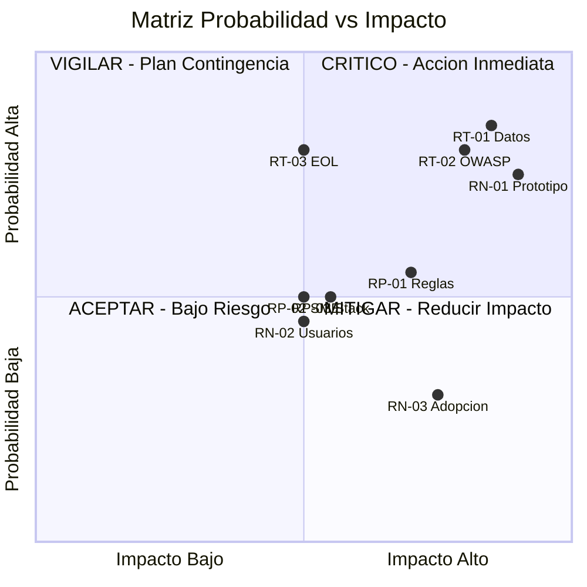

# Gap & Risk Register

---

> **Score Final:** 38.8 / 100 — No Elegible  
> **Banda:** No Elegible (< 50)  
> **Complexity:** 1.5 (Deuda Muy Alta)

---

## 1. Registro de Brechas (Gaps de Elegibilidad)

Dimensiones con score < 2.0 que requieren acción para viabilizar la modernización:

| # | Dimensión | Score Actual | Score Target | Gap | Acciones para Cerrar | Responsable | Timing |
|---|---|---|---|---|---|---|---|
| G-01 | DevOps y Observabilidad (D6) | 0.00 | 3.0 | 3.0 | Construir pipeline CI/CD + tests desde cero | SoftwareOne + Cliente | Durante modernización |
| G-02 | Arquitectura y Acoplamiento (D3) | 1.00 | 3.0 | 2.0 | Rebuild con separación en módulos/servicios | SoftwareOne | Durante modernización |
| G-03 | Datos y Bases de Datos (D4) | 1.00 | 3.0 | 2.0 | Implementar BD relacional (PostgreSQL) con esquema normalizado | SoftwareOne | Durante modernización |
| G-04 | Documentación y Conocimiento (D8) | 1.25 | 3.0 | 1.75 | Event Storming + documentación de reglas de negocio | SoftwareOne + SME | Pre-modernización |
| G-05 | Cloud Readiness (D5) | 1.50 | 3.0 | 1.5 | Definir target cloud + provisionar landing zone | Cliente + SoftwareOne | Pre-modernización |
| G-06 | Seguridad y Compliance (D9) | 1.50 | 3.0 | 1.5 | Implementar auth real + RBAC + HTTPS | SoftwareOne | Durante modernización |

### Detalle de Acciones por Gap

#### G-01: DevOps y Observabilidad (Score 0.00 → Target 3.0)

**Situación actual:** No existe pipeline CI/CD, testing framework, logging estructurado ni estrategia de deployment. La aplicación solo se ejecuta localmente con `ng serve` y `nodemon`.

**Acciones requeridas:**
1. Configurar GitHub Actions con pipeline build + test + deploy
2. Implementar framework de testing (Jest + Playwright)
3. Configurar Docker multi-stage para containerización
4. Implementar logging estructurado (Pino/Winston)
5. Configurar deployment a cloud target

**Prerrequisito para modernización:** No — se construye como parte del Rebuild

#### G-02: Arquitectura y Acoplamiento (Score 1.00 → Target 3.0)

**Situación actual:** God File (700 LOC) + God Service (240 LOC) con 0 modularidad, 0 interfaces y estado completamente mutable en memoria.

**Acciones requeridas:**
1. Diseñar arquitectura modular (NestJS modules o similar)
2. Separar dominios en módulos independientes (5 bounded contexts)
3. Implementar DI con interfaces para testabilidad
4. Eliminar estado compartido mutable

**Prerrequisito para modernización:** No — es la esencia del Rebuild

#### G-03: Datos y BD (Score 1.00 → Target 3.0)

**Situación actual:** Arrays JavaScript in-memory — datos se pierden al reiniciar. No hay esquema, constraints, integridad referencial ni backup posible.

**Acciones requeridas:**
1. Diseñar esquema relacional normalizado (6 entidades identificadas)
2. Implementar PostgreSQL con migrations (TypeORM/Prisma)
3. Configurar connection pooling y health checks
4. Implementar seeds para datos iniciales

**Prerrequisito para modernización:** No — se construye como parte del Rebuild

---

## 2. Registro de Riesgos

### 2.1 Riesgos Técnicos del AS-IS

| ID | Riesgo | Probabilidad | Impacto | Prioridad | Mitigación |
|---|---|---|---|---|---|
| RT-01 | Datos perdidos permanentemente ante crash del servidor | Alta | Alto | 🔴 Crítico | Implementar BD real con backup (PostgreSQL) |
| RT-02 | Vulnerabilidades OWASP explotables si se expone a red | Alta | Alto | 🔴 Crítico | NO exponer a internet hasta rebuild con seguridad real |
| RT-03 | Stack EOL sin parches — vulnerabilidades conocidas sin fix | Alta | Medio | 🟠 Alto | Rebuild con stack actual (Angular 17+, Express 5+) |

### 2.2 Riesgos del Proyecto de Modernización

| ID | Riesgo | Probabilidad | Impacto | Prioridad | Mitigación |
|---|---|---|---|---|---|
| RP-01 | Reglas de negocio no documentadas — rebuild incompleto | Media | Alto | 🟠 Alto | Event Storming con SME funcional en semana 1-2 |
| RP-02 | Sin SME técnico disponible — decisiones de diseño sin validar | Media | Medio | 🟡 Medio | Workshop de validación con stakeholders |
| RP-03 | Target stack no definido — retrasos por indecisión | Media | Medio | 🟡 Medio | Definir target en Advisory (semana 2) |

### 2.3 Riesgos de Negocio

| ID | Riesgo | Probabilidad | Impacto | Prioridad | Mitigación |
|---|---|---|---|---|---|
| RN-01 | La aplicación es solo un prototipo educativo sin valor productivo real | Alta | Alto | 🔴 Crítico | Validar intención productiva con el sponsor ANTES de iniciar |
| RN-02 | Sin usuarios reales — funcionalidad puede no alinearse a necesidades reales | Media | Medio | 🟡 Medio | Descubrimiento funcional con usuarios potenciales |
| RN-03 | Inversión en rebuild sin adopción posterior | Baja | Alto | 🟡 Medio | MVP incremental con validación de usuario en cada sprint |

---

## 3. Matriz de Prioridad

La mayoría de los riesgos críticos se concentran en el cuadrante superior-derecho (alta probabilidad + alto impacto), especialmente RN-01 (es solo un prototipo), RT-01 (datos efímeros) y RT-02 (vulnerabilidades). Esto refuerza la necesidad de validar la intención productiva antes de cualquier inversión.

---

## 4. Resumen Ejecutivo de Riesgos

| Categoría | Total | Críticos | Altos | Medios | Bajos |
|---|---|---|---|---|---|
| Técnicos AS-IS | 3 | 2 | 1 | 0 | 0 |
| Proyecto Modernización | 3 | 0 | 1 | 2 | 0 |
| Negocio | 3 | 1 | 0 | 2 | 0 |
| **TOTAL** | **9** | **3** | **2** | **4** | **0** |

### Top 3 Riesgos que Requieren Acción Inmediata

1. **RN-01: La aplicación es un prototipo educativo** — Sin confirmación de intención productiva, cualquier inversión en modernización carece de justificación. El código explícitamente declara versiones obsoletas "intencionalmente". Acción: validar con sponsor antes de cualquier paso.

2. **RT-01 + RT-02: Datos efímeros + seguridad inexistente** — Si por alguna razón la app se expone a una red, los datos se perderán al primer crash y las vulnerabilidades son trivialmente explotables. Acción: NO exponer bajo ninguna circunstancia hasta rebuild.

3. **RP-01: Reglas de negocio no documentadas** — El rebuild necesita reglas claras. Si no hay SME funcional, las reglas solo pueden inferirse del código (calidad parcial). Acción: asegurar disponibilidad de SME funcional.

---

## 5. Conclusiones

1. **3 riesgos críticos concentrados en viabilidad:** El mayor riesgo no es técnico sino de negocio — la aplicación puede no tener justificación productiva.
2. **Gaps eliminables via Rebuild:** Los 6 gaps identificados se resuelven inherentemente al reconstruir con stack moderno — no requieren remediación previa.
3. **Validación de intención es gate #1:** Ningún gap ni riesgo justifica atención si no se confirma primero que el cliente quiere llevar esto a producción.
4. **Riesgo técnico bajo post-decisión:** Si se decide hacer Rebuild, la aplicación es tan pequeña (1,578 LOC) que el riesgo técnico real es bajo — el equipo centauro puede absorberlo.
5. **Zero riesgo de coexistencia:** Al no tener producción activa, no hay necesidad de coexistencia AS-IS/TO-BE — el rebuild puede ser big-bang limpio.

---

Análisis elaborado por SoftwareOne · 2026-07-22
