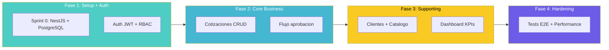
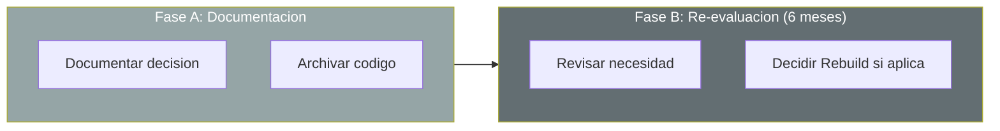
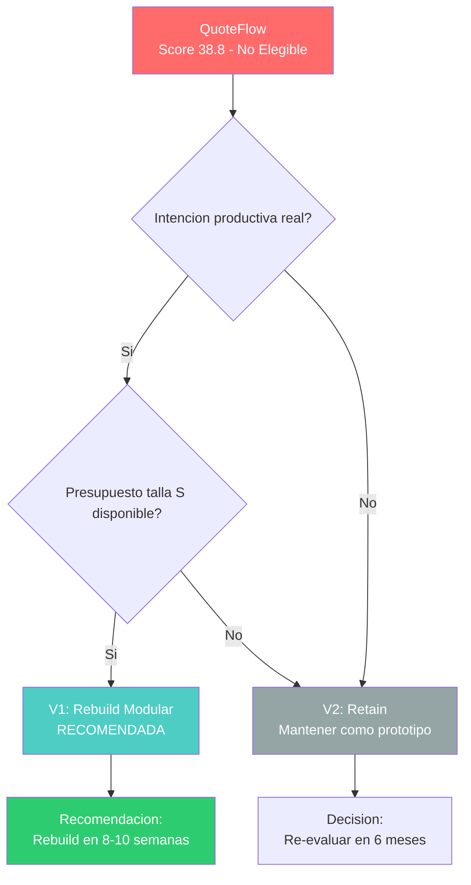

# Variantes de Modernización 7R

---

> **Score Final:** 38.8 / 100 — No Elegible  
> **Complexity:** 1.5 (Deuda Muy Alta)  
> **Score Deuda:** 85  
> **Stack actual:** TypeScript 3.9-4.3 + Angular 12 + Express 4.16 + In-memory  
> **Stack objetivo (definido por cliente):** [PENDIENTE — no definido]

---

## Contexto para la Selección de Variantes

### Factores determinantes

1. **No hay producción activa** — la app es un prototipo educativo, eliminando riesgo de interrupción de servicio
2. **1,578 LOC efectivas** — extremadamente pequeño, hace viable un rebuild completo en talla S
3. **0% tests + 0 seguridad + 0 persistencia** — no hay base salvable sobre la cual refactorizar
4. **Legacy Readiness D en componentes core** — los god modules no tienen seams para extraer
5. **Sin integraciones externas** — no hay contratos ni dependencias que preservar

### Variantes descartadas y razón

| Variante | Razón de descarte |
|---|---|
| Retire | El concepto funcional (cotizaciones comerciales) tiene valor — solo la implementación es descartable |
| Rehost | No hay infraestructura que migrar — la app solo corre en localhost |
| Replatform | No hay plataforma base sobre la cual hacer platform shift (no hay BD, no hay containers, no hay cloud) |
| Refactor | Code quality 2.7/10, Legacy Readiness D, 85% deuda — refactorizar cuesta más que reescribir |
| Rearchitect | No hay arquitectura existente que rediseñar — es un God File, no un monolito con módulos |

### Variantes seleccionadas

Dado que QuoteFlow es un prototipo de 1,578 LOC sin producción, sin usuarios y sin infraestructura, las únicas opciones viables son Rebuild (reescritura completa con stack moderno) o Retain (mantener como prototipo educativo sin inversión). Se incluye Retain como variante conservadora obligatoria.

---

## Variante 1: Rebuild Modular (RECOMENDADA)

### Descripción

Reescritura completa de QuoteFlow usando stack moderno (Angular 17+ o React, NestJS, PostgreSQL) preservando los requerimientos funcionales identificados en el Event Storming AS-IS. Se construye con arquitectura modular, seguridad by-design y CI/CD desde Sprint 0.

### Estrategia de Ejecución

El rebuild se ejecuta en 4 fases incrementales de 2-3 semanas cada una, entregando valor desde la Fase 2 (cotizaciones funcionales con auth real).

### Orden de Migración

| Orden | Módulo/Dominio | Justificación | Dependencias |
|---|---|---|---|
| 1 | Infraestructura (BD + Auth + CI/CD) | Base para todo lo demás | Ninguna |
| 2 | Cotizaciones (Core) | Dominio de mayor valor de negocio | Auth + BD |
| 3 | Clientes + Catálogo (Supporting) | Soporta cotizaciones con datos reales | BD |
| 4 | Dashboard + Hardening | Valor agregado + calidad | Todo lo anterior |

### Perfil

| Atributo | Valor |
|---|---|
| **Esfuerzo** | S |
| **WU estimados** | 5,200 (ver 01.11-Sizing) |
| **Duración** | 8–10 semanas |
| **Equipo centauro** | 1 Tech Lead + 1 Fullstack Developer + 0.5 QA |
| **Talla** | S |
| **Complejidad** | Media |
| **Riesgo** | Bajo (no hay producción que interrumpir) |

### Ventajas

- Stack completamente moderno (0 deuda técnica desde día 1)
- Seguridad by-design (JWT, RBAC, bcrypt, helmet desde Sprint 0)
- Arquitectura modular permite crecimiento futuro
- CI/CD desde Sprint 0 — cada PR se valida automáticamente
- Sin riesgo de regresión (no hay sistema en producción que romper)

### Desventajas

- Requiere descubrimiento funcional completo (reglas no documentadas)
- Mayor inversión inicial vs. mantener como prototipo
- Necesita SME funcional disponible para validar reglas de negocio
- Sin valor incremental hasta Fase 2 (semana 4-5)

### Riesgos específicos

| Riesgo | Probabilidad | Impacto | Mitigación |
|---|---|---|---|
| Reglas de negocio perdidas en la reescritura | Media | Alto | Event Storming + characterization tests del código actual |
| Scope creep (agregar features no existentes en AS-IS) | Media | Medio | Definir funcionalidades baseline en Sprint 0, no agregar extras |
| Dependencia de SME funcional no disponible | Baja | Medio | Extraer reglas del código existente como fallback |

### Prerrequisitos

1. ☐ Confirmación de intención productiva (¿es solo un ejercicio o se quiere en producción?)
2. ☐ Disponibilidad de SME funcional para Event Storming (2-3 sesiones)
3. ☐ Definición de target stack (propuesta: NestJS + Angular 17 + PostgreSQL)
4. ☐ Provisión de cuenta cloud con permisos básicos (AWS/Azure)
5. ☐ Presupuesto aprobado para talla S (~1,040 créditos)

---

## Variante 2: Retain (Conservadora)

### Descripción

Mantener QuoteFlow como está: un prototipo educativo sin producción. Se documenta la decisión, se establece fecha de re-evaluación (6-12 meses) y se mantiene como referencia conceptual sin inversión adicional.

### Estrategia de Ejecución

### Perfil

| Atributo | Valor |
|---|---|
| **Esfuerzo** | N/A |
| **WU estimados** | 0 |
| **Duración** | 0 semanas |
| **Equipo centauro** | N/A |
| **Talla** | N/A |
| **Complejidad** | N/A |
| **Riesgo** | Medio (deuda técnica no se resuelve, puede crecer si alguien intenta usar) |

### Ventajas

- Sin inversión inmediata
- Sin riesgo de proyecto
- Permite priorizar otras aplicaciones más críticas

### Desventajas

- El concepto funcional (cotizaciones) queda inutilizable para producción
- Si se decide producción después, el costo será mayor (más deuda acumulada, personas olvidaron reglas)
- Riesgo de que alguien exponga el prototipo a internet sin seguridad

### Prerrequisitos

1. ☐ Documentar la decisión de no modernizar y sus razones
2. ☐ Establecer fecha de re-evaluación (6-12 meses)
3. ☐ Asegurar que el prototipo NO se exponga a ninguna red

---

## Tabla Comparativa

| Atributo | V1: Rebuild Modular | V2: Retain |
|---|---|---|
| **Total WU** | 5,200 | 0 |
| **Duración** | 8–10 sem | 0 |
| **Equipo** | 2.5 personas | 0 |
| **Talla** | S | N/A |
| **Riesgo** | Bajo | Medio (pasivo) |
| **Valor incremental** | ✅ Desde semana 5 | ❌ Ninguno |
| **Resuelve seguridad** | ✅ Auth real by-design | ❌ Prototipo sigue inseguro |
| **Resuelve deuda** | ✅ Elimina 100% (código nuevo) | ❌ Deuda sigue creciendo |
| **SMEs requeridos** | 1 funcional (primeras 2 sem) | 0 |

---

## Árbol de Decisión

El árbol es simple: la decisión pivotea exclusivamente sobre la intención productiva del cliente. Si existe intención + presupuesto, Rebuild. Si no, Retain.

---

## Recomendación Técnica

### Variante Recomendada: V1 — Rebuild Modular

**Razones de la recomendación:**

1. **1,578 LOC efectivas** — reescribir es trivial comparado con remediar 22 hallazgos de deuda
2. **0% que preservar** — sin tests, sin seguridad, sin BD, no hay código que valga la pena mantener
3. **Riesgo mínimo** — no hay producción que interrumpir ni usuarios que migrar
4. **Valor inmediato** — un rebuild entrega app productiva en 8-10 semanas; retain no entrega nada
5. **Costo mínimo** — talla S (~1,040 créditos) es la inversión más baja posible en QAM

### Condiciones para elegir V2 (Retain)

Si se confirma CUALQUIERA de las siguientes:
- El cliente no tiene intención real de llevar QuoteFlow a producción
- No hay presupuesto disponible para ni siquiera talla S
- El concepto funcional ya fue cubierto por otro sistema existente

---

## Conclusiones

1. **Solo 2 variantes viables:** Dado el estado de prototipo (sin producción, sin usuarios, sin infraestructura), las únicas opciones son Rebuild o Retain. Las demás R no aplican.
2. **Decisión binaria:** La elección depende de una sola pregunta: ¿el cliente quiere esta funcionalidad en producción?
3. **Rebuild es de bajo riesgo:** Con 1,578 LOC, sin usuarios y sin producción, un rebuild es el escenario más simple posible — no hay coexistencia, migración de datos ni impacto operativo.
4. **Talla S = inversión mínima:** 5,200 WU / 1,040 créditos es la inversión más baja del catálogo QAM.
5. **Retain tiene riesgo pasivo:** Si alguien intenta usar el prototipo sin remediación, las vulnerabilidades son trivialmente explotables.

---

Análisis elaborado por SoftwareOne · 2026-07-22
