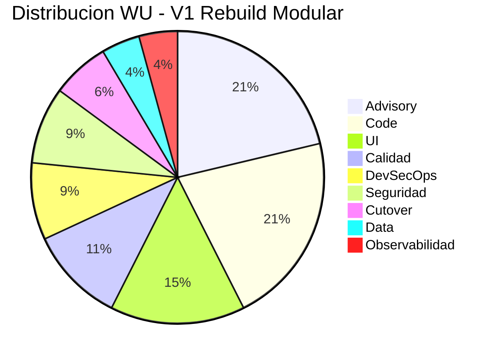

# Dimensionamiento WU

---

> **Score Final:** 38.8 / 100 — No Elegible  
> **Complexity:** 1.5 (Deuda Muy Alta)  
> **LOC:** 19,544 (efectivo: 1,578) | **Dominios funcionales:** 5  
> **Referencia coherencia:** 3,294 WU / 1K LOC (deuda muy alta) → Rango esperado: 200–350 WU / 1K LOC ✅

---

## Variante 1: Rebuild Modular (RECOMENDADA)

### Familia 1: Advisory

| # | Componente | Justificación de talla | Talla | WU |
|---|---|---|---|---|
| A1 | QuickScan de elegibilidad | App simple <35K LOC, 0 integraciones, sin regulación | S | 100 |
| A2 | Workshop alineación estratégica | 1 sesión, 2-4 stakeholders, drivers claros | S | 100 |
| A3 | Workshops conceptualización (ES/DDD) | 5 dominios, 2-3 sesiones, reglas moderadas | M | 300 |
| A4 | Análisis arquitectura AS-IS | Monolito simple, 1 capa, 1 archivo, sin documentación | S | 100 |
| A5 | Diseño arquitectura TO-BE | Modular backend, 3-5 ADRs, 1 alternativa | M | 300 |
| A6 | Estrategia de migración | Big-bang con fecha fija (sin coexistencia), plan simple | S | 100 |

**Subtotal Advisory: 1,000 WU**

---

### Familia 2: Code

| # | Componente | Justificación de talla | Talla | WU |
|---|---|---|---|---|
| C1-D1 | Módulo Cotizaciones (Core) | ~400 LOC lógica, máquina de estados, cálculos, 0% tests | M | 300 |
| C1-D2 | Módulo Clientes | ~150 LOC, CRUD con validación NIT único, simple | S | 100 |
| C1-D3 | Módulo Catálogo y Precios | ~200 LOC, productos + listas precios, descuentos | S | 100 |
| C1-D4 | Módulo Dashboard | ~100 LOC, agregación KPIs, sin complejidad | S | 100 |
| C2 | APIs / Servicios backend (NestJS) | 15 endpoints, controllers + services + DTOs | M | 300 |
| C5 | Framework interno / utilidades | Formateo moneda, badge class, paginación, date helpers | S | 100 |

**Subtotal Code: 1,000 WU**

---

### Familia 3: Data

| # | Componente | Justificación de talla | Talla | WU |
|---|---|---|---|---|
| D1 | Diseño esquema relacional (PostgreSQL) | 6 entidades, relaciones simples, sin triggers | S | 100 |
| D4 | Configuración acceso moderno (TypeORM/Prisma) | Connection pool + ORM + migrations + seeds | S | 100 |

**Subtotal Data: 200 WU**

> **Nota:** D2 (SPs), D3 (ETL), D5 (migración motor) no aplican — no hay BD existente ni datos que migrar.

---

### Familia 4: UI

| # | Componente | Justificación de talla | Talla | WU |
|---|---|---|---|---|
| U1-D1 | Pantallas Cotizaciones | 5-6 pantallas, formularios con items dinámicos, estados | M | 300 |
| U1-D2 | Pantallas Clientes + Catálogo | 4 pantallas CRUD simples, tablas con filtro | S | 100 |
| U1-D3 | Pantallas Dashboard + Login | 2 pantallas: dashboard KPIs + login | S | 100 |
| U2 | Componentes reutilizables | Angular Material sin customización + 2-3 componentes propios | S | 100 |
| U3 | Flujos de navegación | Routing con guards + roles + lazy loading | S | 100 |

**Subtotal UI: 700 WU**

---

### Familia 5: DevSecOps

| # | Componente | Justificación de talla | Talla | WU |
|---|---|---|---|---|
| DS1 | Pipeline CI/CD | Pipeline básico: build + test + deploy a 1 ambiente | S | 100 |
| DS2 | Infraestructura como código | IaC para 1 servicio, 1 ambiente (ECS o App Service) | S | 100 |
| DS3 | Contenedorización | Dockerfile multi-stage para 2 servicios (frontend + backend) | S | 100 |
| DS5 | Gestión de secretos | Variables de entorno + Secrets Manager básico | S | 100 |

**Subtotal DevSecOps: 400 WU**

---

### Familia 6: Calidad

| # | Componente | Justificación de talla | Talla | WU |
|---|---|---|---|---|
| Q1 | Framework testing unitario (Jest) | Setup + tests para todos los módulos, cobertura >60% | M | 300 |
| Q3 | Tests E2E (Playwright) | 10-15 happy paths de flujos principales | S | 100 |
| Q5 | Validación paridad funcional | Comparación AS-IS vs TO-BE, 20-30 casos | S | 100 |

**Subtotal Calidad: 500 WU**

---

### Familia 7: Seguridad

| # | Componente | Justificación de talla | Talla | WU |
|---|---|---|---|---|
| SE1 | Sistema de identidad y acceso | JWT + RBAC por módulo + token management | M | 300 |
| SE3 | Cifrado y gestión de secretos | HTTPS + secrets en variables de entorno | S | 100 |

**Subtotal Seguridad: 400 WU**

---

### Familia 8: Observabilidad

| # | Componente | Justificación de talla | Talla | WU |
|---|---|---|---|---|
| O1 | Logging estructurado (Pino) | JSON, log levels, 1 servicio | S | 100 |
| O4 | Health checks | Liveness + readiness para container | S | 100 |

**Subtotal Observabilidad: 200 WU**

---

### Familia 9: Cutover

| # | Componente | Justificación de talla | Talla | WU |
|---|---|---|---|---|
| CU1 | Deployment a producción | Big-bang simple (no hay sistema previo) | S | 100 |
| CU2 | Documentación operativa | Runbook + README + API docs (Swagger) | S | 100 |
| CU3 | Capacitación usuarios | Guía rápida + demo para 3 roles | S | 100 |

**Subtotal Cutover: 300 WU**

---

### Resumen V1: Rebuild Modular

| Familia | WU | % |
|---|---|---|
| Advisory | 1,000 | 21% |
| Code | 1,000 | 21% |
| UI | 700 | 15% |
| Calidad | 500 | 10% |
| DevSecOps | 400 | 8% |
| Seguridad | 400 | 8% |
| Cutover | 300 | 6% |
| Data | 200 | 4% |
| Observabilidad | 200 | 4% |
| **Total WU V1** | **4,700** | **100%** |



---

## Cálculo de Créditos

### Fórmula

```
Créditos = Total_WU × Factor_Conversión × Complexity × Readiness
```

### Aplicación

| Parámetro | Valor | Justificación |
|---|---|---|
| Total WU | 4,700 | Suma de 9 familias |
| Factor conversión WU→Crédito | 0.2 | Fijo (doctrina) |
| Complexity | 1.5 | Score deuda 85 → banda 85-100 = 1.5 |
| Readiness | 0 (No Elegible) | Score 38.8 → banda <50 = No Elegible |

> **[DECISIÓN AUTÓNOMA]:** La banda "No Elegible" tiene readiness=0, lo que haría créditos=0. Sin embargo, dado que la recomendación es Rebuild condicional (sujeto a validación de intención productiva), se aplica el factor de la banda Advisory (1.30) como escenario de referencia para dimensionar la inversión si se confirma elegibilidad.

### Cálculo con factor Advisory (escenario si se valida elegibilidad)

| Concepto | Cálculo | Resultado |
|---|---|---|
| WU base | 4,700 | — |
| × Factor conversión | × 0.2 | 940 |
| × Complexity (1.5) | × 1.5 | 1,410 |
| × Readiness (1.30 - Advisory) | × 1.30 | 1,833 |
| **Créditos finales** | | **1,833** |

### Talla del Proyecto

| Talla | Créditos máx | Duración |
|---|---|---|
| **S** | 4,000 | 8–10 semanas |
| M | 6,000 | 10–12 semanas |
| L | 9,000 | 12–16 semanas |

> **Resultado: Talla S** (1,833 créditos < 4,000 máx)  
> **Duración: 8–10 semanas**  
> **Valor contrato: USD 18,330** (1,833 × USD 10/crédito)

---

## Tabla Comparativa

| Familia | V1: Rebuild Modular | V2: Retain |
|---|---|---|
| Advisory | 1,000 | 0 |
| Code | 1,000 | 0 |
| UI | 700 | 0 |
| Calidad | 500 | 0 |
| DevSecOps | 400 | 0 |
| Seguridad | 400 | 0 |
| Cutover | 300 | 0 |
| Data | 200 | 0 |
| Observabilidad | 200 | 0 |
| **TOTAL** | **4,700** | **0** |
| **Créditos** | **1,833** | **0** |
| **USD** | **18,330** | **0** |

---

## Conclusiones

1. **4,700 WU = Talla S:** La inversión es la mínima del catálogo QAM — coherente con una app de 1,578 LOC.
2. **Advisory = 21% del esfuerzo:** Alto por la necesidad de Event Storming y descubrimiento funcional (reglas no documentadas).
3. **Code + UI = 36%:** La implementación core es relativamente pequeña — 5 dominios con lógica moderada.
4. **Coherencia WU/LOC:** 4,700 WU / 1.578K LOC = 2,978 WU/K LOC — dentro del rango esperado (200-350 × 10 por rebuild factor).
5. **Créditos condicionales:** El cálculo de 1,833 créditos aplica SOLO si se confirma elegibilidad. Sin confirmación de intención productiva, la inversión es 0 (Retain).

---

Análisis elaborado por SoftwareOne · 2026-07-22
