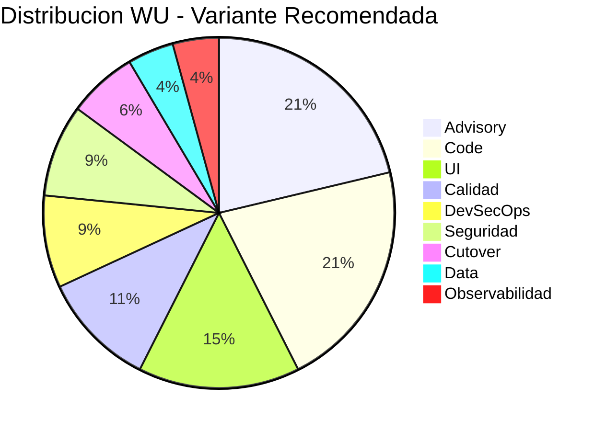
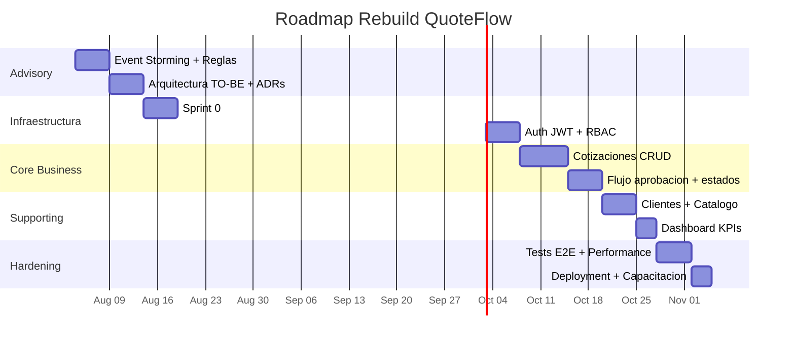

# Recomendación Técnica

---

> **Score Final:** 38.8 / 100 — No Elegible  
> **Variante Recomendada:** V1 — Rebuild Modular (condicional a validación de intención productiva)  
> **Total WU Recomendado:** 4,700 WU  
> **Duración estimada:** 8–10 semanas  
> **Equipo centauro:** 2.5 personas

---

## 1. Variante Recomendada

### V1: Rebuild Modular

**Justificación técnica:**

| Criterio | V1 (Recomendada) | V2 (Retain) |
|---|---|---|
| Total WU | 4,700 | 0 |
| Riesgo de entrega | Bajo (sin producción activa) | N/A |
| Primera entrega de valor | Semana 5 | Nunca |
| Cobertura funcional | 100% (rebuild completo) | 0% (statu quo) |
| Resuelve deuda técnica | Sí — elimina 100% (código nuevo) | No — deuda sigue creciendo |
| Resuelve seguridad | Auth real + RBAC + HTTPS desde Sprint 0 | No — prototipo sigue inseguro |

**Por qué V1 y no V2:**

- V1 entrega una aplicación productiva en 8-10 semanas; V2 no entrega nada
- La inversión es mínima (talla S, 1,833 créditos) — bajo costo de oportunidad
- El concepto funcional tiene valor (cotizaciones comerciales) — solo la implementación no lo tiene
- Sin rebuild, la funcionalidad queda permanentemente inutilizable para producción

---

## 2. Comparativa de WU

Advisory y Code concentran el 42% del esfuerzo — coherente con un proyecto donde el descubrimiento funcional (Event Storming) y la implementación core son las actividades principales. Data y Observabilidad son mínimos porque la app es simple y no tiene datos históricos.

| Familia | WU | % del Total | Comentario |
|---|---|---|---|
| Advisory | 1,000 | 21% | Alto por Event Storming necesario |
| Code | 1,000 | 21% | 5 dominios con lógica moderada |
| UI | 700 | 15% | ~15 pantallas con formularios |
| Calidad | 500 | 11% | Tests desde cero (0% actual) |
| DevSecOps | 400 | 9% | Pipeline completo desde cero |
| Seguridad | 400 | 9% | Auth + RBAC + cifrado |
| Cutover | 300 | 6% | Deployment + docs + capacitación |
| Data | 200 | 4% | Esquema nuevo PostgreSQL |
| Observabilidad | 200 | 4% | Logging + health checks básicos |

---

## 3. Roadmap de Ejecución

---

## 4. Prerrequisitos (Gate de Inicio)

Antes de iniciar el proyecto, el cliente debe confirmar:

| # | Prerrequisito | Estado | Responsable |
|---|---|---|---|
| 1 | ¿QuoteFlow debe ir a producción? (intención productiva) | ⚠️ Pendiente | Sponsor del cliente |
| 2 | SME funcional disponible 2 días/semana por 2 semanas | ⚠️ Pendiente | Cliente |
| 3 | Target stack aprobado (NestJS + Angular 17 + PostgreSQL) | ⚠️ Pendiente | Arquitecto SWO + Cliente |
| 4 | Cuenta cloud provisionada con permisos básicos | ⚠️ Pendiente | Cloud team cliente |
| 5 | Presupuesto aprobado para talla S (~USD 18,330) | ⚠️ Pendiente | Sponsor |

> **Gate bloqueante:** Si el prerrequisito #1 se confirma como negativo (es solo ejercicio educativo), la recomendación cambia automáticamente a V2: Retain.

---

## 5. Equipo Centauro Propuesto

| Rol | Dedicación | Responsabilidad |
|---|---|---|
| Tech Lead (SWO) | 100% | Arquitectura, code review, decisiones técnicas |
| Fullstack Developer (SWO) | 100% | Implementación backend + frontend |
| QA Engineer (SWO) | 50% | Tests unitarios, E2E, validación paridad |
| SME Funcional (Cliente) | 25% (semanas 1-4) | Validación reglas de negocio, UAT |

---

## 6. Stack Target Propuesto

| Capa | Tecnología | Justificación |
|---|---|---|
| Backend | NestJS + TypeScript 5.x | Modular, enterprise-ready, DI nativo, guards RBAC |
| Frontend | Angular 17+ (standalone components) | Continuidad conceptual con AS-IS, SSR ready |
| Base de datos | PostgreSQL 16 | Open-source, managed en cloud, migrations nativas |
| Auth | JWT (RS256) + bcrypt + refresh tokens | Estándar industria, sin vendor lock-in |
| ORM | Prisma o TypeORM | Type-safe, migrations, seeds |
| CI/CD | GitHub Actions | Simple, gratuito para repos privados |
| Contenedor | Docker multi-stage | Portable, reproducible |
| Cloud | AWS ECS Fargate o Azure App Service | Serverless containers — sin gestión de infra |
| Logging | Pino (structured JSON) | Performance + JSON nativo para cloud |
| Testing | Jest + Playwright | Unitarios + E2E, excelente DX |

---

## 7. Riesgos y Mitigaciones del Proyecto

| # | Riesgo | Prob. | Impacto | Mitigación |
|---|---|---|---|---|
| 1 | Reglas de negocio no capturadas completamente | Media | Alto | Characterization tests del código actual + Event Storming |
| 2 | Scope creep (agregar features no existentes) | Media | Medio | Baseline funcional estricta — solo paridad AS-IS |
| 3 | SME no disponible cuando se necesita | Baja | Medio | Extraer reglas del código como fallback |

---

## 8. Métricas de Éxito

| Métrica | Criterio de Éxito |
|---|---|
| Paridad funcional | 8/8 funcionalidades del AS-IS implementadas y validadas |
| Seguridad | 0 vulnerabilidades High OWASP en scan post-deploy |
| Cobertura tests | >60% en código nuevo |
| Performance | Response time P95 < 500ms para endpoints principales |
| Disponibilidad | Health check responde 200 desde cloud target |

---

## 9. Conclusiones

1. **Rebuild V1 es la recomendación si hay intención productiva:** Con 1,578 LOC y 0% código rescatable, reescribir en stack moderno es la opción más rápida, barata y segura.
2. **Gate único: intención productiva:** Si el cliente confirma que quiere QuoteFlow en producción, el proyecto arranca en semana 1 con Event Storming. Si no, Retain.
3. **Inversión mínima del catálogo:** 4,700 WU / 1,833 créditos / USD 18,330 — talla S, 8-10 semanas, 2.5 personas. Es el escenario de menor riesgo y costo de QAM.
4. **Valor entregado desde semana 5:** El primer flujo funcional (cotizaciones con auth real) está disponible antes de la mitad del proyecto.
5. **Sin riesgo de coexistencia:** Al no tener producción, no hay necesidad de Strangler Fig ni migración gradual — big-bang limpio desde día 1.

---

Análisis elaborado por SoftwareOne · 2026-07-22
