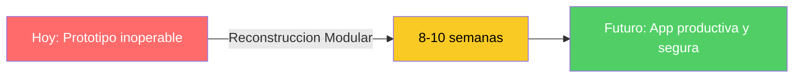
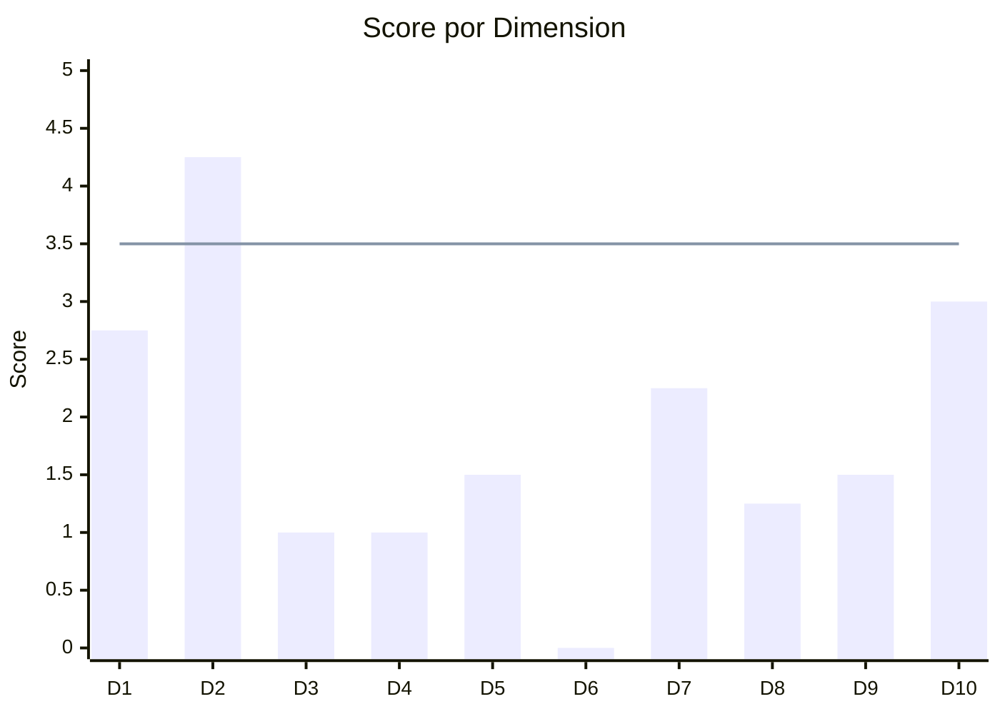
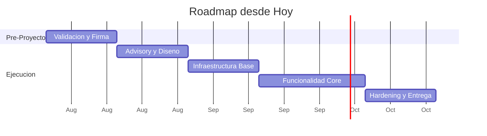
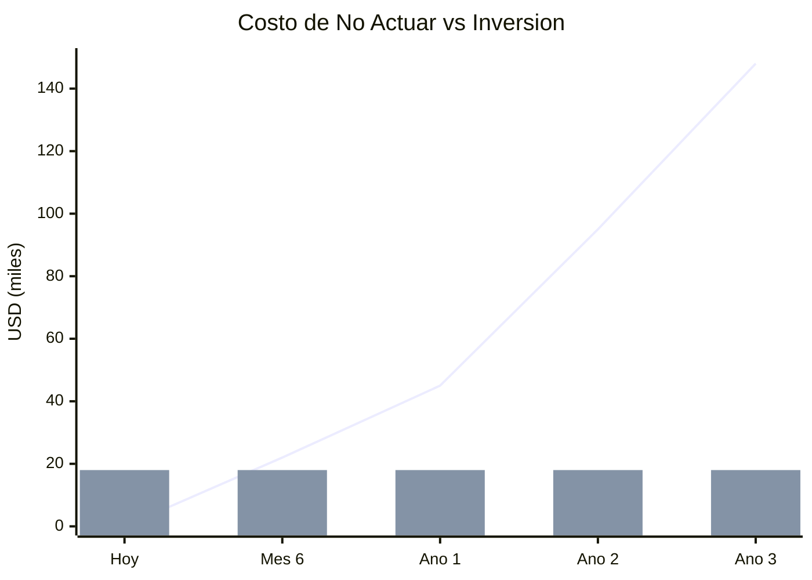

# Resumen Ejecutivo — QuoteFlow

---

> **Cliente:** SoftwareOne  
> **Aplicación:** Aplicación de cotización y gestión comercial  
> **Fecha:** 2026-07-22

---

## 1. Indicadores Clave

| Indicador | Valor |
|---|---|
| **Score** | **38.8 / 100 — No Elegible** |
| **Estrategia** | **Reconstrucción Modular** |
| **Créditos** | **1,833** |
| **Inversión** | **USD 18,330** |
| **Duración** | **8–10 semanas (+ 2 sem pre-proyecto)** |
| **ROI** | **[ESTIMADO] 190% a 3 años · equilibrio en 5 meses** |
| **Costo de no actuar** | **[ESTIMADO] USD 45,000 / año** |

---

## 2. El Problema

La aplicación de cotización y gestión comercial fue construida como prototipo de demostración. Hoy opera sin protección de datos, sin almacenamiento permanente y sobre una base que ya no recibe actualizaciones de seguridad. Si la organización necesita esta funcionalidad en producción, el estado actual impide cualquier uso real sin exponer la operación a pérdida de información y brechas de seguridad.

---

## 3. Diagnóstico (QuickScan)

| ID | Dimensión | Qué evalúa |
|---|---|---|
| D1 | Elegibilidad | Candidatura estructural para modernización |
| D2 | Código Fuente | Calidad, legibilidad y mantenibilidad |
| D3 | Arquitectura | Modularidad y desacoplamiento |
| D4 | Datos y BD | Estado del modelo de datos y acceso |
| D5 | Cloud Readiness | Preparación para infraestructura moderna |
| D6 | DevOps | Automatización del ciclo de desarrollo |
| D7 | SMEs | Disponibilidad de personas con conocimiento |
| D8 | Documentación | Existencia y calidad de documentación |
| D9 | Seguridad | Protección y cumplimiento normativo |
| D10 | Drivers | Urgencia y respaldo organizacional |

| Hallazgo crítico | Impacto |
|---|---|
| No existe almacenamiento permanente de datos | Toda la información se pierde al reiniciar el sistema |
| Sin automatización ni pruebas de calidad | Imposible desplegar cambios de forma segura |
| Seguridad inexistente en todos los niveles | Cualquier exposición a red genera riesgo inmediato |

---

## 4. Lo que Proponemos

| Aspecto | Detalle |
|---|---|
| **Servicio** | App Modernization — Reconstrucción Modular |
| **Modelo** | Centauro (IA + Arquitectos Senior) — precio cerrado, cero true-up |
| **Alcance** | Reescritura completa con almacenamiento real, seguridad y despliegue automatizado |
| **Resultado al finalizar** | Aplicación de cotizaciones operando en producción con protección integral |
| **Garantía** | Pago por valor entregado (hitos en producción) |

---

## 5. Cómo lo Hacemos

---

## 6. Los Números

| Componente | Significado |
|---|---|
| Linea ascendente | Costo acumulado de NO actuar (crece cada año) |
| Barras constantes | Inversión en modernización (se paga una vez) |
| Punto de cruce | Equilibrio — a partir de ahí, todo es ahorro |

---

## 7. Próximo Paso

> **Acción:** Confirmar intención de llevar la aplicación a producción real  
> **Responsable:** Sponsor del proyecto  
> **Fecha:** Semana del 2026-08-04  
> **Contacto SoftwareOne:** [PENDIENTE: asignar contacto comercial]

---

## 8. En Resumen

| Pregunta | Respuesta |
|---|---|
| **¿Es urgente?** | Sí — cada mes sin actuar acumula riesgo de exposición y retraso competitivo |
| **¿Es viable?** | Sí, condicionado a confirmación de intención productiva por parte del sponsor |
| **¿Cuánto toma?** | 10-12 semanas desde la firma (incluyendo pre-proyecto) |
| **¿Cuánto cuesta?** | USD 18,330 a precio cerrado, sin costos adicionales |
| **¿Cuál es el ROI?** | [ESTIMADO] 190% a 3 años — equilibrio en 5 meses |
| **¿Qué hago ahora?** | Confirmar intención productiva y agendar reunión de validación |

---

Análisis elaborado por SoftwareOne · 2026-07-22
