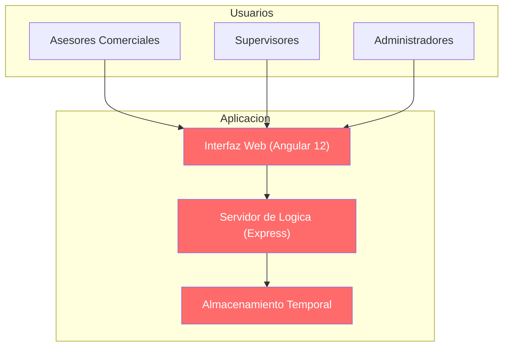
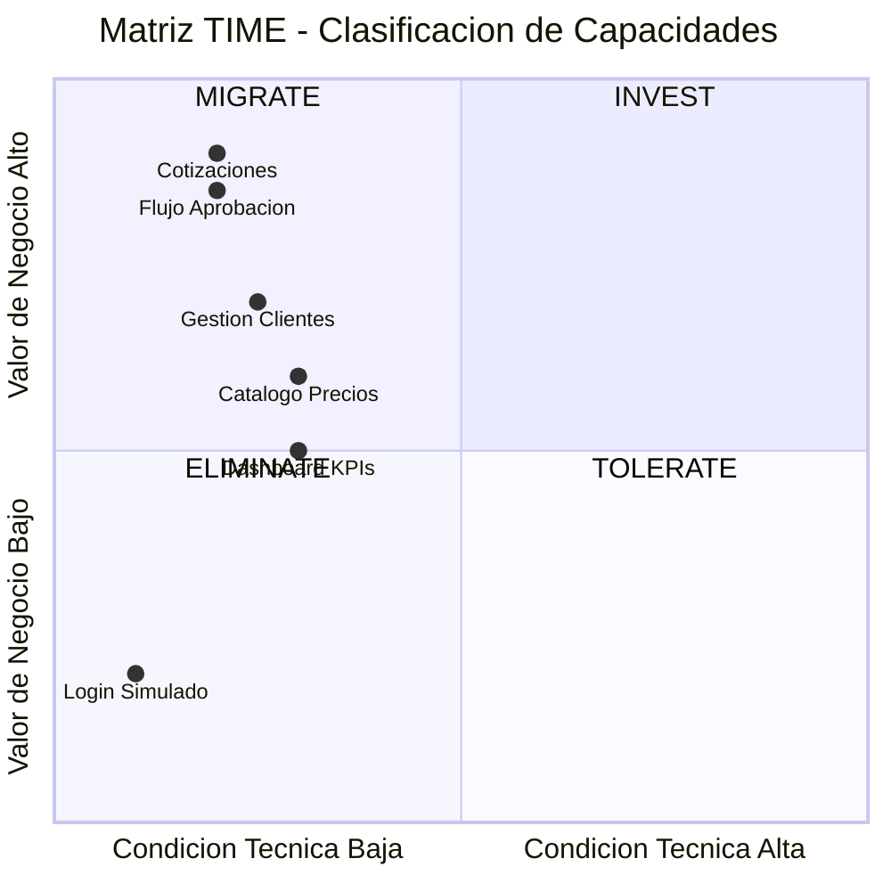
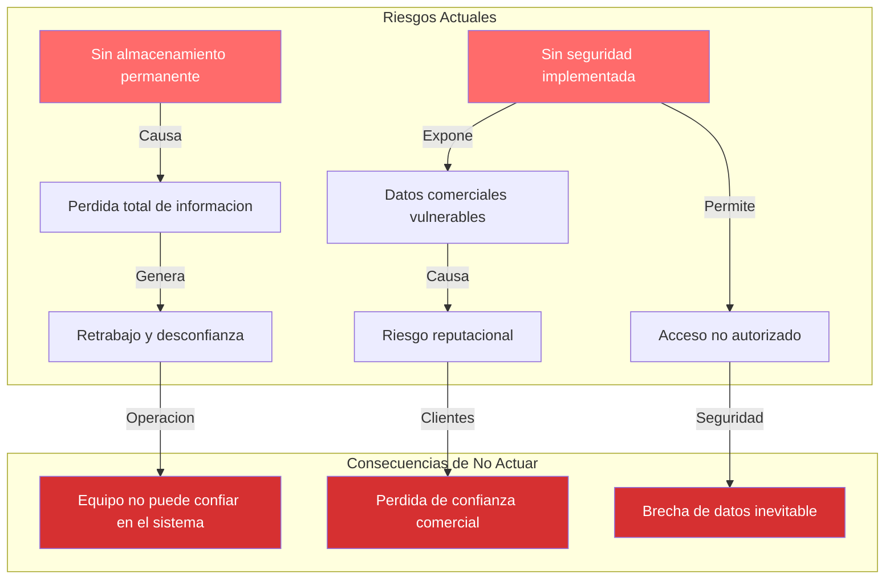

# Estado Actual — QuoteFlow

---

> **Aplicación:** Aplicación de cotización y gestión comercial  
> **Cliente:** SoftwareOne  
> **Dominio:** Cotización y gestión comercial — ciclo de vida de cotizaciones para clientes corporativos con flujo de aprobación  
> **Fecha:** 2026-07-22

---

## 1. ¿Qué hace la aplicación?

QuoteFlow gestiona el ciclo completo de cotizaciones comerciales: desde la creación por parte de asesores, pasando por la aprobación de supervisores, hasta la aceptación o rechazo por parte del cliente. Es utilizada por equipos comerciales (asesores, supervisores y administradores) para manejar clientes corporativos, catálogos de productos con listas de precios y un panel de indicadores de desempeño comercial. Soporta 6 procesos de negocio clave para la operación de ventas.

---

## 2. ¿Sobre qué opera?

La aplicación opera sobre una plataforma de desarrollo web construida hace más de 4 años, con componentes que dejaron de recibir soporte en 2022. Su arquitectura es una aplicación web de dos capas (interfaz de usuario + servidor) que se ejecuta exclusivamente en el equipo del desarrollador — no existe infraestructura de servidores ni almacenamiento en la nube.

### Arquitectura Actual (Vista Ejecutiva)

Todos los componentes del sistema están en estado de riesgo (rojo): la interfaz usa una versión sin soporte, el servidor centraliza toda la lógica en un solo archivo sin separación, y el almacenamiento es temporal — toda la información se pierde al reiniciar. No existen conexiones a sistemas externos ni bases de datos permanentes.

---

## 3. Drivers de negocio afectados

| Driver de Negocio | Estado | Descripción del impacto |
|---|---|---|
| Continuidad del Negocio | 🔴 Comprometido | Los datos de cotizaciones no sobreviven un reinicio — no hay continuidad operativa posible |
| Seguridad y Cumplimiento | 🔴 Comprometido | Sin protección de acceso, contraseñas almacenadas sin cifrar, ningún mecanismo de seguridad activo |
| Time-to-Market | 🔴 Comprometido | Sin automatización de despliegue ni pruebas — cualquier cambio toma días en lugar de minutos |
| Agilidad del Negocio | 🟡 Limitado | El concepto funcional existe pero no puede escalar ni evolucionar sobre la plataforma actual |
| Escalabilidad | 🔴 Comprometido | Diseño de una sola instancia sin posibilidad de crecimiento — no soporta más usuarios ni carga |
| Innovación y Transformación | 🟡 Limitado | La plataforma obsoleta impide adoptar capacidades modernas como análisis de datos o automatización |

---

## 4. Hallazgos principales

### 4.1 Problemas actuales

| # | Hallazgo | Criticidad | Impacto en el negocio |
|---|---|---|---|
| 1 | Información almacenada solo en memoria temporal | Alta | Toda la operación comercial se pierde al apagar el sistema |
| 2 | Sin protección de acceso ni cifrado de datos | Alta | Cualquier persona con acceso a la red puede ver y modificar toda la información |
| 3 | Plataforma sin soporte desde 2022 | Alta | Vulnerabilidades conocidas sin corrección disponible — riesgo creciente |
| 4 | Toda la lógica concentrada en un solo punto | Media | Un error en cualquier parte afecta todo el sistema — imposible mantener de forma segura |
| 5 | Sin pruebas automatizadas ni proceso de despliegue | Media | Cada cambio es un riesgo — no hay forma de validar que funciona antes de entregarlo |

### 4.2 Fortalezas identificadas

| # | Fortaleza | Por qué importa |
|---|---|---|
| 1 | Código fuente disponible y compilable | Permite extraer todas las reglas de negocio para la reconstrucción |
| 2 | Funcionalidad clara y bien definida | Los 6 procesos de negocio están implementados y son comprensibles |
| 3 | Tamaño muy pequeño (aplicación compacta) | Hace viable la reconstrucción completa en pocas semanas con bajo riesgo |

---

## 5. Matriz TIME — Clasificación de Capacidades

| Cuadrante | Capacidad | Justificación |
|---|---|---|
| **MIGRATE** | Cotizaciones (ciclo de vida completo) | Máximo valor de negocio sobre plataforma en estado crítico — prioridad 1 de reconstrucción |
| **MIGRATE** | Flujo de aprobación | Proceso crítico para control de calidad comercial, inoperable sin seguridad |
| **MIGRATE** | Gestión de clientes | Soporte esencial para cotizaciones, necesita persistencia real |
| **MIGRATE** | Catálogo y precios | Datos maestros necesarios para operación, requiere almacenamiento permanente |
| **TOLERATE** | Dashboard de indicadores | Valor informativo, puede construirse al final |
| **ELIMINATE** | Autenticación simulada | Sin valor — debe reemplazarse completamente por seguridad real |

---

## 6. Impacto del Negocio (Riesgos)

| # | Riesgo actual | Consecuencia si se materializa | Áreas afectadas |
|---|---|---|---|
| 1 | Datos se pierden al reiniciar el sistema | Pérdida total de cotizaciones, clientes y catálogos — retrabajo masivo | Operaciones / Ventas |
| 2 | Sin protección contra acceso no autorizado | Exposición de datos comerciales sensibles, modificación maliciosa | Seguridad / Reputación |
| 3 | Plataforma sin actualizaciones de seguridad | Explotación de vulnerabilidades conocidas si se conecta a red | Seguridad / Cumplimiento |

### Cadena de impacto: Riesgos → Consecuencias

Los riesgos más graves son la ausencia total de persistencia y de seguridad. Ambos hacen que la aplicación sea inutilizable para cualquier propósito productivo real. La cadena de consecuencias lleva inevitablemente a la imposibilidad de operación.

---

## 7. Estado Actual vs Estado Deseado

| Dimensión | Hoy | Después de Modernizar |
|---|---|---|
| Elegibilidad | Prototipo educativo sin producción | Aplicación productiva y vigente |
| Código Fuente | Compilable pero con stack sin soporte | Stack moderno con soporte activo |
| Arquitectura | Todo en un solo archivo, sin separación | Modular y desacoplado por dominio |
| Datos y BD | Solo memoria temporal, datos efímeros | Base de datos permanente con respaldos |
| Cloud Readiness | Solo funciona en máquina local | Nativo en la nube, disponible siempre |
| DevOps | Sin automatización, despliegue manual | Automatizado en minutos con validación |
| SMEs y Conocimiento | Concentrado en el código fuente | Documentado y transferible |
| Documentación | Inexistente | Actualizada y accesible |
| Seguridad | Sin protección alguna | Protección integral con cifrado |
| Drivers de Negocio | Urgencia alta sin plan de acción | Plan ejecutado con resultados |

---

## Conclusiones

1. **Sistema inutilizable para producción:** El estado actual impide cualquier uso comercial real — los datos son temporales y la seguridad es inexistente.
2. **Drivers críticos comprometidos:** Continuidad, seguridad, escalabilidad y velocidad de entrega están todos en estado de riesgo.
3. **Fortaleza principal: tamaño compacto y funcionalidad clara:** La aplicación es suficientemente pequeña para reconstruirse completamente en semanas, no meses.
4. **Riesgo de exposición accidental:** Si alguien conecta el prototipo a una red sin remediación, las consecuencias son inmediatas e irrecuperables.
5. **Camino claro:** La funcionalidad tiene valor de negocio — solo la implementación necesita reemplazarse por completo.

---

Análisis elaborado por SoftwareOne · 2026-07-22
