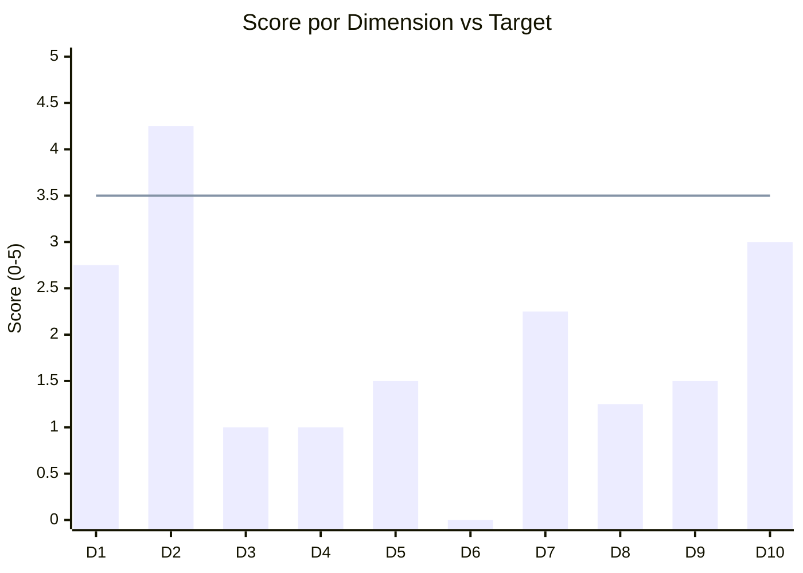
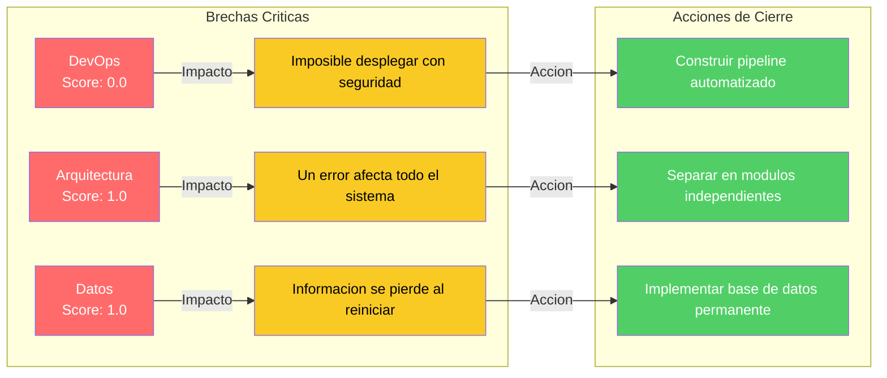

# Radar de Brechas — QuoteFlow

---

> **Aplicación:** Aplicación de cotización y gestión comercial  
> **Cliente:** SoftwareOne  
> **Score Final:** 38.8 / 100 — No Elegible  
> **Fecha:** 2026-07-22

---

## 1. Contextualización

Las 10 dimensiones evaluadas representan las capacidades clave que una aplicación necesita para ser modernizada con éxito:

| # | Dimensión | ¿Qué evalúa? |
|---|---|---|
| 1 | Elegibilidad | Si la aplicación es candidata estructural para modernización |
| 2 | Código Fuente | Calidad, legibilidad y mantenibilidad del código actual |
| 3 | Arquitectura | Nivel de modularidad y desacoplamiento del sistema |
| 4 | Datos y BD | Estado del modelo de datos y acceso a la información |
| 5 | Cloud Readiness | Preparación para operar en infraestructura moderna |
| 6 | DevOps | Automatización del ciclo de desarrollo y despliegue |
| 7 | SMEs y Conocimiento | Disponibilidad de personas que conocen el sistema |
| 8 | Documentación | Existencia y calidad de documentación funcional y técnica |
| 9 | Seguridad | Protección contra amenazas y cumplimiento normativo |
| 10 | Drivers de Negocio | Urgencia y respaldo organizacional para modernizar |

---

## 2. Radar Visual de Brechas

Las barras que no alcanzan la línea de referencia (3.5) representan **brechas** que el proyecto de modernización debe cerrar. Solo una dimensión (Código Fuente) supera el umbral aceptable.

---

## 3. Tabla de Scores por Dimensión

| # | Dimensión | Score | Peso | Clasificación |
|---|---|---|---|---|
| 1 | Elegibilidad | 2.75 | 12% | Brecha moderada |
| 2 | Código Fuente | 4.25 | 12% | Fortaleza |
| 3 | Arquitectura | 1.00 | 12% | Brecha crítica |
| 4 | Datos y BD | 1.00 | 10% | Brecha crítica |
| 5 | Cloud Readiness | 1.50 | 10% | Brecha moderada |
| 6 | DevOps | 0.00 | 8% | Brecha crítica |
| 7 | SMEs y Conocimiento | 2.25 | 12% | Brecha moderada |
| 8 | Documentación | 1.25 | 8% | Brecha crítica |
| 9 | Seguridad | 1.50 | 8% | Brecha moderada |
| 10 | Drivers de Negocio | 3.00 | 8% | Aceptable |

---

## 4. Brechas que Requieren Cierre

### Top-3 Brechas Críticas

| # | Dimensión | Score | Impacto en el negocio | Acción de cierre |
|---|---|---|---|---|
| 1 | DevOps (D6) | 0.00 | Sin forma de desplegar cambios ni validar calidad — proceso completamente manual y riesgoso | Construir automatización completa desde cero como parte del proyecto |
| 2 | Arquitectura (D3) | 1.00 | Todo concentrado en un punto — cualquier error o cambio afecta la totalidad del sistema | Reconstruir con separación por dominios de negocio |
| 3 | Datos y BD (D4) | 1.00 | Sin almacenamiento permanente — la operación comercial no puede funcionar sobre datos temporales | Implementar base de datos con respaldos automáticos |

---

## 5. ¿Qué Significa Esto?

### Brechas que se solucionan en el proyecto de modernización

- **DevOps (0.00):** Se construye automatización completa (despliegue, pruebas, validación) desde el primer día del proyecto.
- **Arquitectura (1.00):** La reconstrucción modular separa cada dominio de negocio en un módulo independiente.
- **Datos (1.00):** Se implementa base de datos permanente con esquema diseñado profesionalmente.
- **Documentación (1.25):** El proceso de reconstrucción genera documentación como subproducto natural.
- **Seguridad (1.50):** Se incorpora protección integral desde el diseño — no como parche posterior.
- **Cloud Readiness (1.50):** La aplicación se construye directamente para operar en la nube.

### Fortalezas que aceleran la ejecución

- **Código Fuente (4.25):** El código es accesible y compilable, permitiendo extraer las reglas de negocio para la reconstrucción sin adivinar.
- **Drivers de Negocio (3.00):** La urgencia técnica es alta (plataforma sin soporte desde 2022), lo que justifica la inversión.

---

## 6. Score Consolidado

| Indicador | Valor |
|---|---|
| **Score Global** | **38.8 / 100** |
| **Clasificación** | **No Elegible** |
| Brechas Críticas (score < 1.5) | 4 dimensiones |
| Brechas Moderadas (score 1.5-2.4) | 3 dimensiones |
| Aceptables (score 2.5-3.4) | 2 dimensiones |
| Fortalezas (score ≥ 3.5) | 1 dimensión |

---

## Conclusiones

1. **9 de 10 dimensiones están por debajo del umbral aceptable:** La aplicación tiene brechas en casi todas las áreas evaluadas — esto es consistente con su naturaleza de prototipo.
2. **Las 4 brechas críticas son eliminables con la reconstrucción:** DevOps, Arquitectura, Datos y Documentación se resuelven inherentemente al construir con prácticas modernas.
3. **La fortaleza en Código Fuente es clave:** Permite extraer reglas de negocio del prototipo para reconstruir sin pérdida de conocimiento.
4. **El score bajo no implica inviabilidad:** Implica que el camino es una reconstrucción (no una reparación parcial) — lo cual es coherente con el tamaño compacto de la aplicación.
5. **Todas las brechas se cierran dentro del proyecto propuesto:** No se requiere inversión adicional ni remediación previa — la reconstrucción modular resuelve el 100% de los gaps identificados.

---

Análisis elaborado por SoftwareOne · 2026-07-22
