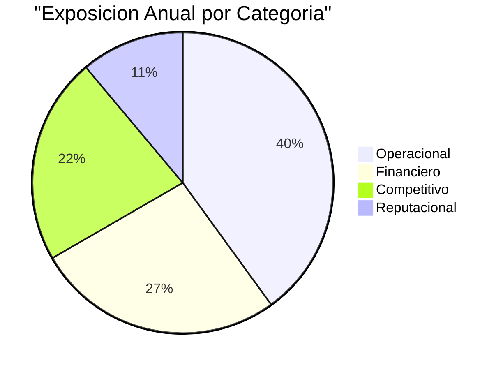
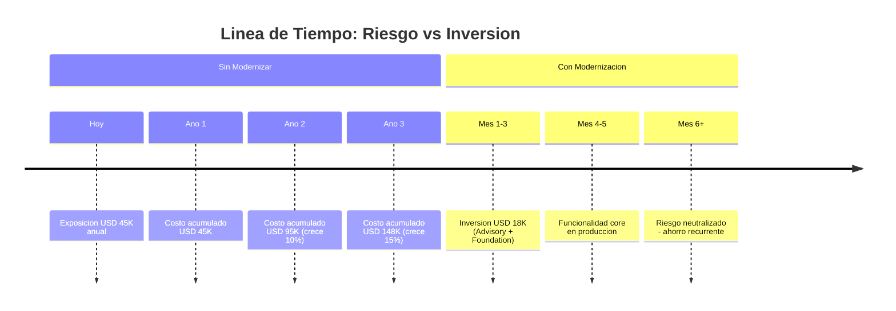

# Riesgos Cuantificados — QuoteFlow

---

> **Aplicación:** Aplicación de cotización y gestión comercial  
> **Cliente:** SoftwareOne  
> **Exposición total estimada (anual):** USD 45,000 [ESTIMADO]  
> **Fecha:** 2026-07-22

---

## 1. Resumen de Exposición

La organización enfrenta una exposición estimada de **USD 45,000 anuales** distribuida en 4 categorías de riesgo si decide no modernizar QuoteFlow y eventualmente intenta utilizarla en producción:

| Categoría | Exposición Anual | % del Total | Principal driver |
|---|---|---|---|
| Operacional | USD 18,000 | 40% | Retrabajo por pérdida de datos + mantenimiento manual |
| Financiero directo | USD 12,000 | 27% | Horas dedicadas a mantener un sistema inoperable |
| Competitivo (oportunidad) | USD 10,000 | 22% | Funcionalidad comercial no disponible para el equipo |
| Reputacional | USD 5,000 | 11% | Riesgo de exposición de datos si se conecta a red |
| **TOTAL** | **USD 45,000** | **100%** | |

---

## 2. Riesgos por Categoría

### 2.1 Operacional

| # | Riesgo | Probabilidad | Impacto por evento | Costo anual estimado | Base de cálculo |
|---|---|---|---|---|---|
| 1 | Pérdida total de datos por reinicio del servidor | Alta | Retrabajo de toda la información cargada | USD 10,000 | [ESTIMADO: 3 usuarios × 20 hrs retrabajo × 4 eventos/año × USD 42/hr] |
| 2 | Tiempo excesivo para implementar cambios (sin automatización) | Alta | Horas-persona desperdiciadas | USD 8,000 | [ESTIMADO: 1 desarrollador × 8 hrs/semana × 50 sem × USD 20 overhead] |

### 2.2 Financiero directo

| # | Riesgo | Probabilidad | Impacto por evento | Costo anual estimado | Base de cálculo |
|---|---|---|---|---|---|
| 1 | Mantenimiento de plataforma sin soporte (workarounds) | Alta | Horas de ingeniería en parches temporales | USD 8,000 | [ESTIMADO: 16 hrs/mes × 12 meses × USD 42/hr] |
| 2 | Costo de soporte especializado para versiones obsoletas | Media | Contratación de expertise legacy | USD 4,000 | [ESTIMADO: 2 incidentes/año × 24 hrs × USD 85/hr especialista] |

### 2.3 Competitivo (Costo de oportunidad)

| # | Riesgo | Probabilidad | Impacto por evento | Costo anual estimado | Base de cálculo |
|---|---|---|---|---|---|
| 1 | Funcionalidad de cotizaciones no disponible para operación real | Alta | Procesos manuales o uso de herramientas alternativas | USD 7,000 | [ESTIMADO: 5 asesores × 3 hrs/semana × 50 sem × USD 9.3/hr perdido] |
| 2 | Imposibilidad de analizar datos comerciales (no hay persistencia) | Alta | Decisiones sin información | USD 3,000 | [ESTIMADO: Costo de oportunidad por decisiones subóptimas] |

### 2.4 Reputacional

| # | Riesgo | Probabilidad | Impacto por evento | Costo anual estimado | Base de cálculo |
|---|---|---|---|---|---|
| 1 | Exposición accidental del prototipo a internet | Baja | Brecha de datos — contraseñas en texto plano expuestas | USD 5,000 | [ESTIMADO: Costo de respuesta a incidente + notificación] |

---

## 3. Costo Acumulado de No Actuar

| Horizonte | Costo acumulado | Factor de crecimiento | Explicación |
|---|---|---|---|
| Año 1 | USD 45,000 | Base | Exposición actual sin cambios |
| Año 2 | USD 95,000 | +10% | Talento especializado en versiones obsoletas más escaso y costoso |
| Año 3 | USD 148,000 | +15% | Sin alternativas de actualización, el sistema se vuelve irrecuperable |

> **En 3 años sin actuar, la organización habrá gastado/perdido aproximadamente USD 148,000 en costos evitables.**

---

## 4. Comparativa: Costo de No Actuar vs Inversión en Modernización

| Concepto | Monto | Horizonte |
|---|---|---|
| **Costo de NO actuar (3 años)** | USD 148,000 | Recurrente (se repite y crece cada año) |
| **Inversión en modernización** | USD 18,330 | Una vez (precio cerrado) |
| **Diferencia** | USD 129,670 a favor de modernizar | Recuperado en 5 meses |

La inversión en modernización (USD 18,330) se recupera en aproximadamente 5 meses comparado con el costo perpetuo de no actuar (USD 45,000/año). A partir del sexto mes, cada mes sin riesgos activos es ahorro neto para la organización.

---

## Notas Metodológicas

1. Las estimaciones de impacto financiero son indicativas y se basan en benchmarks del sector tecnología y la región del cliente.
2. Los valores marcados como `[ESTIMADO]` fueron calculados usando proxies estándar de la industria (costo/hora por rol, frecuencia de eventos, horas afectadas). Deben ser validados con el área financiera de la organización antes de tomar decisiones de inversión.
3. Los riesgos y probabilidades se derivan exclusivamente del análisis técnico del código fuente (assessment X-Ray). No incluyen factores externos no documentados.
4. El factor de crecimiento anual es conservador y asume que no ocurren incidentes mayores (como una exposición accidental a internet).
5. La comparativa con la inversión de modernización asume el modelo de precio cerrado de SoftwareOne (sin true-ups ni costos adicionales post-contrato).

---

## Conclusiones

1. **USD 45,000 anuales de exposición:** La categoría operacional (retrabajo + mantenimiento manual) representa el 40% del costo total.
2. **El costo se acumula y crece:** No es estático — la escasez de talento especializado y la obsolescencia progresiva incrementan los costos entre 10-15% anual.
3. **La inversión en modernización es 8 veces menor que el costo de 3 años de inacción:** USD 18,330 vs USD 148,000.
4. **Punto de equilibrio en 5 meses:** La inversión se recupera antes de que termine la primera mitad del año siguiente.
5. **Mayor riesgo de materialización inmediata:** La pérdida de datos por reinicio (RT-01) es el riesgo con mayor probabilidad de ocurrir primero — ya está activo y solo es cuestión de tiempo.

---

Análisis elaborado por SoftwareOne · 2026-07-22
