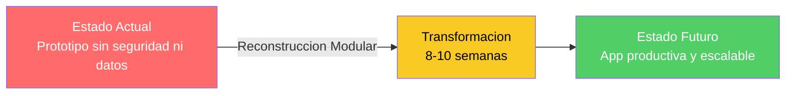
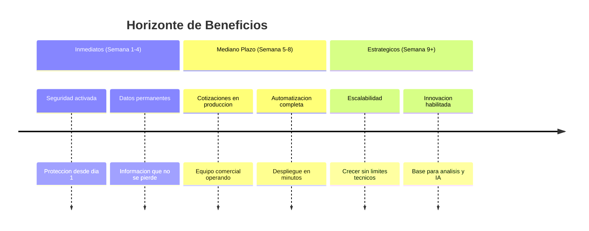
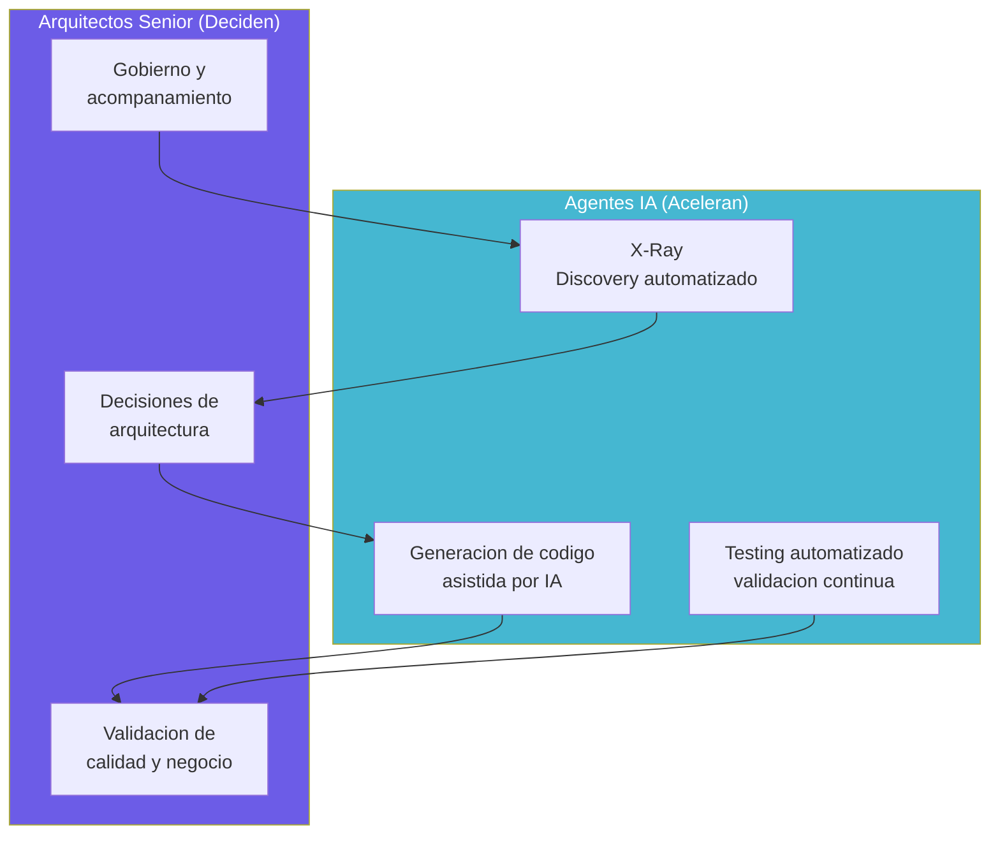

# Oportunidad de Modernización — QuoteFlow

---

> **Aplicación:** Aplicación de cotización y gestión comercial  
> **Cliente:** SoftwareOne  
> **Variante recomendada:** Reconstrucción Modular  
> **Fecha:** 2026-07-22

---

## 1. Visión del Estado Futuro

### "De Prototipo Inoperable a Herramienta Comercial Productiva"

La reconstrucción de QuoteFlow transforma un concepto funcional válido — pero inutilizable — en una aplicación de cotizaciones lista para producción. El equipo comercial pasa de depender de procesos manuales a contar con una herramienta segura, disponible desde cualquier lugar y con datos permanentes que permiten tomar decisiones informadas.

---

## 2. Beneficios por Driver de Negocio

| Driver de Negocio | Beneficio concreto | Hoy | Después | Mejora |
|---|---|---|---|---|
| Continuidad del Negocio | Datos permanentes con respaldo | Información se pierde al reiniciar | Almacenamiento permanente con backup | De temporal a permanente |
| Seguridad y Cumplimiento | Protección integral de acceso | Sin protección alguna | Cifrado + control de acceso por rol | De cero a completo |
| Time-to-Market | Despliegue automatizado | Proceso manual sin validación | Automatizado con validación en minutos | De horas a minutos |
| Escalabilidad | Infraestructura en la nube | Solo funciona en una máquina local | Auto-escalable según demanda | De fijo a elástico |
| Agilidad del Negocio | Evolución independiente por módulo | Un cambio afecta todo | Módulos independientes | De riesgoso a seguro |
| Innovación | Base para análisis de datos | Sin datos históricos | Datos acumulados para inteligencia | De imposible a habilitado |

---

## 3. ¿Por Qué App Modernization con SoftwareOne?

### El Modelo Centauro: IA + Arquitectos Senior

**¿Por qué funciona para QuoteFlow?**

La aplicación es compacta (5 dominios funcionales) pero requiere reconstruirse completamente desde cero. La IA acelera la generación del nuevo código mientras los arquitectos senior validan que las reglas de negocio extraídas del prototipo se preservan correctamente. El resultado: una reconstrucción que tomaría 16-20 semanas de forma tradicional se comprime a 8-10 semanas sin sacrificar calidad.

---

## 4. Resultado Esperado

| Aspecto | Antes (Hoy) | Después (10 semanas) |
|---|---|---|
| Plataforma | Sin soporte desde 2022 | Stack moderno con soporte activo |
| Seguridad | Sin protección, contraseñas expuestas | Protección integral, cifrado completo |
| Datos | Temporales (se pierden al reiniciar) | Permanentes con respaldos automáticos |
| Despliegue | Solo en máquina del desarrollador | Automatizado en la nube |
| Monitoreo | Sin visibilidad de estado | Alertas y estado en tiempo real |
| Escalabilidad | Una sola instancia local | Nube con crecimiento automático |
| Mantenibilidad | Todo en un solo archivo | Modular, separado por dominio |
| Testing | Sin pruebas automatizadas | Más del 60% de cobertura automatizada |

---

## 5. Ventana de Oportunidad

El momento de actuar es ahora. La plataforma actual dejó de recibir actualizaciones de seguridad en 2022 — cada mes que pasa incrementa la brecha entre lo que el sistema necesita y lo que su tecnología puede ofrecer. Además, el conocimiento de las reglas de negocio implementadas en el código aún es accesible — pero este conocimiento se degrada con el tiempo a medida que las personas involucradas cambian de rol o proyecto.

**Factores de urgencia:**

- La plataforma base no recibe correcciones de seguridad desde hace más de 3 años
- El tamaño compacto de la aplicación hace que HOY sea viable reconstruirla en talla mínima — esperar puede agregar complejidad
- El concepto funcional está claro y extraíble del código actual — si se pierde esta ventana, se requiere descubrimiento funcional desde cero

---

## Conclusiones

1. **De prototipo a producción en 8-10 semanas:** La reconstrucción entrega una aplicación completa, segura y escalable en el plazo más corto posible.
2. **Todos los drivers críticos se resuelven:** Continuidad, seguridad, velocidad y escalabilidad pasan de estado comprometido a cubierto.
3. **El modelo centauro reduce el timeline a la mitad:** IA acelera la generación de código mientras arquitectos validan calidad y reglas de negocio.
4. **La ventana es ahora:** Tamaño compacto + conocimiento accesible + talla mínima = momento óptimo para actuar.
5. **Base para el futuro:** Una vez reconstruida, la aplicación queda habilitada para crecer con nuevas funcionalidades, análisis de datos y capacidades de inteligencia artificial.

---

Análisis elaborado por SoftwareOne · 2026-07-22
