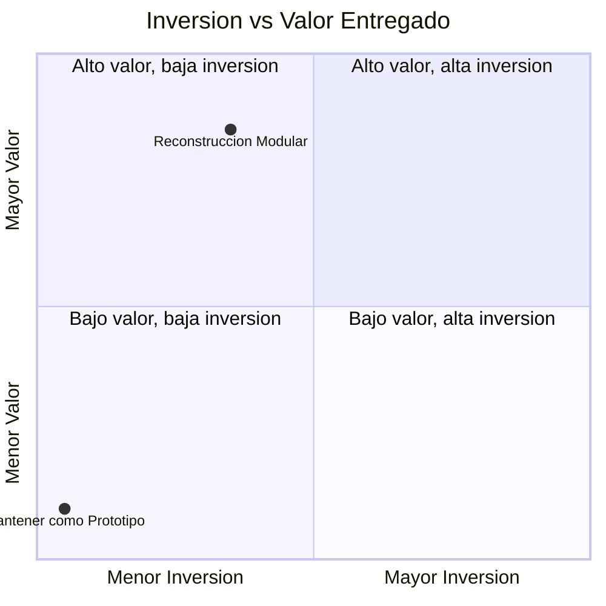
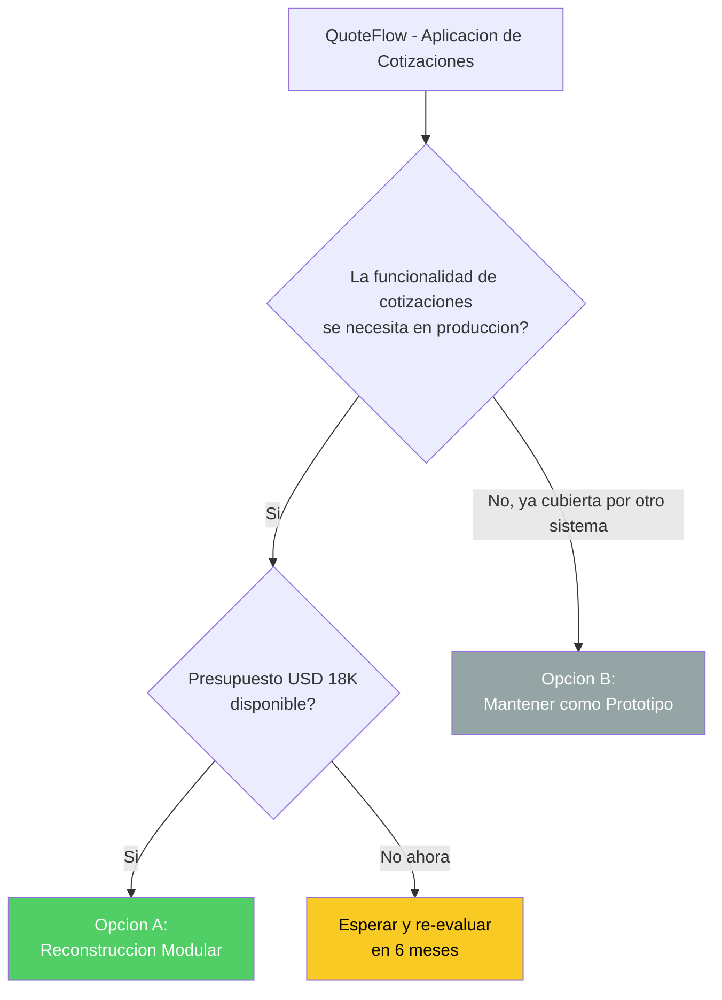

# Opciones y Caminos — QuoteFlow

---

> **Aplicación:** Aplicación de cotización y gestión comercial  
> **Cliente:** SoftwareOne  
> **Opciones evaluadas:** 2  
> **Fecha:** 2026-07-22

---

## 1. ¿Qué opciones existen?

La evaluación de QuoteFlow identifica 2 caminos posibles, cada uno con un balance diferente entre inversión, valor entregado y riesgo:

- **Opción A: Reconstrucción Modular** — Se construye la aplicación desde cero con tecnología moderna, preservando toda la funcionalidad de cotizaciones pero sobre una base segura, escalable y automatizada.
- **Opción B: Mantener como Prototipo** — Se deja la aplicación en su estado actual como referencia conceptual sin inversión. Se documenta la decisión y se re-evalúa en 6-12 meses.

La Opción A ofrece el mejor balance: inversión moderada (talla mínima del catálogo) con valor máximo (aplicación productiva completa). La Opción B no tiene inversión pero tampoco entrega valor — la funcionalidad permanece inutilizable.

---

## 2. Detalle de Opciones

### Opción A: Reconstrucción Modular

| Aspecto | Detalle |
|---|---|
| **Qué se hace** | Se reconstruye la aplicación completa con plataforma moderna: almacenamiento permanente, seguridad real, despliegue automatizado y arquitectura por módulos |
| **Duración** | 8–10 semanas |
| **Talla** | S (la mínima del catálogo) |
| **Inversión** | USD 18,330 (1,833 créditos) |
| **Resultado** | Aplicación de cotizaciones operando en producción con protección integral y datos permanentes |
| **Deuda resuelta** | 100% — se elimina por completo (código nuevo desde cero) |
| **Riesgo de ejecución** | Bajo — no hay sistema en producción que interrumpir ni datos que migrar |
| **Ideal para** | Organizaciones que necesitan esta funcionalidad comercial en producción real |

### Opción B: Mantener como Prototipo

| Aspecto | Detalle |
|---|---|
| **Qué se hace** | Se documenta la decisión de no invertir, se archiva el código y se establece una fecha de re-evaluación |
| **Duración** | 0 semanas |
| **Talla** | No aplica |
| **Inversión** | USD 0 |
| **Resultado** | El prototipo permanece como está — sin uso productivo posible |
| **Deuda resuelta** | 0% — los problemas persisten y pueden empeorar |
| **Riesgo de ejecución** | N/A — pero con riesgo pasivo de uso accidental sin seguridad |
| **Ideal para** | Organizaciones donde la funcionalidad ya está cubierta por otro sistema o no es prioritaria |

---

## 3. Comparación

| Aspecto | Opción A: Reconstrucción | Opción B: Mantener |
|---|---|---|
| **Qué se hace** | Aplicación nueva completa | Nada — se deja como está |
| **Duración** | 8-10 semanas | 0 |
| **Inversión (USD)** | 18,330 | 0 |
| **Talla** | S | N/A |
| **Deuda resuelta** | 100% | 0% |
| **Riesgo** | Bajo | Medio (pasivo) |
| **Primera entrega de valor** | Semana 5 | Nunca |
| **Cobertura funcional** | 100% | 0% (statu quo) |

---

## 4. Opción Recomendada

**Recomendamos la Opción A: Reconstrucción Modular.**

La funcionalidad de gestión de cotizaciones tiene valor claro para la operación comercial — 6 procesos de negocio definidos que actualmente no pueden usarse en producción. Con una inversión mínima (talla S, la más pequeña del catálogo) y 8-10 semanas de ejecución, la organización obtiene una aplicación productiva, segura y escalable. El riesgo de ejecución es el más bajo posible: no hay sistema en producción que interrumpir, no hay datos que migrar y el tamaño es compacto.

---

## 5. Diagrama de Decisión

La decisión pivotea sobre una sola pregunta: ¿la organización necesita gestionar cotizaciones de forma productiva? Si la respuesta es sí y hay presupuesto, la Opción A es la indicada.

---

## Conclusiones

1. **Solo 2 opciones viables:** Dado el estado de prototipo, las opciones intermedias (reparar parcialmente, actualizar gradualmente) no son aplicables — o se reconstruye o se mantiene.
2. **Opción A recomendada:** Mejor balance inversión/valor — mínima inversión del catálogo con máximo resultado (aplicación productiva completa).
3. **El trade-off de la Opción A es el descubrimiento funcional:** Requiere 2 semanas de validación de reglas de negocio con personas que conozcan la operación.
4. **La Opción B es válida si la funcionalidad no es necesaria:** Si otro sistema ya cubre cotizaciones o no es prioritario, no invertir es una decisión racional.
5. **La decisión es simple y binaria:** ¿Se necesita esta funcionalidad en producción? Sí → Opción A. No → Opción B.

---

Análisis elaborado por SoftwareOne · 2026-07-22
