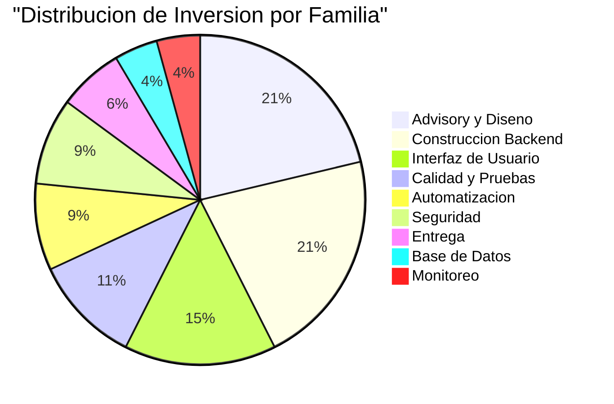
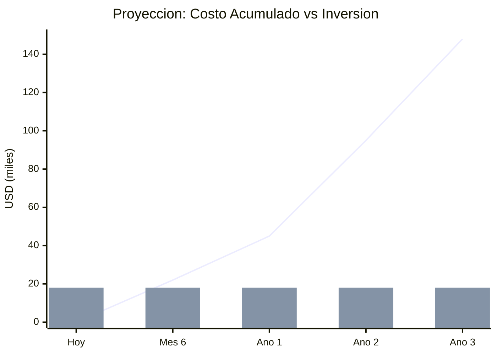
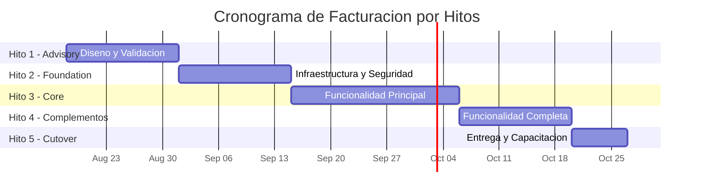

# Inversión y Retorno — QuoteFlow

---

> **Aplicación:** Aplicación de cotización y gestión comercial  
> **Cliente:** SoftwareOne  
> **Opción recomendada:** Reconstrucción Modular  
> **Fecha:** 2026-07-22

---

## 1. Resumen de Inversión

| Concepto | Valor |
|---|---|
| **Inversión total** | **USD 18,330** |
| **Créditos** | 1,833 |
| **Talla del proyecto** | S (la mínima del catálogo) |
| **Duración estimada** | 8–10 semanas |
| **Modalidad** | Precio cerrado |
| **True-up** | Cero — sin costos adicionales |
| **Modelo de pago** | Por hitos de valor entregado |

---

## 2. ¿Qué incluye la inversión?

| Fase | Entregable | Qué obtiene la organización |
|---|---|---|
| Advisory | Diseño de la solución + Plan de ejecución | Arquitectura validada y estrategia aprobada para construir |
| Infraestructura | Base de datos + Seguridad + Automatización | Ambiente productivo listo para recibir funcionalidad |
| Core | Cotizaciones + Aprobaciones + Clientes | Funcionalidad principal operando con datos permanentes y seguridad |
| Complementos | Catálogo + Dashboard + Reportes | Paridad funcional completa respecto al concepto original |
| Entrega | Despliegue + Documentación + Capacitación | Sistema en producción con soporte intensivo post-arranque |

### Distribución de la inversión

La mayor parte de la inversión (42%) se concentra en el diseño de la solución y la construcción del motor de negocio — coherente con un proyecto donde las reglas de cotizaciones y aprobaciones son lo más valioso. El resto se distribuye entre interfaz, calidad, automatización y seguridad.

---

## 3. ROI y Punto de Equilibrio

| Métrica | Valor |
|---|---|
| Inversión (una vez) | USD 18,330 |
| Costo de no actuar (anual) | USD 45,000 [ESTIMADO] |
| Costo de no actuar (3 años acumulado) | USD 148,000 [ESTIMADO] |
| **ROI a 3 años** | **[ESTIMADO] 708%** |
| **Punto de equilibrio** | **[ESTIMADO] 5 meses** |

> La inversión se recupera en **5 meses** — a partir de ese punto, cada mes sin riesgos activos es ahorro neto.

### Proyección ROI año a año

| Componente | Representación | Descripción |
|---|---|---|
| Línea ascendente | Costo acumulado de NO actuar | Crece año a año — incluye riesgos operacionales, retrabajo y oportunidad perdida |
| Barras constantes | Inversión en modernización | Valor constante — se paga una vez (precio cerrado) |
| Punto de cruce | Equilibrio (mes 5) | Momento donde el costo de no actuar supera la inversión — a partir de ahí, todo es ahorro |

La línea de costo de inacción cruza la barra de inversión alrededor del mes 5. A partir de ese punto, cada mes adicional sin actuar es dinero perdido que ya supera lo invertido en la solución.

---

## 4. Cronograma de Facturación

| Hito | Entregable | % | Créditos | USD | Semana |
|---|---|---|---|---|---|
| 1 | Arquitectura validada + Plan aprobado | 20% | 367 | USD 3,666 | Semana 2 |
| 2 | Ambiente productivo con seguridad configurada | 20% | 367 | USD 3,666 | Semana 4 |
| 3 | Cotizaciones + Aprobaciones operando | 30% | 550 | USD 5,500 | Semana 7 |
| 4 | Paridad funcional completa | 20% | 367 | USD 3,666 | Semana 9 |
| 5 | Sistema en producción + Capacitación | 10% | 182 | USD 1,832 | Semana 10 |
| **Total** | | **100%** | **1,833** | **USD 18,330** | |

---

## 5. Garantías del Modelo

| Garantía | Descripción |
|---|---|
| **Precio cerrado** | La inversión no cambia — sin sorpresas ni costos adicionales |
| **Cero True-up** | No hay ajustes posteriores por consumo real vs estimado |
| **Pago por valor** | Cada hito de facturación está vinculado a un entregable verificable en producción |
| **Equipo centauro dedicado** | Arquitectos senior + IA trabajando exclusivamente en el proyecto |
| **Soporte post-arranque** | Acompañamiento intensivo incluido después del primer día de operación |

---

## 6. Comparación: Invertir Ahora vs Esperar

| Aspecto | Invertir Ahora | Esperar 12 meses |
|---|---|---|
| Inversión | USD 18,330 (una vez) | USD 18,330 + aumento (talento más escaso) |
| Riesgo acumulado | Se neutraliza en 10 semanas | USD 45,000 adicional de exposición |
| Conocimiento disponible | Reglas extraíbles del código actual | Posible pérdida de contexto del prototipo |
| Plataforma | Stack moderno con soporte vigente | 12 meses más sin actualizaciones de seguridad |
| Funcionalidad comercial | Disponible en semana 5 | 12+ meses de retraso adicional |
| Costo total (3 años) | USD 18,330 | USD 148,000 (sin contar proyecto eventual) |

> **Cada mes de espera cuesta USD 3,750 en riesgos no resueltos** — equivalente al 20% de la inversión total del proyecto.

---

## 7. Notas Metodológicas

1. El ROI se calcula comparando la inversión contra el costo estimado de no actuar (documentado en el análisis de riesgos cuantificados). Las estimaciones de costo de inacción son indicativas y se basan en benchmarks del sector.
2. El punto de equilibrio asume que los riesgos se neutralizan progresivamente durante la reconstrucción — la funcionalidad core está disponible desde la semana 5.
3. El cronograma de facturación es indicativo y se formaliza en el Statement of Work (SOW). Los hitos y porcentajes pueden ajustarse durante la negociación comercial.
4. La inversión no incluye costos del lado del cliente (tiempo de personas con conocimiento del negocio, cuentas en la nube, licencias propias).
5. Los valores marcados como `[ESTIMADO]` requieren validación con el área financiera del cliente antes de formalizar la decisión.

---

## Conclusiones

1. **Inversión mínima del catálogo:** USD 18,330 es la talla más pequeña disponible — coherente con una aplicación de tamaño compacto.
2. **El modelo de precio cerrado elimina incertidumbre:** No hay costos adicionales, ajustes ni sorpresas post-firma.
3. **Equilibrio en 5 meses:** La inversión se recupera antes de que termine el primer semestre posterior al proyecto.
4. **Pago vinculado a entregables:** Cada hito de facturación corresponde a algo concreto y verificable en producción.
5. **Esperar no reduce el costo:** Lo incrementa. Cada mes de inacción equivale al 20% de la inversión total del proyecto.

---

Análisis elaborado por SoftwareOne · 2026-07-22
