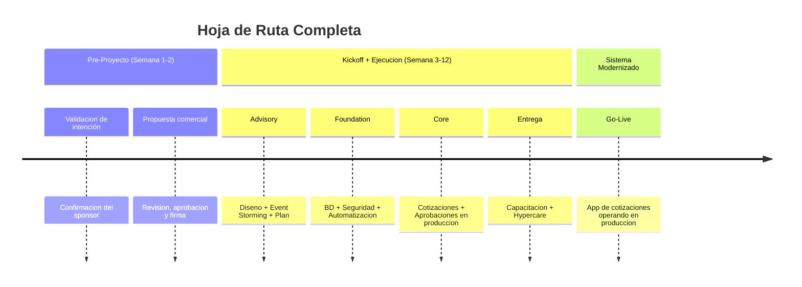
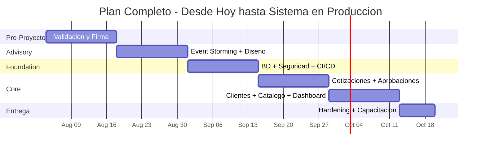

# Próximos Pasos — QuoteFlow

---

> **Aplicación:** Aplicación de cotización y gestión comercial  
> **Cliente:** SoftwareOne  
> **Opción recomendada:** Reconstrucción Modular  
> **Inversión:** USD 18,330 | **Duración:** 8–10 semanas | **Talla:** S  
> **Fecha:** 2026-07-22

---

## 1. Decisión Solicitada

**Se solicita:** Confirmación de que la funcionalidad de cotización y gestión comercial debe llevarse a producción real, para proceder con la propuesta comercial y firma del proyecto.

**¿Por qué ahora?** Cada mes de espera acumula USD 3,750 en riesgos no resueltos — equivalente al 20% de la inversión total. La ventana óptima para actuar es mientras el conocimiento del concepto funcional es accesible y el tamaño permite la talla mínima.

---

## 2. Próximos Pasos Inmediatos

### Hoja de Ruta (desde hoy)

### Detalle por paso

| Paso | Semanas | Participantes | Objetivo | Entregable |
|---|---|---|---|---|
| 1. Validación + Firma | Semana 1-2 | Sponsor + Líder de área + SoftwareOne | Confirmar intención, validar alcance, firmar acuerdo | Contrato firmado + confirmación de intención productiva |
| 2. Advisory | Semana 3-4 | Sponsor + Persona con conocimiento del negocio + SWO | Documentar reglas, diseñar solución | Arquitectura aprobada + Plan de ejecución |
| 3. Foundation | Semana 5-6 | Equipo SoftwareOne | Preparar infraestructura, seguridad, automatización | Ambiente productivo listo |
| 4. Core | Semana 7-9 | Equipo centauro | Construir cotizaciones, aprobaciones, clientes | Funcionalidad principal en producción |
| 5. Entrega | Semana 10 | Todos | Completar funcionalidad + capacitar usuarios | **Sistema completo operando** |

### Ejecución Completa (desde hoy)

---

## 3. Qué necesita SoftwareOne del cliente

| # | Prerrequisito | Responsable | Cuándo |
|---|---|---|---|
| 1 | Confirmación de intención productiva (decisión de negocio) | Sponsor del proyecto | Antes de firma |
| 2 | Persona con conocimiento del negocio disponible 2 días/semana | Líder de área comercial | Semanas 3-4 |
| 3 | Cuenta en la nube con permisos básicos (AWS o Azure) | Equipo de infraestructura | Antes de Semana 5 |
| 4 | Validación de funcionalidad construida (aceptación de usuario) | Usuarios del área comercial | Semanas 8-9 |

---

## 4. ¿Qué recibe SoftwareOne al final?

| # | Entregable | Descripción |
|---|---|---|
| 1 | Aplicación de cotizaciones en producción | Sistema completo operando en la nube con los 6 procesos de negocio |
| 2 | Seguridad integral | Control de acceso por rol, cifrado de datos, protección completa |
| 3 | Base de datos permanente | Almacenamiento con respaldos automáticos — información que no se pierde |
| 4 | Automatización completa | Cambios validados y desplegados automáticamente en minutos |
| 5 | Documentación operativa | Guías de operación + documentación de la solución |
| 6 | Capacitación para 3 roles | Formación para asesores, supervisores y administradores |

---

## 5. Acciones Inmediatas Recomendadas (Sin Costo)

Mientras se formaliza la decisión, recomendamos estas acciones que no requieren inversión:

1. **Confirmar la necesidad de negocio** — Validar con el equipo comercial si la funcionalidad de cotizaciones es necesaria para la operación o si ya está cubierta por otro sistema.
2. **Identificar a la persona con conocimiento** — Determinar quién conoce las reglas del proceso de cotizaciones y puede dedicar tiempo en las primeras 2 semanas.
3. **Asegurar que el prototipo NO se exponga a ninguna red** — Mientras no se reconstruya, cualquier exposición genera riesgo inmediato de seguridad.

---

## 6. Contacto y Siguiente Reunión

| Aspecto | Detalle |
|---|---|
| **Siguiente paso concreto** | Reunión de validación de intención productiva con el sponsor |
| **Fecha propuesta** | Semana del 2026-08-04 |
| **Participantes sugeridos** | Sponsor + Líder comercial + Contacto SoftwareOne |
| **Contacto SoftwareOne** | [PENDIENTE: asignar contacto comercial y email] |

---

## 7. Conclusiones

| Pregunta | Respuesta |
|---|---|
| **¿Es urgente?** | Sí. Cada mes de espera cuesta USD 3,750 en riesgos activos no resueltos |
| **¿Es viable?** | Sí, condicionado a confirmación de intención productiva por el sponsor |
| **¿Cuánto toma?** | 10-12 semanas desde la firma (incluyendo pre-proyecto) |
| **¿Cuánto cuesta?** | USD 18,330 a precio cerrado — sin costos adicionales |
| **¿Cuál es el ROI?** | [ESTIMADO] 708% a 3 años — equilibrio en 5 meses |
| **¿Cuál es el siguiente paso?** | Confirmar intención productiva y agendar reunión de validación semana del 2026-08-04 |

---

Análisis elaborado por SoftwareOne · 2026-07-22
