# QuoteFlow — Codebase Analysis

## Descripción

Análisis estático integral del sistema **QuoteFlow** — una aplicación de cotización y gestión comercial construida como prototipo/demostración con Angular 12 + Express 4.16 + datos in-memory.

## Estadísticas del Proyecto

| Métrica | Valor |
|---|---|
| **LOC Total (oficial)** | 19,544 (fuente: `_cloc-report.txt`) |
| **LOC Código Efectivo** | ~1,578 (TypeScript 1,508 + CSS 70) |
| **Archivos Totales** | 33 |
| **Lenguaje Principal** | TypeScript |
| **Framework Frontend** | Angular 12 (EOL) |
| **Framework Backend** | Express 4.16 (obsoleto) |
| **Base de Datos** | In-memory (arrays JS) |
| **Tests** | 0% cobertura |
| **Dependencias** | 19 (todas desactualizadas) |
| **Deuda Técnica** | 22 items (11 Alta, 7 Media, 4 Baja) |
| **Clean Code Score** | 2.7/10 |
| **Production Readiness** | 1/10 (Dangerous) |
| **Estrategia Recomendada** | Rebuild (7R) — ~36 días |

## Navegación

### Visión General
- [Project Overview](project-overview.md) — Stack, módulos, roles, LOC
- [Technical Debt Report](technical-debt-report.md) — Resumen ejecutivo de deuda
- [Specialized Documentation](specialized/specialized-documentation.md) — Integraciones y particularidades

### Arquitectura
- [System Overview](architecture/system-overview.md) — C4 Nivel 1, deployment, decisiones
- [Components](architecture/components.md) — Inventario de componentes
- [Dependencies](architecture/dependencies.md) — Grafo de dependencias
- [Patterns](architecture/patterns.md) — Patrones y anti-patrones, DDD

### Comportamiento
- [Business Logic](behavior/business-logic.md) — Reglas de negocio extraídas
- [Workflows](behavior/workflows.md) — Flujos principales del sistema
- [Decision Logic](behavior/decision-logic.md) — Lógica condicional y estados
- [Error Handling](behavior/error-handling.md) — Estrategia de manejo de errores

### Referencia
- [Program Structure](reference/program-structure.md) — Árbol del proyecto completo
- [Interfaces](reference/interfaces.md) — Contratos y APIs internas
- [Data Models](reference/data-models.md) — Modelo de datos (inferido)
- [API Reference](reference/api-reference.md) — Endpoints REST documentados
- [Modules](reference/modules.md) — Módulos funcionales

### Análisis
- [Code Metrics](analysis/code-metrics.md) — LOC, Clean Code score, distribución
- [Complexity Analysis](analysis/complexity-analysis.md) — Legacy Readiness, God Classes
- [Dependency Analysis](analysis/dependency-analysis.md) — Acoplamiento y métricas
- [Security Patterns](analysis/security-patterns.md) — STRIDE + OWASP Top 10
- [Tech Debt](analysis/tech-debt.md) — Inventario completo de deuda técnica
- [Production Readiness](analysis/production-readiness.md) — Stability patterns, scalability
- [Dependency Security Assessment](analysis/dependency-security-assessment.md) — CVEs y riesgo
- [Modernization Assessment](analysis/modernization-assessment.md) — Scorecard 8 frameworks
- [Team Structure Assessment](analysis/team-structure-assessment.md) — Fracture planes y equipos

### Base de Datos
- [Schema Analysis](database/schema-analysis.md) — Modelo de datos (in-memory)

### Diagramas
- [System Context](diagrams/architecture/system-context.md) — C4 + deployment + flujo de datos
- [Sequence Diagrams](diagrams/behavioral/sequence-diagrams.md) — 4 flujos principales
- [Component Diagrams](diagrams/structural/component-diagrams.md) — Estructura y dependencias

### Deuda Técnica
- [Summary](technical-debt/summary.md) — Distribución por severidad
- [Outdated Components](technical-debt/outdated-components.md) — Componentes EOL
- [Maintenance Burden](technical-debt/maintenance-burden.md) — Carga de mantenimiento
- [Remediation Plan](technical-debt/remediation-plan.md) — Plan con refactorings nombrados

### Migración
- [Component Order](migration/component-order.md) — Olas + Gantt + herramientas
- [Test Specifications](migration/test-specifications.md) — Characterization + target tests
- [Validation Criteria](migration/validation-criteria.md) — Definition of Done por ola

### User Stories (Backlog de Modernización)
- [Backlog](user-stories/backlog.md) — 42 HUs, story map, estimación de esfuerzo
- [Story Map Diagram](user-stories/_story-map-diagram.md) — Mapa visual de épicas y olas
- [Épica 1: Core Business](user-stories/epics/01-core-business.md) — Cotizaciones (8 HUs)
- [Épica 2: Gestión Comercial](user-stories/epics/02-integrations.md) — Clientes y Catálogo (5 HUs)
- [Épica 3: Seguridad](user-stories/epics/03-security.md) — Auth, RBAC, hardening (6 HUs)
- [Épica 4: Datos](user-stories/epics/04-data-persistence.md) — PostgreSQL, migrations, seeds (4 HUs)
- [Épica 5: Infraestructura](user-stories/epics/05-infrastructure.md) — Setup, CI/CD, Docker (4 HUs)
- [Épica 6: Observabilidad](user-stories/epics/06-observability.md) — Health, logging, docs (4 HUs)
- [Épica 7: Deuda Técnica](user-stories/epics/07-tech-debt.md) — Tests, linting, tipos (11 HUs)

## Diagrama de Navegación

```mermaid
flowchart TD
    README["README.md"]
    README --> PO["project-overview.md"]
    README --> TDR["technical-debt-report.md"]

    README --> ARCH["architecture/"]
    ARCH --> A1["system-overview"]
    ARCH --> A2["components"]
    ARCH --> A3["dependencies"]
    ARCH --> A4["patterns"]

    README --> BEH["behavior/"]
    BEH --> B1["business-logic"]
    BEH --> B2["workflows"]
    BEH --> B3["decision-logic"]
    BEH --> B4["error-handling"]

    README --> REF["reference/"]
    REF --> R1["program-structure"]
    REF --> R2["interfaces"]
    REF --> R3["data-models"]
    REF --> R4["api-reference"]
    REF --> R5["modules"]

    README --> ANA["analysis/"]
    ANA --> AN1["code-metrics"]
    ANA --> AN2["complexity-analysis"]
    ANA --> AN3["security-patterns"]
    ANA --> AN4["production-readiness"]
    ANA --> AN5["modernization-assessment"]

    README --> MIG["migration/"]
    MIG --> M1["component-order"]
    MIG --> M2["test-specifications"]
    MIG --> M3["validation-criteria"]

    style README fill:#4ecdc4,color:#000
    style ARCH fill:#45b7d1,color:#fff
    style BEH fill:#f9ca24,color:#000
    style REF fill:#6c5ce7,color:#fff
    style ANA fill:#e17055,color:#fff
    style MIG fill:#00b894,color:#fff
```

## Metodología

Este análisis fue generado por **OneClickCBA v3.5** mediante análisis estático exhaustivo del código fuente. Se leyeron el 100% de los archivos del proyecto (33/33). Cada afirmación está respaldada por evidencia de archivos específicos del repositorio.

## Referencias

- [Execution Report](_cba-execution-report.md)
