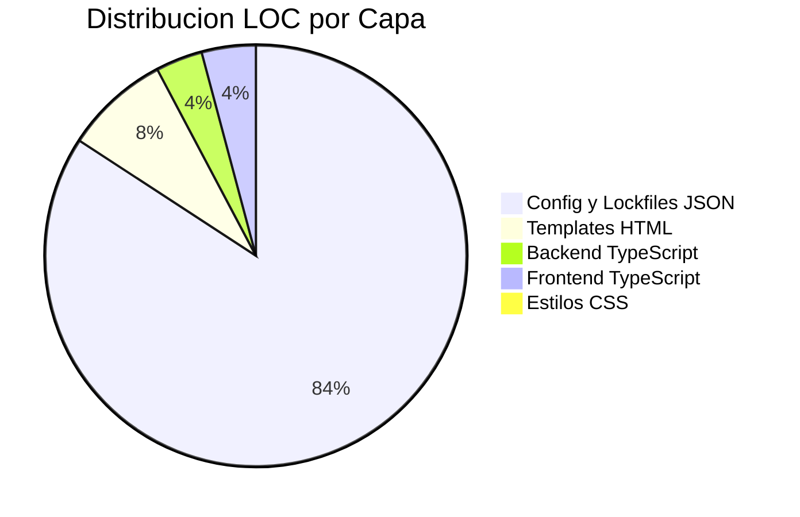
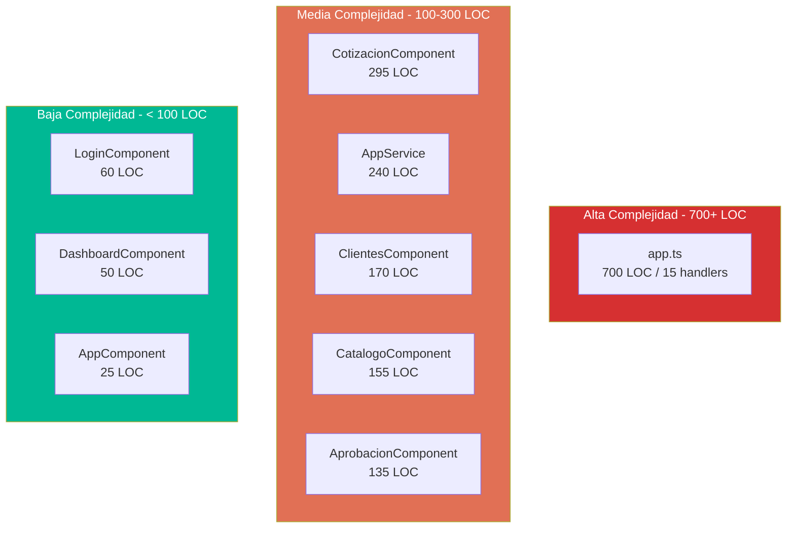

# QuoteFlow — Métricas de Código y Calidad

## LOC Oficial (desde `_cloc-report.txt`)

| Lenguaje | Archivos | Blancos | Comentarios | Código |
|----------|----------|---------|-------------|--------|
| JSON | 8 | 0 | 0 | 16,398 |
| HTML | 8 | 53 | 74 | 1,568 |
| TypeScript | 15 | 195 | 235 | 1,508 |
| CSS | 2 | 12 | 4 | 70 |
| **SUM** | **33** | **260** | **313** | **19,544** |

**LOC Total Oficial: 19,544** (desde `_cloc-report.txt`, línea SUM)

### Desglose por tipo funcional

| Categoría | LOC | % del total | Archivos |
|-----------|-----|-------------|----------|
| LOC Código backend (TypeScript) | ~700 | 3.6% | 1 (`app.ts`) |
| LOC Código frontend (TypeScript) | ~808 | 4.1% | 14 archivos |
| LOC Templates HTML | 1,568 | 8.0% | 8 archivos |
| LOC Estilos CSS | 70 | 0.4% | 2 archivos |
| LOC Config/Markup (JSON) | 16,398 | 83.9% | 8 archivos (package.json, angular.json, tsconfig, lock) |
| **LOC Código efectivo (TS + CSS)** | **1,578** | **8.1%** | **17 archivos** |

> [ESTIMADO: LOC por componente basado en conteo manual durante lectura de archivos]

## Distribución por Capa

## Métricas de API

| Métrica | Valor | Evidencia |
|---------|-------|-----------|
| Endpoints REST | 15 | `backend/src/app.ts` — 15 handlers HTTP |
| Entidades | 5 | Clientes, Productos, Listas Precios, Cotizaciones, Usuarios |
| Componentes Angular | 7 | 6 feature + 1 shell (`app.component.ts`) |
| Servicios Angular | 1 | `AppService` — God Service único |
| Módulos Angular | 1 | `AppModule` — sin lazy loading |
| Pipes/Directivas | 0 | Lógica de formateo inline en servicio |
| Interceptors | 0 | Sin manejo HTTP centralizado |
| Guards | 0 | Sin protección de rutas |

## Métricas de Complejidad por Archivo

| Archivo | LOC | Métodos | Max Nesting | Responsabilidades | God? |
|---------|-----|---------|-------------|-------------------|------|
| `backend/src/app.ts` | ~700 | 15 handlers | 4 | 8+ (auth, CRUD×4, dashboard, middleware, datos) | ✅ |
| `app.service.ts` | ~240 | 18 | 3 | 6 (auth, CRUD×4, cálculos) | ✅ |
| `cotizacion.component.ts` | ~295 | 12+ | 3 | 5 (lista, crear, detalle, acciones, PDF) | ✅ |
| `clientes.component.ts` | ~170 | 8 | 3 | 4 (lista, crear, editar, eliminar) | ⚠️ |
| `catalogo.component.ts` | ~155 | 8 | 3 | 4 (productos + listas precios) | ⚠️ |
| `aprobacion.component.ts` | ~135 | 6 | 3 | 3 (lista, aprobar, rechazar) | — |
| `login.component.ts` | ~60 | 2 | 2 | 1 (login) | — |
| `dashboard.component.ts` | ~50 | 2 | 1 | 1 (mostrar KPIs) | — |

## Cobertura de Tests

| Tipo de Test | Archivos | Cobertura |
|---|---|---|
| Unit tests | 0 | 0% |
| Integration tests | 0 | 0% |
| E2E tests | 0 | 0% |
| **Total** | **0** | **0%** |

**Evidencia:** No se detectó ningún archivo `*.spec.ts`, `*.test.ts`, framework de testing (Jasmine, Jest, Karma, Cypress) ni configuración de tests (`karma.conf.js`, `jest.config.*`). La cobertura de tests es 0%.

## Score de Clean Code (0-10)

| Criterio (Martin) | Score | Evidencia |
|---|---|---|
| **Naming** | 5/10 | Nombres en español correcto para dominio (`razonSocial`, `condicionTributaria`), pero `var` + `any` en todo — sin revelación de tipo |
| **Funciones pequeñas** | 2/10 | Handlers de 30-50 LOC, `app.ts` es una función gigante. Solo `login.component.ts` tiene funciones <20 LOC |
| **Argumentos mínimos** | 4/10 | La mayoría usa 2-3 args (OK), pero `(req: any, res: any)` y `(error: any)` sin tipado |
| **Error handling limpio** | 1/10 | 8 instancias de catch-and-swallow con `console.log`. Sin errores tipados, sin boundaries |
| **DRY** | 1/10 | `formatearMoneda` ×5, `getBadgeClass` ×4, búsqueda por ID ×6, cálculo de totales ×3 |
| **Comments significativos** | 3/10 | Comentarios explican "qué es malo" (educativo) pero no por qué se diseñó así. Sin JSDoc. |

**Score Clean Code promedio: 2.7/10**

Evidencia clave:
- `backend/src/app.ts`:1-14 — Comentarios explícitos de malas prácticas (archivo educativo)
- `app.service.ts`:1-14 — Misma documentación de anti-patrones
- 0 interfaces, 0 tipos, 0 enums en todo el proyecto
- `var` usado en lugar de `const`/`let` en toda la aplicación (`app.ts`:24-27, `app.service.ts`:21)

## Evaluación Deep vs Shallow (Ousterhout)

| Componente | Tipo | Justificación |
|---|---|---|
| `AppService` | ❌ **Shallow** | Interfaz de 18 métodos públicos, pero cada uno es un wrapper trivial de 1-3 líneas sobre HttpClient. Sin profundidad real. |
| `app.ts` | ❌ **Shallow** (paradoja) | 700 LOC pero cada handler es simple CRUD repetitivo. Ancho, no profundo. |
| `CotizacionComponent` | ⚠️ Semi-Deep | 295 LOC con estado complejo (3 vistas), pero la lógica es repetitiva, no profunda. |
| Módulo de cálculo (inline) | ❌ Pass-through | `calcularTotalesCotizacion()` existe en 3 lugares — triplicación, no abstracción |

**Hallazgo:** El sistema es **wide-and-shallow** — muchas responsabilidades superficiales amontonadas, no módulos profundos con interfaz simple.

## Diagrama de Complejidad

## Hallazgos Clave

- **83.9% del LOC total son archivos JSON** (configs + lock file) — el código efectivo real es solo 1,578 LOC
- **0% de cobertura de tests** — sin framework, sin archivos de test
- **Clean Code score: 2.7/10** — DRY violation masiva, error handling inexistente, God objects en todo
- **Wide-and-shallow** — módulos anchos sin profundidad, sin encapsulación real
- **3 God objects** — `app.ts`, `AppService`, `CotizacionComponent`

## Referencias

- [Análisis de Complejidad](complexity-analysis.md)
- [Dependencias](../architecture/dependencies.md)
- [Deuda Técnica](tech-debt.md)
- [Modernization Assessment](modernization-assessment.md)
