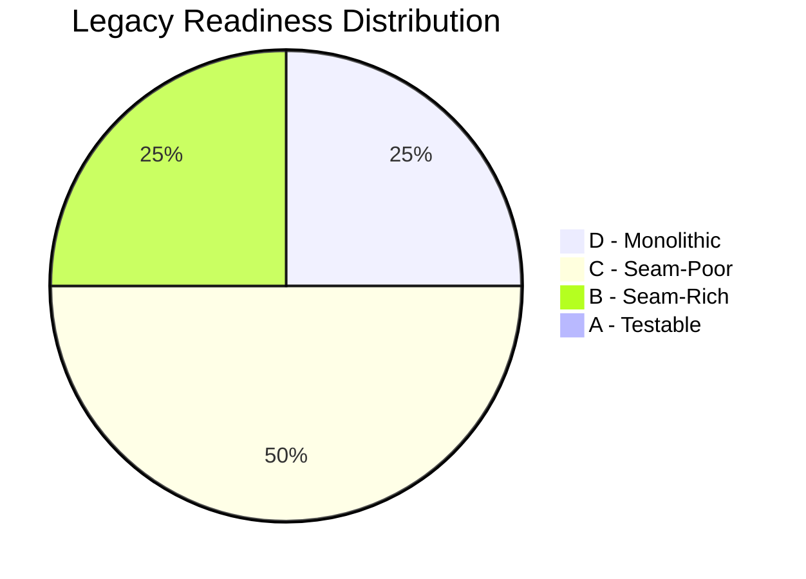
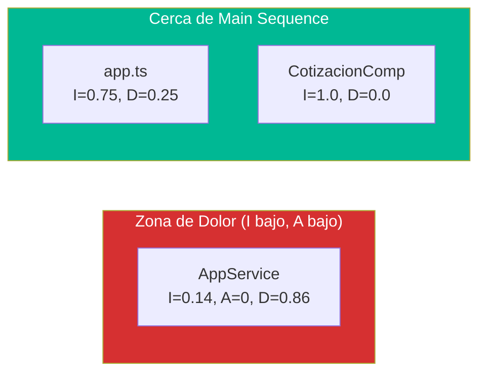

# QuoteFlow — Análisis de Complejidad

## Legacy Readiness por Componente (Michael Feathers)

| Componente | Nivel | Justificación |
|---|---|---|
| `backend/src/app.ts` | **D — Monolithic** | God File, 0 interfaces, 0 DI, statics, estado global mutable. No se puede testear sin reescribir. |
| `app.service.ts` | **D — Monolithic** | God Service, 0 interfaces, constructor hace trabajo, estado público mutable. Todo depende de él. |
| `CotizacionComponent` | **C — Seam-Poor** | Sin interfaces inyectables, dependencia directa de AppService, múltiples responsabilidades. |
| `ClientesComponent` | **C — Seam-Poor** | Mismo patrón: dependencia directa, lógica inline, sin seams. |
| `CatalogoComponent` | **C — Seam-Poor** | 2 entidades en 1 componente, dependencia directa de AppService. |
| `AprobacionComponent` | **C — Seam-Poor** | Copy-paste de patrones de CotizacionComponent. |
| `LoginComponent` | **B — Seam-Rich** | Pequeño, con AppService inyectado — podría testearse con mock del servicio. |
| `DashboardComponent` | **B — Seam-Rich** | Simple, solo lee `AppService.dashboardData`. Testeable con mock. |

### Resumen de Distribución

## Seams Detectados

| Tipo de Seam | Cantidad | Evidencia |
|---|---|---|
| Interfaces TypeScript | 0 | Ninguna definida en todo el proyecto |
| DI Container (Angular) | 1 | `AppService` con `providedIn: 'root'` — pero sin interfaz → no mockeable |
| Virtual Methods | 0 | No hay herencia |
| HTTP Proxy (proxy.conf.json) | 1 | Único punto de desacople frontend↔backend |

## Dependency Blockers

| Bloqueador | Archivo | Línea | Impacto |
|---|---|---|---|
| Estado global `var CLIENTES: any[]` | `app.ts` | 32-55 | Imposible aislar lógica de acceso a datos |
| Estado público mutable `this.clientes` | `app.service.ts` | 30-38 | Templates acceden directamente al estado |
| Constructor con side effects | `app.service.ts` | 40-50 | Constructor lee localStorage — rompe tests |
| `var` en scope de módulo | `app.ts` | 24-27, 153-156 | Estado compartido entre handlers |
| `localStorage` acoplado | `app.service.ts` | 42, 65, 72 | Sin abstracción, imposible testear offline |

## Indicadores de Complejidad

### God Classes

| Archivo | LOC | Responsabilidades | Score (0-10) |
|---|---|---|---|
| `backend/src/app.ts` | ~700 | Auth + CRUD×4 + Dashboard + Middleware + Datos + Server | 1/10 (crítico) |
| `app.service.ts` | ~240 | Auth + HTTP×5 + Estado + Cálculos + Formateo | 2/10 (crítico) |
| `cotizacion.component.ts` | ~295 | Lista + Crear + Detalle + Acciones + PDF + Email | 3/10 |

### Deep Nesting (>4 niveles)

| Archivo | Máx. Nesting | Evidencia |
|---|---|---|
| `app.ts` | 4 | Handlers con `if` dentro de `for` dentro de callback |
| `cotizacion.component.ts` | 3 | Múltiples `if` en `subscribe` callbacks |
| Otros componentes | 2-3 | Patrón subscribe→if→setState |

### Code Duplication

| Patrón Duplicado | Instancias | Archivos Afectados |
|---|---|---|
| `formatearMoneda()` | 5 | `app.service.ts`, `cotizacion.component.ts`, `clientes.component.ts`, `aprobacion.component.ts`, `catalogo.component.ts` |
| `getBadgeClass()` | 4 | `app.service.ts`, `cotizacion.component.ts`, `aprobacion.component.ts`, `dashboard.component.ts` |
| Loop búsqueda por ID (`for...find`) | 6 | `app.ts` (6 instancias en diferentes handlers) |
| Cálculo de totales | 3 | `app.ts`:320, `app.service.ts`:208, `cotizacion.component.ts` (parcial) |
| Patrón `subscribe({success, error:console.log})` | 8 | `app.service.ts` (todos los `cargar*()` métodos) |

## Métricas Component Principles (Clean Architecture)

| Componente | Ca | Ce | I = Ce/(Ca+Ce) | A | D = \|A+I-1\| | Zona |
|---|---|---|---|---|---|---|
| `AppService` | 6 | 1 | 0.14 | 0 | **0.86** | Zona de Dolor |
| `app.ts` (backend) | 1 | 3 | 0.75 | 0 | 0.25 | Cerca de Main Sequence |
| `CotizacionComponent` | 0 | 1 | 1.0 | 0 | 0.0 | Main Sequence |
| `AppModule` | 0 | 7 | 1.0 | 0 | 0.0 | Main Sequence |
| `LoginComponent` | 0 | 2 | 1.0 | 0 | 0.0 | Main Sequence |

**Interpretación:** `AppService` está en la zona de dolor porque es extremadamente estable (todo depende de él) pero no tiene abstracción (0 interfaces). Cambiarlo es imposible sin romper 6 componentes.

## Evaluación de Information Hiding (Ousterhout)

| Módulo | Information Hiding | Evidencia |
|---|---|---|
| `AppService` | ❌ Nulo | Estado público, sin encapsulación. Templates acceden a `service.clientes`, `service.cargando` directamente |
| `app.ts` | ❌ Nulo | Datos globales, handlers acceden a arrays globales sin abstracción |
| Componentes | ⚠️ Parcial | Tienen estado interno (`vista`, `seleccionado`) pero exponen lógica via template |

## Pass-Through Methods Identificados

| Método | Archivo | ¿Qué hace realmente? |
|---|---|---|
| `crearCliente(c)` | `app.service.ts`:113 | Solo `http.post(url, c)` — 0 lógica agregada |
| `actualizarCliente(id, c)` | `app.service.ts`:117 | Solo `http.put(url+id, c)` — 0 lógica |
| `eliminarCliente(id)` | `app.service.ts`:121 | Solo `http.delete(url+id)` — 0 lógica |
| `crearProducto(p)` | `app.service.ts`:139 | Solo `http.post(url, p)` — 0 lógica |
| `actualizarProducto(id, p)` | `app.service.ts`:143 | Solo `http.put(url+id, p)` — 0 lógica |
| `crearListaPrecios(l)` | `app.service.ts`:157 | Solo `http.post(url, l)` — 0 lógica |
| `crearCotizacion(c)` | `app.service.ts`:175 | Solo `http.post(url, c)` — 0 lógica |

**7 de 18 métodos (39%)** son pass-through — no agregan valor, solo delegan a HttpClient. Esto es **classitis al revés**: un servicio que pretende ser una abstracción pero no esconde nada.

## Hallazgos Clave

- **Nivel D (Monolithic)** en los 2 componentes más críticos — requiere Sprout/Wrap o rewrite
- **0 seams útiles** — no hay interfaces para inyectar mocks
- **AppService en zona de dolor** (D=0.86) — punto de bloqueo arquitectónico #1
- **39% de métodos son pass-through** — abstracción falsa, no aporta encapsulación
- **8 instancias de código duplicado** que afectan 5+ archivos

## Referencias

- [Métricas de Código](code-metrics.md)
- [Patrones Arquitectónicos](../architecture/patterns.md)
- [Deuda Técnica](tech-debt.md)
- [Modernization Assessment](modernization-assessment.md)
