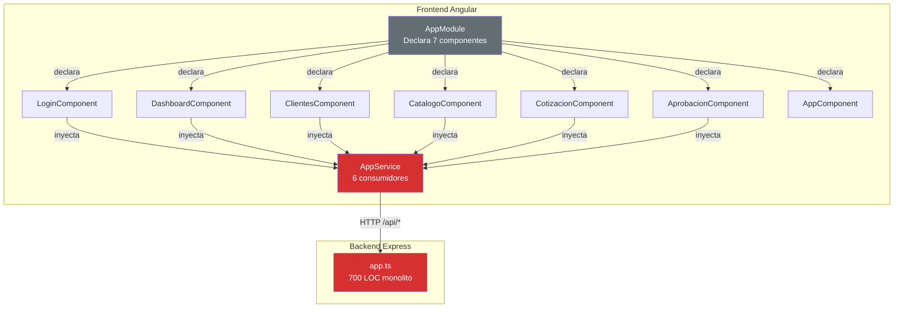

# QuoteFlow — Análisis de Dependencias (Acoplamiento Interno)

## Grafo de Acoplamiento Interno

## Métricas de Acoplamiento

| Componente | Fan-in | Fan-out | Instability (I) | Interpretación |
|---|---|---|---|---|
| `AppService` | 6 | 1 (HttpClient) | 0.14 | **Muy estable** — peligroso cambiar |
| `app.ts` (backend) | 1 (via HTTP) | 3 (express, cors, body-parser) | 0.75 | Relativamente inestable |
| `CotizacionComponent` | 0 (solo Router) | 1 (AppService) | 1.0 | Totalmente inestable — OK para leaf |
| `AppModule` | 0 | 7 (6 comps + service) | 1.0 | Orquestador — esperable |
| `LoginComponent` | 0 | 2 (AppService + Router) | 1.0 | Leaf — OK |

## Inconsistencias de Versiones entre Proyectos

| Dependencia | Frontend | Backend | ¿Inconsistente? |
|---|---|---|---|
| TypeScript | ~4.3.5 | ~3.9.10 | ⚠️ **Sí** — 1 minor de diferencia peligrosa |
| tslib | ^2.3.0 | N/A | — |
| Express types | N/A | ^4.16.1 | — |
| Node types | N/A | ^12.12.0 | — |

**Hallazgo:** TypeScript 3.9 (backend) es **2 minor versions anterior** al frontend (4.3). Esto puede causar incompatibilidades si se comparten tipos entre proyectos.

## Dependencias Transitivas de Riesgo

| Paquete directo | Trae transitivamente | Riesgo |
|---|---|---|
| `@angular/cli` 12.2.13 | webpack 5.x, sass, terser, sourcemap-support | Medio — tooling EOL |
| `express` 4.16.4 | accepts, content-type, cookie, debug, depd, send | Bajo — ecosystem estable |
| `rxjs` 6.6.7 | tslib (compartido) | Bajo |

## Puntos de Desacople

| Punto | Tipo | Fortaleza |
|---|---|---|
| `proxy.conf.json` | Proxy HTTP dev-time | ⚠️ Solo desarrollo — no produce |
| API REST `/api/*` | Contrato HTTP implícito | ⚠️ Sin OpenAPI spec, sin tipos compartidos |
| `localStorage` | Persistencia de sesión | ❌ Acoplamiento a browser API |

## Hallazgos Clave

- **Patrón estrella absoluto** — AppService es single point of coupling (6 de 6 componentes)
- **TypeScript inconsistente** entre frontend (4.3) y backend (3.9)
- **0 contratos formales** entre frontend y backend — solo strings de URL y `any`
- **Sin módulos feature** — todo declarado en AppModule, sin lazy loading posible
- **Sin barrel exports** — cada import apunta directamente al archivo

## Referencias

- [Componentes y Dependencias](../architecture/dependencies.md)
- [Patrones Arquitectónicos](../architecture/patterns.md)
- [Deuda Técnica](tech-debt.md)
- [Modernization Assessment](modernization-assessment.md)
