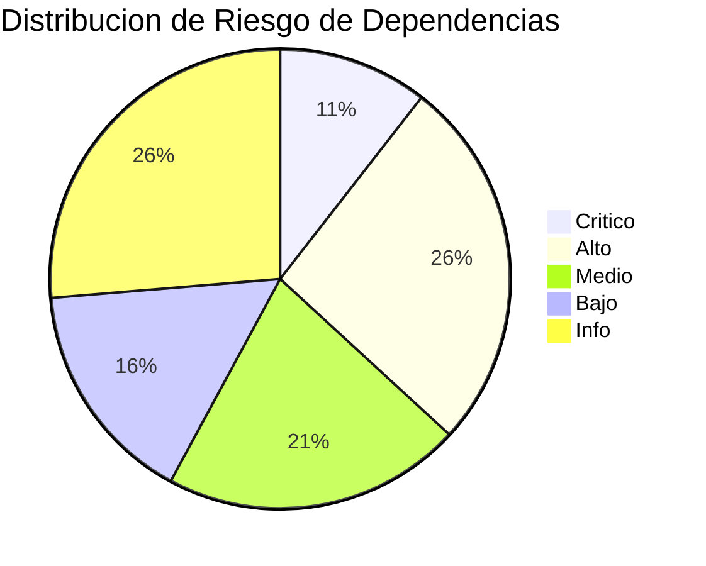
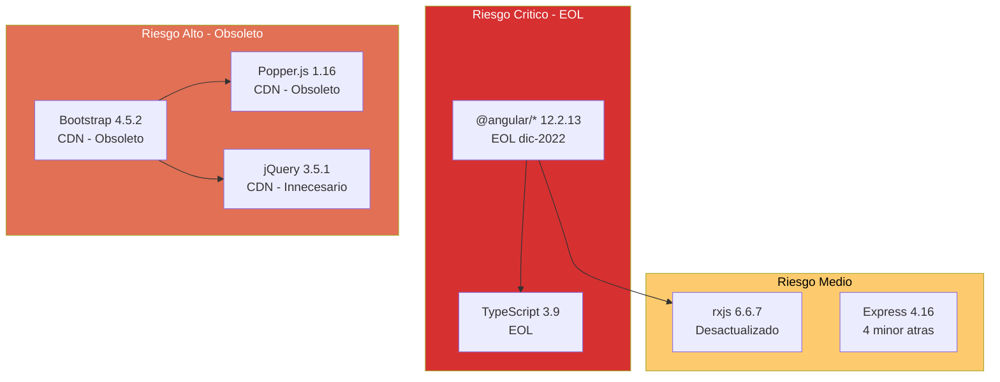

# QuoteFlow — Análisis de Dependencias (Seguridad y Exposición)

## Resumen Ejecutivo

| Métrica | Valor |
|---|---|
| Total dependencias directas | 14 (8 frontend + 3 backend + 3 dev backend) |
| Dependencias CDN no gestionadas | 5 |
| Riesgo Crítico | 2 |
| Riesgo Alto | 5 |
| Riesgo Medio | 4 |
| Riesgo Bajo | 3 |
| Riesgo Info | 5 |

## Inventario Completo de Dependencias

### Frontend — Producción (`frontend/package.json`)

| Paquete | Versión | Última conocida | Tipo | Riesgo | Estado |
|---|---|---|---|---|---|
| @angular/core | ~12.2.13 | [PENDIENTE: verificar] | Directa | 🔴 Crítico | EOL dic-2022 |
| @angular/common | ~12.2.13 | — | Directa | 🔴 Crítico | EOL |
| @angular/forms | ~12.2.13 | — | Directa | Alto | EOL |
| @angular/router | ~12.2.13 | — | Directa | Alto | EOL |
| @angular/platform-browser | ~12.2.13 | — | Directa | Alto | EOL |
| rxjs | ~6.6.7 | [PENDIENTE] | Directa | Medio | Desactualizado (actual ~7.8+) |
| zone.js | ~0.11.4 | [PENDIENTE] | Directa | Medio | Desactualizado |
| tslib | ^2.3.0 | [PENDIENTE] | Directa | Info | Probablemente OK |

### Frontend — Desarrollo

| Paquete | Versión | Riesgo | Estado |
|---|---|---|---|
| typescript | ~4.3.5 | Alto | EOL (actual: 5.5+) |
| @angular/cli | ~12.2.13 | Alto | EOL |
| @angular-devkit/build-angular | ~12.2.13 | Medio | EOL |

### Backend — Producción (`backend/package.json`)

| Paquete | Versión | Última conocida | Tipo | Riesgo | Estado |
|---|---|---|---|---|---|
| express | ^4.16.4 | [PENDIENTE] | Directa | Medio | Desactualizado ~4 minor |
| body-parser | ^1.18.3 | — | Directa | Bajo | **Deprecated** (integrado en Express 4.16+) |
| cors | ^2.8.5 | [PENDIENTE] | Directa | Info | Activo |

### Backend — Desarrollo

| Paquete | Versión | Riesgo | Estado |
|---|---|---|---|
| typescript | ~3.9.10 | 🔴 Crítico | EOL — 2 major versions atrás |
| ts-node | ^8.10.2 | Bajo | Desactualizado |
| nodemon | ^2.0.7 | Info | Desactualizado minor |
| @types/express | ^4.16.1 | Info | Desactualizado |
| @types/node | ^12.12.0 | Bajo | EOL (Node 12 → LTS ended 2022) |

### CDN — No gestionadas por package manager

| Recurso | Versión | URL | Riesgo | Estado |
|---|---|---|---|---|
| Bootstrap CSS | 4.5.2 | cdn.jsdelivr.net | Alto | Obsoleto (actual: 5.3+) |
| jQuery slim | 3.5.1 | cdn.jsdelivr.net | Medio | Desactualizado + innecesario con Angular |
| Popper.js | 1.16.1 | cdn.jsdelivr.net | Alto | Obsoleto (actual: @popperjs/core 2.x) |
| Bootstrap JS | 4.5.2 | cdn.jsdelivr.net | Alto | Obsoleto |
| Font Awesome | 5.15.4 | cdnjs.cloudflare.com | Info | Desactualizado (actual: 6.5+) |

## Dependencias Abandonadas/Deprecated

| Paquete | Evidencia | Alternativa |
|---|---|---|
| `body-parser` | Deprecated — funcionalidad incluida en Express 4.16+ | `express.json()` nativo |
| `Popper.js` 1.x | Proyecto movido a `@popperjs/core` 2.x | `@popperjs/core` via npm |
| `jQuery` | Innecesario con Angular — DOM manipulation direct | Eliminar, usar Angular binding |

## Análisis de Exposición

| Dependencia de Riesgo | ¿Expuesta a internet? | ¿Runtime? | Surface area |
|---|---|---|---|
| Angular 12 (EOL) | Sí (SPA en browser) | Sí | Toda la app frontend |
| Express 4.16 | Sí (server HTTP) | Sí | Todos los endpoints |
| TypeScript 3.9 (backend) | No (solo compilación) | No | Build-time only |
| jQuery 3.5.1 | Sí (browser) | Sí | Mínima (solo Bootstrap tooltips) |
| Bootstrap 4.5 | Sí (browser) | Sí | UI completa |

## Cadena de Dependencias

## Licencias

| Paquete | Licencia | Riesgo Legal |
|---|---|---|
| @angular/* | MIT | ✅ Ninguno |
| Express | MIT | ✅ Ninguno |
| rxjs | Apache-2.0 | ✅ Ninguno |
| Bootstrap | MIT | ✅ Ninguno |
| jQuery | MIT | ✅ Ninguno |
| Font Awesome | CC BY 4.0 (icons) + SIL OFL (fonts) + MIT (code) | ✅ Ninguno |

**Sin riesgos legales detectados.** Todas las dependencias usan licencias permisivas.

## Recomendaciones Priorizadas

### Quick Wins (días)

| # | Acción | Esfuerzo | Impacto |
|---|---|---|---|
| 1 | Eliminar `body-parser` — usar `express.json()` | 10 min | Elimina deprecated |
| 2 | Eliminar jQuery del `index.html` | 30 min | -34KB, elimina conflicto |
| 3 | Agregar SRI (integrity) a scripts CDN restantes | 1 hora | Mitiga supply-chain attack |

### Refactoring Medio (semanas)

| # | Acción | Esfuerzo | Impacto |
|---|---|---|---|
| 4 | Migrar Angular 12 → 16+ (LTS) | 2-3 semanas | Sale de EOL, habilita features modernos |
| 5 | Migrar TypeScript 3.9 → 5.x | 1 semana (junto con Angular) | Strict mode, type safety |
| 6 | Reemplazar CDN por npm packages | 1-2 días | Control de versiones, bundling |
| 7 | Migrar Bootstrap 4 → 5 o Angular Material | 1 semana | Stack moderno, sin jQuery |

## Impacto en Modernización

| Dependencia | ¿Bloquea migración? | Equivalente moderno |
|---|---|---|
| Angular 12 | Sí — EOL, no recibe fixes | Angular 17+ o React/Vue |
| TypeScript 3.9 | Sí — incompatible con tooling moderno | TypeScript 5.5+ |
| Express 4.16 | No — actualizable in-place | Express 5.x o NestJS |
| Bootstrap 4 CDN | No — reemplazable | Bootstrap 5 (npm) o Tailwind |
| jQuery | No — eliminable | Nativo Angular |
| body-parser | No — eliminable en 10 min | `express.json()` |

## Hallazgos Clave

- **2 dependencias críticas (EOL)** que bloquean la modernización: Angular 12, TypeScript 3.9
- **5 dependencias CDN sin control de versiones** — riesgo de supply chain
- **0 CVEs confirmados** [PENDIENTE: verificar en NVD para versiones específicas]
- **body-parser deprecated** — fix trivial (10 min)
- **jQuery innecesario** — conflicto conceptual con Angular (DOM manipulation vs binding)

## Referencias

- [Dependencias del Proyecto](../architecture/dependencies.md)
- [Seguridad](security-patterns.md)
- [Deuda Técnica](tech-debt.md)
- [Cloud Readiness](cloud-readiness-assessment.md)
