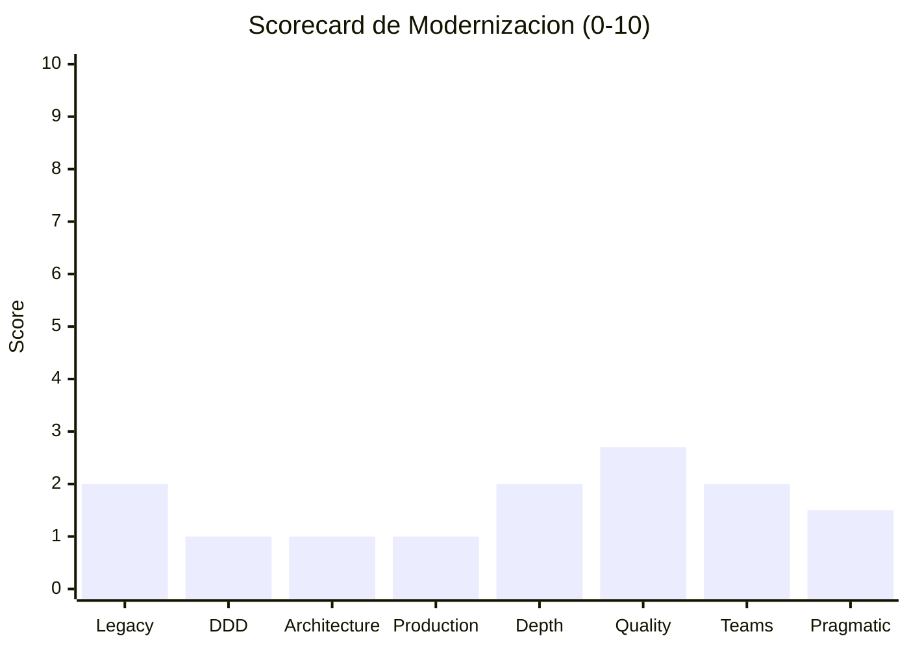
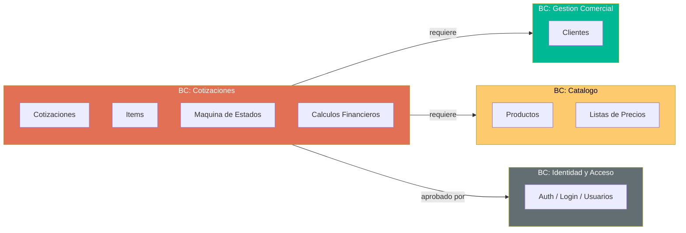

# QuoteFlow — Modernization Assessment

## Scorecard de Modernización (8 Frameworks)

| # | Framework | Score (0-10) | Justificación |
|---|---|---|---|
| 1 | Legacy Readiness (Feathers) | 2/10 | 2 componentes nivel D, 4 nivel C, 0 testeable. Sin seams, sin interfaces, sin DI real. |
| 2 | DDD Maturity (Evans) | 1/10 | Big Ball of Mud. Sin bounded contexts, sin aggregates, sin ubiquitous language. Modelo 100% anémico. |
| 3 | Architecture Compliance (Martin) | 1/10 | Dependency Rule violada completamente. Sin layers reales. I=0.75 (extrema inestabilidad). |
| 4 | Production Readiness (Nygard) | 1/10 | 0/8 stability patterns. Dangerous. Datos in-memory, sin health checks, sin observabilidad. |
| 5 | Module Depth (Ousterhout) | 2/10 | Módulos extremadamente shallow. God File = interfaz enorme + implementación mezclada. |
| 6 | Code Quality (Martin) | 2.7/10 | Naming regular, funciones gigantes, error handling nulo, DRY violado 5x, `any` everywhere. |
| 7 | Team Boundaries (Skelton) | 2/10 | Cognitive load extremo en God File. Sin fracture planes claros entre módulos. |
| 8 | Pragmatic Assessment (Hunt/Thomas) | 1.5/10 | Orthogonality 1/5, broken windows por doquier, sin DRY knowledge, irreversible. |

**Score Promedio: 1.65/10**

## 1. Legacy Readiness (Michael Feathers)

### Clasificación por Componente

| Componente | Nivel | Seams | Interfaces | DI | Testeable |
|---|---|---|---|---|---|
| `app.ts` (backend) | **D — Monolithic** | 0 | 0 | No | No |
| `AppService` | **D — Monolithic** | 0 | 0 | Angular DI (sin interface) | No |
| `CotizacionComponent` | **C — Seam-Poor** | 1 (DI de AppService) | 0 | Parcial | Difícil |
| `ClientesComponent` | **C — Seam-Poor** | 1 | 0 | Parcial | Difícil |
| `CatalogoComponent` | **C — Seam-Poor** | 1 | 0 | Parcial | Difícil |
| `AprobacionComponent` | **C — Seam-Poor** | 1 | 0 | Parcial | Difícil |
| `LoginComponent` | **B — Seam-Rich** | 1 | 0 | Parcial | Posible con mock |
| `DashboardComponent` | **B — Seam-Rich** | 1 | 0 | Parcial | Posible con mock |

**Evidencia clave:**
- 0 interfaces en todo el proyecto (búsqueda: `interface` → solo `interface Environment` en environments)
- Constructor de AppService hace trabajo (`app.service.ts`:40-50 — lee localStorage)
- God File sin inyección de dependencias (Express puro, sin IoC container)

### Recomendación

Dado que el 75% de los componentes están en nivel C o D, la migración por refactoring incremental (Feathers: "Edit and Pray") no es viable. **Rebuild** es más seguro y eficiente que "Sprout/Wrap → Strangler".

## 2. DDD Assessment (Eric Evans)

### Evaluación

| Criterio | Estado | Evidencia |
|---|---|---|
| Ubiquitous Language | ❌ Ausente | Nombres mixtos español/inglés: `clientes`, `cotizaciones` pero `login`, `dashboard` |
| Bounded Contexts | ❌ Ausente | Todo en 1 módulo Angular + 1 archivo backend |
| Aggregates | ❌ Ausente | No hay entidades con invariantes — todo es `any[]` |
| Domain Events | ❌ Ausente | Sin eventos de dominio — operaciones síncronas imperativas |
| Anti-Corruption Layer | ❌ N/A | No hay integraciones que proteger |
| Modelo Rico vs Anémico | ❌ 100% Anémico | 0 métodos de negocio en entidades — son arrays de `any` |

### Bounded Contexts Implícitos (candidatos para el Rebuild)

### Clasificación por Dominio

| Bounded Context | Tipo | Justificación |
|---|---|---|
| Cotizaciones | **Core** | Es el diferenciador del negocio — flujo de cotización + aprobación |
| Catálogo | **Supporting** | Necesario pero no diferenciador — CRUD estándar |
| Gestión Comercial | **Supporting** | CRUD de clientes — commodity |
| Identidad y Acceso | **Generic** | Puede resolverse con librería/servicio existente (Keycloak, Auth0) |

## 3. Architecture Compliance (Robert C. Martin)

### Dependency Rule

| Dirección Esperada | Estado | Evidencia |
|---|---|---|
| Frameworks → Use Cases → Entities | ❌ Violada | No existen layers separados — todo mezclado en 1 archivo |
| Inner no importa Outer | ❌ N/A | No hay inner/outer — solo hay "todo junto" |

### Métricas de Componentes

| Componente | Ca (incoming) | Ce (outgoing) | I (Instability) | A (Abstractness) | D (Distance) |
|---|---|---|---|---|---|
| AppService | 6 | 2 | 0.25 | 0.00 | 0.75 |
| app.ts | 1 (proxy) | 5 (arrays) | 0.83 | 0.00 | 0.17 |
| CotizacionComponent | 0 | 1 | 1.00 | 0.00 | 0.00 |

- **AppService**: Zona de dolor (I=0.25, A=0.00, D=0.75) — altamente acoplado SIN abstracción
- **app.ts**: Inestable y concreto — cambios constantes requeridos para cualquier feature

### Framework Leakage

| Leakage | Evidencia |
|---|---|
| Angular HttpClient en "negocio" | `AppService` mezcla HTTP calls con cálculos de totales |
| Express en "dominio" | Validaciones de negocio dentro de handlers HTTP (`app.ts`:280-295) |
| localStorage en "servicio" | `AppService` lee/escribe localStorage directamente |

## 4. Production Readiness (Michael Nygard)

**Score: 1/10 — Dangerous**

| Pattern | Presente | Justificación |
|---|---|---|
| Circuit Breaker | ❌ | 0 instancias en 33 archivos |
| Timeouts | ❌ | Sin timeout en HttpClient ni Express |
| Retry | ❌ | 0 instancias de retry |
| Bulkheads | ❌ | 1 proceso, 1 thread pool |
| Health Checks | ❌ | Sin endpoint /health |
| Graceful Degradation | ❌ | Sin fallbacks |
| Graceful Shutdown | ❌ | Sin SIGTERM handler |
| Steady State | ❌ | Arrays crecen sin límite |

Detalle completo en [Production Readiness](production-readiness.md).

## 5. Module Depth (John Ousterhout)

| Módulo | Interface Complexity | Implementation Depth | Evaluación |
|---|---|---|---|
| `app.ts` | Enorme (12 endpoints, 156 líneas datos, ~544 lógica) | Trivial (CRUD directo a arrays) | **Shallow** — interfaz grande, implementación simple |
| `AppService` | Enorme (30+ métodos públicos) | Trivial (HTTP calls + state assignment) | **Shallow** — pass-through a backend |
| `CotizacionComponent` | Grande (20+ propiedades, 5 métodos) | Media (lógica de vista + cálculos) | **Shallow-Medium** |
| `LoginComponent` | Pequeña (2 propiedades, 1 método) | Mínima (1 call + redirect) | **Balanced** (interfaz simple, impl simple) |

**Hallazgo principal:** El sistema es mayoritariamente **shallow** — módulos con interfaces enormes que hacen poco internamente (pass-through). Esto indica falta de information hiding y temporal decomposition.

## 6. Code Quality (Robert C. Martin — Clean Code)

| Dimensión | Score | Evidencia |
|---|---|---|
| Naming | 4/10 | Mezcla español/inglés, algunos nombres reveladores (`calcularTotales`) pero mucho `data`, `item` |
| Funciones pequeñas | 2/10 | Handlers de 50-80 LOC, `calcularTotales` es largo |
| Argumentos mínimos | 3/10 | `req, res` en todos los handlers (2 args), pero objetos `any` sin tipo |
| Error handling | 1/10 | `console.log(error)` × 8 — zero recovery |
| DRY | 2/10 | `formatearMoneda` ×5, `getBadgeClass` ×4, búsqueda por ID ×6 |
| Comments | 4/10 | Comentario intencional de versiones obsoletas (útil), pero 0 JSDoc |

**Score promedio Clean Code: 2.7/10**

## 7. Team Boundaries (Skelton & Pais)

### Fracture Planes

| Fracture Plane | Viabilidad | Justificación |
|---|---|---|
| Frontend / Backend | ✅ Alta | Proxy los separa. Contrato REST informal pero existente. |
| Por Bounded Context | ⚠️ Media | Contextos mezclados en God File. Requiere separación previa. |
| Módulo Cotizaciones (Core) vs Resto | ✅ Alta | Dominio más complejo, justifica equipo dedicado. |

### Cognitive Load por Módulo

| Módulo | Responsabilidades | Cognitive Load |
|---|---|---|
| `app.ts` | Auth + 4 CRUDs + Dashboard + Config + Datos | **Extremo** — inmanejable para 1 persona |
| `AppService` | Auth + 5 dominios + Cálculos + Formateo | **Extremo** — SRP violado completamente |
| `CotizacionComponent` | Lista + Crear + Detalle + Estado + Cálculos + Filtrado | **Alto** — debería ser 3-4 componentes |

### Equipo Recomendado para Rebuild

| Rol | Dedicación | Responsabilidad |
|---|---|---|
| Tech Lead / Architect | 50% | Diseño, decisiones técnicas, code review |
| Backend Developer | 100% | NestJS modules, API, BD, Auth |
| Frontend Developer | 100% | Angular 17, componentes, state management |
| QA Engineer | 50% (Ola 3) | Tests E2E, validación de criterios |

**Tamaño:** 3-4 personas, 7-8 semanas

## 8. Pragmatic Assessment (Hunt & Thomas)

| Principio | Score | Evidencia |
|---|---|---|
| DRY (Knowledge) | 1/5 | Cálculos duplicados frontend/backend, formateo ×5, badge ×4 |
| Orthogonality | 1/5 | Cambiar formato de moneda requiere editar 5 archivos |
| Reversibility | 1/5 | Decisiones hardcoded: port, URL, CORS, auth strategy — sin config |
| Tracer Bullets | 2/5 | El flujo login→dashboard→cotización funciona E2E (aunque inseguro) |
| Broken Windows | 1/5 | `console.log` como logging, `any` types, `var` en 2024, 0 tests, dead code |

### Broken Windows Detectadas

| Ventana Rota | Ubicación | Impacto Moral |
|---|---|---|
| `var` en lugar de `const/let` | `app.ts`:24-27, 32-156 | Señal de código no moderno |
| `any` en todas las variables | Todo el proyecto | "¿Para qué TypeScript si todo es any?" |
| `console.log` como logging | 15+ instancias | "Nadie va a ver los logs de todos modos" |
| 0 tests | Proyecto completo | "Si no hay tests, ¿para qué escribir tests nuevos?" |
| Passwords en texto plano | `app.ts`:153 | "Es un prototipo, no importa" |

## Recomendación Final

### Estrategia Recomendada: **Rebuild** (7R)

| Factor | Valor | Justificación |
|---|---|---|
| Scorecard promedio | 1.65/10 | Debajo de umbral mínimo para Refactor (3.0) |
| LOC efectivo | ~1,578 | Extremadamente bajo — reescribible en semanas |
| Datos a migrar | 0 | Arrays in-memory sin datos reales |
| Integraciones | 0 | Sin sistemas externos que preservar |
| Tests existentes | 0% | Sin safety net para refactoring |
| Stack EOL | 100% | Todo requiere upgrade sin path de migración directa |

### Alternativa: Refactor Incremental

No recomendada porque:
1. Costo de agregar tests + migrar Angular 12→17 + migrar Express → NestJS + agregar BD + agregar auth SUPERA el costo de rebuild
2. Sin tests no hay safety net para refactoring — cada cambio es "Edit and Pray"
3. Angular 12→17 requiere 5 major upgrades secuenciales (no hay path directo)

### Variante Propuesta

| Parámetro | Valor |
|---|---|
| **R seleccionada** | Rebuild |
| **Talla QAM** | S (Small) |
| **Créditos estimados** | 20-40 |
| **Duración** | 7-8 semanas |
| **Equipo centauro** | 3-4 personas |
| **Riesgo** | Bajo (LOC mínimo, 0 datos, 0 integraciones) |

## Hallazgos Clave

- **Score 1.65/10** confirma que el sistema no es modernizable incrementalmente
- **Rebuild es la opción racional** dado el bajo LOC y la ausencia de datos/integraciones
- **4 Bounded Contexts** identificados para la nueva arquitectura
- **El mayor valor del código actual** son los requisitos funcionales documentados, no el código mismo
- **Inversión mínima** — 7-8 semanas producen un sistema production-ready vs. mantener un prototipo indefinidamente

## Referencias

- [Production Readiness](production-readiness.md)
- [Complexity Analysis](complexity-analysis.md)
- [Tech Debt](tech-debt.md)
- [Component Order](../migration/component-order.md)
- [Cloud Readiness](cloud-readiness-assessment.md)
- [Team Structure](team-structure-assessment.md)
