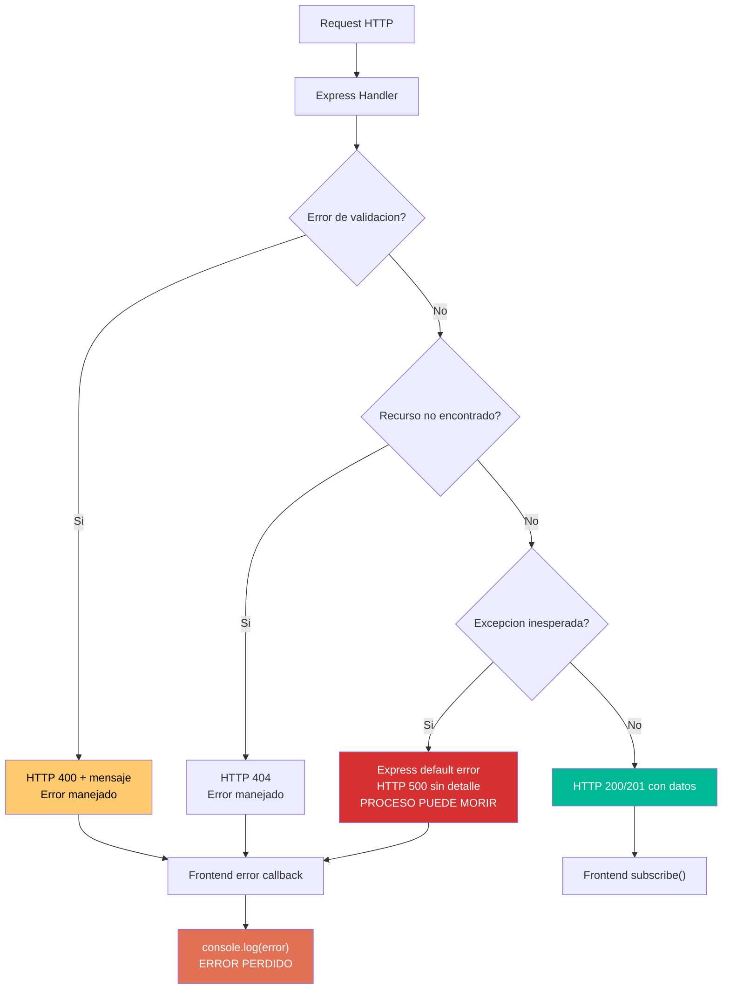

# QuoteFlow — Production Readiness

## Score Global: 1/10 — Dangerous

**Justificación:** El sistema no tiene ningún stability pattern, ningún mecanismo de observabilidad real, y se ejecuta como proceso único en memoria sin persistencia. Un reinicio destruye todos los datos.

## Stability Patterns — Presencia/Ausencia

| Pattern | Presente | Evidencia |
|---|---|---|
| Circuit Breaker | ❌ No | Sin Polly, sin custom retry — búsqueda exhaustiva en 33 archivos: 0 resultados |
| Timeouts | ❌ No | Sin timeout en HttpClient (`app.service.ts`), sin timeout en Express handlers |
| Retry con backoff | ❌ No | 0 instancias de retry, retryWhen, o backoff en todo el codebase |
| Bulkheads | ❌ No | Un solo proceso Node.js, un solo thread pool |
| Health Checks | ❌ No | Sin endpoint `/health`, `/ready`, `/alive` en `app.ts` |
| Graceful Degradation | ❌ No | Si un endpoint falla, no hay fallback — frontend muestra datos vacíos |
| Graceful Shutdown | ❌ No | Sin manejo de SIGTERM/SIGINT en `app.ts` — `process.on` no existe |
| Steady State | ❌ No | Arrays crecen sin límite (`COTIZACIONES.push(...)`) sin cleanup |

## Anti-Patterns de Producción Detectados

| Anti-Pattern | Evidencia | Impacto |
|---|---|---|
| **Single Point of Failure** | 1 proceso Node.js, 1 archivo, datos in-memory | Si el proceso muere, se pierde TODO |
| **No persistencia** | `var CLIENTES: any[] = [...]` en `app.ts`:32 | Reinicio = pérdida total de datos |
| **Unbounded results** | `GET /api/cotizaciones` retorna TODAS sin paginación (`app.ts`:300) | Memory exhaustion con datos crecientes |
| **Thread pool compartido** | 1 event loop Node.js para todo (API + logging + datos) | Una operación lenta bloquea todo |
| **Cascading failure** | Frontend asume backend siempre disponible — sin retry/fallback | Backend caído = frontend vacío sin mensaje |
| **Error swallowing** | 8 instancias de `console.log(error)` sin acción (`app.service.ts`:82-135) | Failures silenciosos |
| **No backpressure** | Sin límites en requests concurrentes | DOS trivial |
| **Log pollution** | `console.log(JSON.stringify(req.body))` en cada request (`app.ts`:163) | Performance + security issue |

## Observability Assessment

| Aspecto | Estado | Evidencia |
|---|---|---|
| **Structured Logging** | ❌ No | Solo `console.log` con strings concatenados |
| **Log Levels** | ❌ No | Sin info/warn/error/debug — todo es `console.log` |
| **Correlation IDs** | ❌ No | Sin request ID ni trace ID |
| **Metrics (RED/USE)** | ❌ No | Sin Prometheus, AppInsights, ni custom metrics |
| **Distributed Tracing** | ❌ No | Sin OpenTelemetry, Jaeger ni similar |
| **Alerting** | ❌ No | Sin configuración de alertas |
| **Dashboard** | ❌ No | Sin Grafana, CloudWatch, ni equivalente |
| **Error Tracking** | ❌ No | Sin Sentry, Bugsnag ni similar |

## Deployment Readiness

| Criterio | Estado | Evidencia |
|---|---|---|
| **Zero-downtime deploy** | ❌ Imposible | Datos in-memory — deploy = pérdida de datos |
| **Feature flags** | ❌ No | Sin feature toggle mechanism |
| **Rollback strategy** | ❌ No | Sin versioning, sin blue-green, sin canary |
| **Environment config** | ❌ No | URL hardcodeada en `app.service.ts`:21, port hardcodeado en `app.ts`:25 |
| **Containerizable** | ⚠️ Parcial | No hay Dockerfile pero Node.js es containerizable |
| **CI/CD pipeline** | ❌ No | Sin Jenkinsfile, GitHub Actions, Azure Pipelines |
| **Database migrations** | N/A | Sin BD real |
| **Secrets management** | ❌ No | Passwords hardcodeados en `app.ts`:153 |

## Scalability Assessment (System Design)

| Aspecto | Estado | Evidencia |
|---|---|---|
| **Statelessness** | ❌ Stateful | Datos y sesiones en memoria del proceso (`app.ts`:32-156) |
| **Caching** | ❌ No | Sin Redis, sin in-memory cache, sin HTTP cache headers |
| **Message Queues** | ❌ No | Sin RabbitMQ, Kafka, ni queue de ningún tipo |
| **Database Patterns** | ❌ N/A | Sin BD — arrays in-memory |
| **Connection Pooling** | N/A | Sin BD que poolear |
| **Async/Non-blocking** | ⚠️ Parcial | Express es async por naturaleza, pero handlers son síncronos |
| **Rate Limiting** | ❌ No | Sin middleware de throttling |
| **CDN** | ⚠️ Parcial | Bootstrap/jQuery servidos desde CDN (index.html:8-14) |
| **Horizontal scaling** | ❌ Imposible | Estado in-memory impide múltiples instancias |
| **Batch Processing** | ❌ N/A | Sin jobs ni procesamiento batch |

**Score Scalability: 1/10 — Unscalable**

Justificación: Stateful, sin cache, sin queues, sin BD, sin horizontal scaling posible. Hardcoded a single instance.

## Diagrama de Flujo de Errores

## Recomendaciones para Resilience (Orden de implementación)

| # | Building Block | Prioridad | Justificación |
|---|---|---|---|
| 1 | **Base de datos real** (PostgreSQL/MySQL) | P0 | Sin persistencia no hay producción posible |
| 2 | **JWT real con middleware** | P0 | Sin auth no se puede exponer |
| 3 | **Error handler global** (Express + Angular) | P1 | Errores silenciosos causan data corruption |
| 4 | **Structured logging** (Pino/Winston) | P1 | Sin logs no se puede debuggear |
| 5 | **Health check endpoint** | P2 | Necesario para orchestrators |
| 6 | **Environment config** (dotenv) | P2 | Para multi-environment |
| 7 | **Rate limiting** (express-rate-limit) | P2 | Protección básica contra abuse |
| 8 | **Graceful shutdown** (SIGTERM handler) | P3 | Para containers/Kubernetes |
| 9 | **Circuit breaker** (si se agregan integraciones) | P3 | Futuro: cuando haya servicios externos |
| 10 | **Monitoring** (Prometheus + Grafana) | P3 | Observabilidad post-deploy |

## Hallazgos Clave

- **Score 1/10 — Dangerous** — No tiene ninguno de los 8 stability patterns
- **Datos se pierden al reiniciar** — arrays in-memory son la "base de datos"
- **Escalado horizontal imposible** — estado in-process
- **0 observabilidad** — solo `console.log` como "monitoring"
- **No es deployable a producción** en su estado actual — es un prototipo/demo educativo

## Referencias

- [Error Handling](../behavior/error-handling.md)
- [Análisis de Seguridad](security-patterns.md)
- [Deuda Técnica](tech-debt.md)
- [Cloud Readiness](cloud-readiness-assessment.md)
