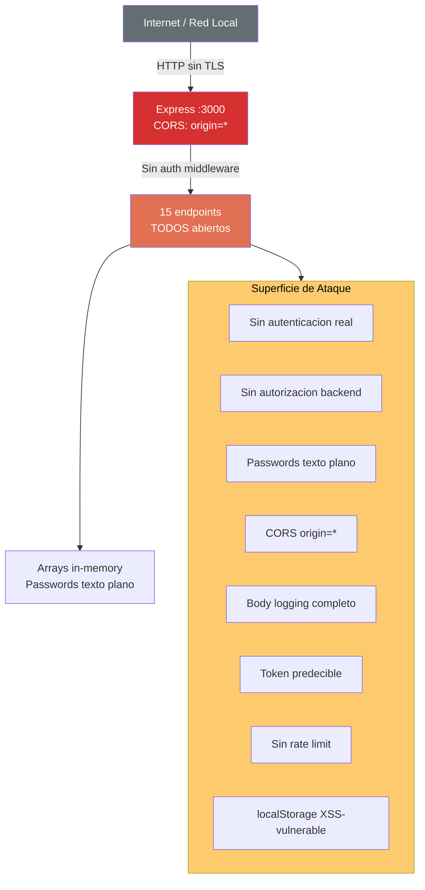

# QuoteFlow — Análisis de Seguridad

## Resumen Ejecutivo

El sistema tiene **postura de seguridad crítica**. La autenticación es simulada, no hay autorización en el backend, los datos sensibles están en texto plano, y CORS está completamente abierto. Este es un sistema educativo/demo que **no debe exponerse a internet**.

## Mecanismos de Seguridad Existentes

| Mecanismo | Estado | Evidencia |
|---|---|---|
| Autenticación | ❌ Simulada — token falso "fake-jwt-token-..." | `app.ts`:165-168 |
| Autorización backend | ❌ Inexistente | Sin middleware de auth en ningún endpoint |
| Autorización frontend | ⚠️ Solo cosmética | `cotizacion.component.ts`:250 (`puedeAprobar()`) |
| Cifrado de passwords | ❌ Texto plano | `app.ts`:153 `USUARIOS[].password = '1234'` |
| CORS | ❌ Completamente abierto | `app.ts`:158 `cors({ origin: '*' })` |
| Validación de input | ⚠️ Parcial | Solo campos requeridos, sin sanitización |
| Rate limiting | ❌ No existe | Sin middleware de throttling |
| HTTPS | ❌ No configurado | Solo HTTP en `app.ts`:430 `app.listen(3000)` |
| Helmet/Security headers | ❌ No existe | Sin helmet ni headers de seguridad |
| CSRF protection | ❌ No existe | Sin tokens CSRF |
| Content Security Policy | ❌ No existe | Sin CSP headers |

## Modelo STRIDE

| Amenaza | Riesgo | Evidencia | Impacto |
|---|---|---|---|
| **Spoofing** | 🔴 Crítico | Token falso (`"fake-jwt-token-" + Date.now()`) sin verificación | Cualquiera puede suplantar identidad |
| **Tampering** | 🔴 Crítico | Datos in-memory sin integridad, sin checksum, sin auditoría inmutable | Datos manipulables vía API directa |
| **Repudiation** | 🔴 Crítico | Sin logging de auditoría real, `console.log` insuficiente | No se puede probar quién hizo qué |
| **Information Disclosure** | 🔴 Crítico | Passwords en texto plano, body completo logueado, tokens en console.log | Datos sensibles expuestos |
| **Denial of Service** | 🟡 Alto | Sin rate limiting, sin validation de tamaño de payload, arrays crecen sin límite | Fácil saturar con requests |
| **Elevation of Privilege** | 🔴 Crítico | Backend no verifica roles — cualquier request puede aprobar/rechazar cotizaciones | Un asesor puede actuar como admin |

## Diagrama de Superficie de Ataque

## Evaluación OWASP Top 10 (2021)

### A01: Broken Access Control

**Estado:** ❌ Vulnerable
**Severidad:** Crítica
**Evidencia:**
- `app.ts`: 0 middleware de autenticación en endpoints. Todos los endpoints son accesibles sin token.
- `app.ts`:165-168: Token generado es `"fake-jwt-token-" + Date.now()` — no se verifica en ningún request posterior.
- `cotizacion.component.ts`:250: `puedeAprobar()` solo existe en frontend — bypass trivial con curl.
**Hallazgos:** Cualquier actor puede realizar CUALQUIER operación sin autenticación.
**Impacto en modernización:** Requiere implementación completa de auth (JWT + middleware) como prerequisito.

### A02: Cryptographic Failures

**Estado:** ❌ Vulnerable
**Severidad:** Crítica
**Evidencia:**
- `app.ts`:153: `password: '1234'` en texto plano en array de usuarios.
- Sin HTTPS configurado (`app.listen(3000)` sin TLS).
- `app.service.ts`:65: Token almacenado en localStorage (vulnerable a XSS).
**Hallazgos:** 0 criptografía en todo el sistema.
**Impacto en modernización:** Implementar bcrypt/argon2 + HTTPS + secure storage.

### A03: Injection

**Estado:** ⚠️ Parcialmente mitigado
**Severidad:** Media (mitigado por arquitectura accidental)
**Evidencia:**
- No hay base de datos SQL → SQL injection N/A.
- No hay eval/exec → no hay code injection.
- Los datos se buscan con loops en arrays in-memory → no inyectable.
**Hallazgos:** La arquitectura in-memory accidentalmente mitiga injection, pero si se migra a BD sin prepared statements, será vulnerable.
**Impacto en modernización:** Al migrar a BD real, implementar ORM con parameterized queries desde el inicio.

### A04: Insecure Design

**Estado:** ❌ Vulnerable
**Severidad:** Alta
**Evidencia:**
- `app.ts`:287-295: Máquina de estados sin validación de transiciones — cualquier cambio de estado es posible.
- Sin rate limiting en login → brute force trivial.
- Sin validación de descuento máximo por lista de precios.
**Hallazgos:** Diseño inseguro por defecto. Flujos críticos sin validación de negocio.
**Impacto en modernización:** Requiere rediseño del flujo de estados con validación server-side.

### A05: Security Misconfiguration

**Estado:** ❌ Vulnerable
**Severidad:** Alta
**Evidencia:**
- `app.ts`:158: `cors({ origin: '*' })` — abierto a cualquier origen.
- `app.ts`:163: Logging del body completo incluyendo passwords.
- Sin helmet, sin security headers.
- Stack traces no controlados (sin error handler global).
**Hallazgos:** Configuración completamente insegura en todos los aspectos.
**Impacto en modernización:** Agregar helmet, CORS restrictivo, error handler, logging sanitizado.

### A06: Vulnerable and Outdated Components

**Estado:** ❌ Vulnerable
**Severidad:** Alta
**Evidencia:**
- Angular 12 EOL (dic-2022) — `frontend/package.json`.
- TypeScript 3.9 (backend) — EOL.
- jQuery 3.5.1 en CDN — desactualizado.
- body-parser deprecated.
**Hallazgos:** Stack completo desactualizado con frameworks en EOL.
**Impacto en modernización:** Actualización masiva de dependencias requerida.

### A07: Identification and Authentication Failures

**Estado:** ❌ Vulnerable
**Severidad:** Crítica
**Evidencia:**
- `app.ts`:165: Token = `"fake-jwt-token-" + Date.now()` — predecible y sin firma.
- `app.ts`:153: Passwords sin hashing (`password: '1234'`).
- Sin expiración de sesión (sesiones en memoria sin TTL).
- Sin MFA.
- Sin protección contra brute force.
**Hallazgos:** Autenticación completamente simulada, no funcional.
**Impacto en modernización:** Implementar JWT real con refresh tokens, bcrypt, rate limiting.

### A08: Software and Data Integrity Failures

**Estado:** ⚠️ Parcialmente mitigado
**Severidad:** Media
**Evidencia:**
- Sin deserialización insegura (JSON.parse básico con try/catch en `app.service.ts`:42).
- Sin verificación de integridad en datos de localStorage.
- CDN sin SRI (Subresource Integrity) en `index.html`.
**Hallazgos:** CDN scripts sin hash de integridad.
**Impacto en modernización:** Agregar SRI a scripts externos, o migrar a npm packages.

### A09: Security Logging and Monitoring Failures

**Estado:** ❌ Vulnerable
**Severidad:** Media
**Evidencia:**
- `app.ts`:163: Solo `console.log` — no es logging real.
- Sin alertas de seguridad.
- Sin correlación de eventos de auth.
- Loguea datos sensibles (passwords, tokens) en `app.ts`:163 y `app.service.ts`:65.
**Hallazgos:** Logging inexistente como mecanismo de seguridad. Datos sensibles en logs.
**Impacto en modernización:** Implementar structured logging con redacción de PII.

### A10: Server-Side Request Forgery (SSRF)

**Estado:** ℹ️ No evaluable
**Severidad:** N/A
**Evidencia:** No hay llamadas HTTP server-side a URLs dinámicas. El backend no consume APIs externas.
**Hallazgos:** No aplica en la arquitectura actual.
**Impacto en modernización:** Si se agregan integraciones externas, implementar whitelist de URLs.

## Tabla Resumen OWASP

| Categoría | Estado | Severidad | Bloqueante para QAM |
|---|---|---|---|
| A01: Broken Access Control | ❌ | Crítica | Sí — requiere implementación auth |
| A02: Cryptographic Failures | ❌ | Crítica | Sí — requiere hashing + TLS |
| A03: Injection | ⚠️ | Media | No (actual) — Sí al migrar a BD |
| A04: Insecure Design | ❌ | Alta | Sí — rediseño de estados |
| A05: Security Misconfiguration | ❌ | Alta | No — fix de configuración |
| A06: Vulnerable Components | ❌ | Alta | Sí — upgrade de stack |
| A07: Auth Failures | ❌ | Crítica | Sí — auth completa requerida |
| A08: Integrity Failures | ⚠️ | Media | No |
| A09: Logging Failures | ❌ | Media | No — mejora operativa |
| A10: SSRF | ℹ️ | N/A | No |
| **Totales** | ✅:0 ⚠️:2 ❌:7 ℹ️:1 | | **4 bloqueantes** |

## Hallazgos de Seguridad Clasificados

### Severidad Alta (Requieren remediación inmediata)

| # | Hallazgo | Archivo | Línea | CWE |
|---|---|---|---|---|
| SEC-01 | Passwords en texto plano | `app.ts` | 153 | CWE-256 |
| SEC-02 | Token predecible sin firma | `app.ts` | 165 | CWE-330 |
| SEC-03 | CORS origin: * | `app.ts` | 158 | CWE-942 |
| SEC-04 | Sin auth middleware en endpoints | `app.ts` | (global) | CWE-306 |
| SEC-05 | Logging de datos sensibles | `app.ts` | 163 | CWE-532 |
| SEC-06 | Token en localStorage (XSS) | `app.service.ts` | 65 | CWE-922 |
| SEC-07 | Autorización solo en frontend | `cotizacion.component.ts` | 250 | CWE-602 |

### Severidad Media

| # | Hallazgo | Archivo | Línea | CWE |
|---|---|---|---|---|
| SEC-08 | Sin rate limiting | `app.ts` | (global) | CWE-770 |
| SEC-09 | Sin HTTPS | `app.ts` | 430 | CWE-319 |
| SEC-10 | CDN sin SRI | `index.html` | 8-14 | CWE-353 |
| SEC-11 | Sin CSP headers | `app.ts` | (global) | CWE-1021 |

## Hallazgos Clave

- **7 de 10 categorías OWASP vulnerables** — postura de seguridad crítica
- **4 hallazgos bloqueantes** para modernización (auth, crypto, stack, diseño)
- **0 mecanismos de defensa implementados** — ni auth, ni HTTPS, ni headers, ni rate limit
- **Este es un sistema educativo/demo** — los comentarios explícitos en `app.ts`:1-14 lo confirman

## Referencias

- [Error Handling](../behavior/error-handling.md)
- [Production Readiness](production-readiness.md)
- [Dependency Security Assessment](dependency-security-assessment.md)
- [Deuda Técnica](tech-debt.md)
