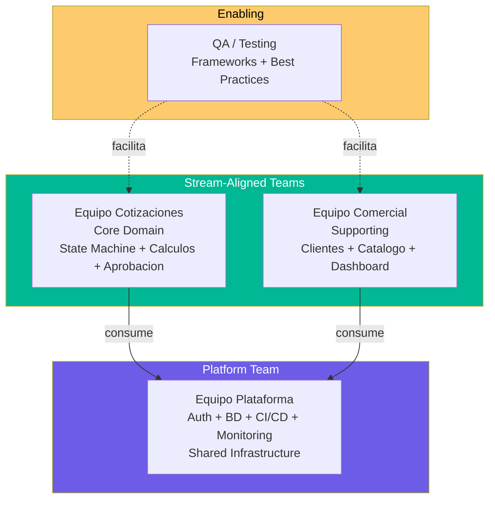
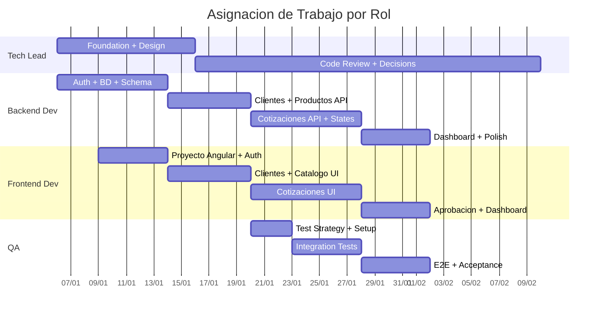

# QuoteFlow — Team Structure Assessment

## Fracture Planes

Puntos donde el sistema puede partirse en ownership independiente:

| # | Fracture Plane | Viabilidad | Justificación |
|---|---|---|---|
| 1 | Frontend / Backend | ✅ Alta | Separación física de carpetas, contrato REST via proxy. Un equipo puede trabajar en cada lado. |
| 2 | BC Cotizaciones / BC Catálogo / BC Clientes | ⚠️ Media | Actualmente mezclados en God File. Requiere separación en módulos primero. |
| 3 | Core Domain (Cotizaciones) / Supporting (CRUD) | ✅ Alta | Cotizaciones es el módulo más complejo (295 LOC + state machine + cálculos). El resto es CRUD estándar. |
| 4 | Auth/Identity / Business Logic | ✅ Alta | Auth es genérico — puede externalizarse a servicio (Keycloak, Auth0) o módulo independiente. |

## Cognitive Load Map

| Módulo | Responsabilidades | Cognitive Load | Team Type Natural |
|---|---|---|---|
| `app.ts` (God File) | Auth + CRUD ×4 + Dashboard + Config + Datos + Validaciones | **10/10 — Extremo** | N/A (debe partirse) |
| `AppService` (God Service) | HTTP ×6 dominios + Cálculos + Formateo + Estado | **9/10 — Extremo** | N/A (debe partirse) |
| `CotizacionComponent` | Lista + Crear + Detalle + Estado + Items + Filtrado | **7/10 — Alto** | Stream-aligned (Core) |
| `CatalogoComponent` | 2 entidades en 1 vista (Productos + Listas) | **5/10 — Medio** | Stream-aligned (Supporting) |
| `ClientesComponent` | CRUD estándar con búsqueda | **3/10 — Bajo** | Stream-aligned (Supporting) |
| `LoginComponent` | Login simple | **2/10 — Bajo** | Platform |
| `DashboardComponent` | Lectura de KPIs | **2/10 — Bajo** | Stream-aligned |

## Team Types Propuestos (Post-Rebuild)

## Interaction Modes

| Equipo A | Equipo B | Modo de Interacción | Justificación |
|---|---|---|---|
| Cotizaciones | Plataforma | **X-as-a-Service** | Plataforma provee Auth/BD/Logging como servicio |
| Comercial | Plataforma | **X-as-a-Service** | Mismo consumo de infraestructura |
| QA | Cotizaciones | **Facilitating** | QA ayuda a establecer prácticas, no es permanente |
| Cotizaciones | Comercial | **Collaboration** (temporal) | Al inicio para definir contratos entre módulos |

## Equipo Recomendado para Modernización (Rebuild)

| Rol | Cantidad | Dedicación | Responsabilidad |
|---|---|---|---|
| **Tech Lead** | 1 | 50% | Diseño arquitectónico, code review, decisiones técnicas |
| **Backend Developer** | 1 | 100% | NestJS modules, PostgreSQL, API REST, Auth JWT |
| **Frontend Developer** | 1 | 100% | Angular 17 standalone components, state management, UX |
| **QA Engineer** | 1 | 50% (Ola 2-3) | E2E tests, validación de criterios, automation |

**Tamaño total:** 3-4 personas
**Duración:** 7-8 semanas
**Talla QAM:** S (Small)

### Distribución de Trabajo por Persona

## Fracture Planes para la Nueva Arquitectura

En el sistema reconstruido, los fracture planes naturales son:

| Módulo NestJS | Ownership | Autonomía |
|---|---|---|
| `auth/` | Platform Team | Alta — contrato JWT estable |
| `clientes/` | Equipo Comercial | Alta — CRUD independiente |
| `productos/` | Equipo Comercial | Alta — CRUD independiente |
| `cotizaciones/` | Equipo Cotizaciones | Alta — Core domain aislado |
| `dashboard/` | Equipo Comercial | Media — depende de queries cross-module |

## Hallazgos Clave

- **Cognitive load actual es inmanejable** — God File y God Service concentran 10/10 de carga
- **2 Stream-Aligned teams** son suficientes post-rebuild (Core + Supporting)
- **1 Platform team** maneja la infraestructura compartida (Auth, BD, CI/CD)
- **Equipo de 3-4 personas** es apropiado para la talla del proyecto (~1,578 LOC a reescribir)
- **Sin cross-team dependencies bloqueantes** — la arquitectura modular de NestJS habilita trabajo paralelo

## Referencias

- [Modernization Assessment](modernization-assessment.md)
- [Complexity Analysis](complexity-analysis.md)
- [Component Order](../migration/component-order.md)
- [Architecture Patterns](../architecture/patterns.md)
