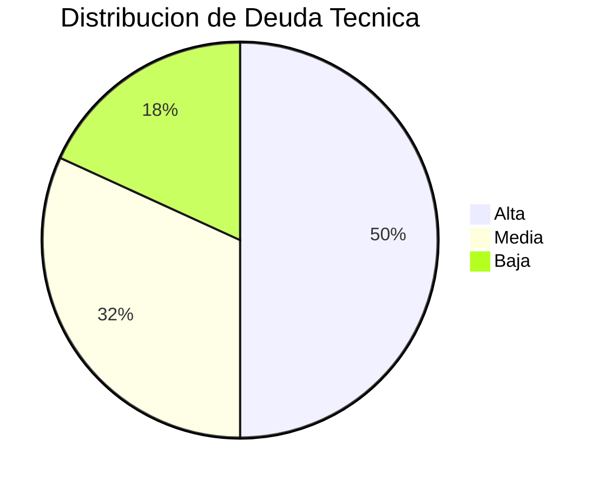
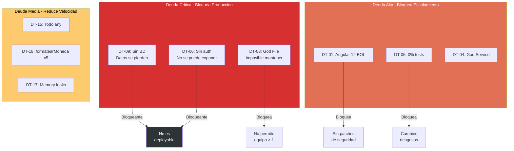

# QuoteFlow — Deuda Técnica y Legacy Assessment

## Resumen de Deuda Técnica

| Severidad | Cantidad | Impacto |
|---|---|---|
| 🔴 Alta | 11 | Framework/runtime EOL, vulnerabilidades, patrones bloqueantes |
| 🟡 Media | 7 | Versiones desactualizadas, patrones obsoletos |
| 🟢 Baja | 4 | Mejoras estilísticas, optimizaciones opcionales |
| **Total** | **22** | |

## Deuda Técnica — Severidad Alta

| # | Hallazgo | Categoría | Archivo | Línea | Impacto |
|---|---|---|---|---|---|
| DT-01 | Angular 12 EOL (dic-2022) | Framework EOL | `frontend/package.json` | 15 | Sin parches de seguridad, 4 major versions atrás |
| DT-02 | TypeScript 3.9 (backend) EOL | Runtime EOL | `backend/package.json` | 16 | Sin soporte, 2 major atrás |
| DT-03 | God File backend (700 LOC) | Architecture | `backend/src/app.ts` | 1-430 | Imposible testear, escalar o mantener |
| DT-04 | God Service frontend (240 LOC) | Architecture | `app.service.ts` | 1-250 | Todo depende de él, zona de dolor |
| DT-05 | 0% test coverage | Testing | (global) | — | Ningún cambio es seguro sin tests |
| DT-06 | Auth simulada (fake tokens) | Security | `app.ts` | 165 | No se puede exponer a internet |
| DT-07 | Passwords texto plano | Security | `app.ts` | 153 | CWE-256 |
| DT-08 | CORS origin: * | Security | `app.ts` | 158 | CWE-942 |
| DT-09 | Datos in-memory (sin BD) | Persistence | `app.ts` | 32-156 | Reinicio = pérdida total |
| DT-10 | Máquina de estados sin validación | Business Logic | `app.ts` | 287-295 | Cualquier transición es posible |
| DT-11 | Lógica de cálculo triplicada | DRY | `app.ts`:320, `app.service.ts`:208, componente | — | Inconsistencias entre capas |

## Deuda Técnica — Severidad Media

| # | Hallazgo | Categoría | Archivo | Impacto |
|---|---|---|---|---|
| DT-12 | body-parser deprecated | Dependency | `backend/package.json` | Uso de API obsoleta |
| DT-13 | jQuery incluido innecesariamente | Dependency | `frontend/src/index.html` | Peso muerto + conflicto con Angular |
| DT-14 | Bootstrap 4 via CDN (obsoleto) | Dependency | `frontend/src/index.html` | Sin control de versiones |
| DT-15 | 0 interfaces TypeScript | Typing | (global) | `any` en todo = sin type safety |
| DT-16 | `var` en lugar de `const/let` | Code Style | `app.ts`, `app.service.ts` | Scope issues, no-modern JS |
| DT-17 | rxjs sin unsubscribe/takeUntil | Memory Leak | `app.service.ts`:94-101 | Subscriptions activas post-destroy |
| DT-18 | formatearMoneda duplicado ×5 | DRY | 5 archivos | Cambio requiere editar 5 archivos |

## Deuda Técnica — Severidad Baja

| # | Hallazgo | Categoría | Archivo | Impacto |
|---|---|---|---|---|
| DT-19 | getBadgeClass duplicado ×4 | DRY | 4 archivos | Menor pero indica patrón copy-paste |
| DT-20 | `==` en vez de `===` | Code Style | `app.service.ts`:86 | Bug potencial con coerción |
| DT-21 | setTimeout sin cleanup | Memory | Múltiples componentes | Memory leak menor |
| DT-22 | console.log como logging | Operations | `app.ts`, `app.service.ts` | No es logging real |

## Legacy Readiness (Feathers) — Resumen

| Nivel | Componentes | Acción de Modernización |
|---|---|---|
| **D — Monolithic** | `app.ts`, `AppService` | Sprout/Wrap → Strangler fig → Rewrite parcial |
| **C — Seam-Poor** | CotizacionComponent, ClientesComponent, CatalogoComponent, AprobacionComponent | Dependency-breaking → Tests → Migrar |
| **B — Seam-Rich** | LoginComponent, DashboardComponent | Characterization tests → Migrar |
| **A — Testable** | (ninguno) | — |

## Characterization Tests Necesarios

Antes de cualquier refactoring, se necesitan tests que capturen el comportamiento actual:

| Componente | Test Necesario | Pinch Point |
|---|---|---|
| `app.ts` — cálculo de totales | Test de cálculo con datos conocidos | `app.ts`:320-335 |
| `app.ts` — CRUD endpoints | Integration tests de cada endpoint | Cada handler |
| `AppService.calcularTotalesCotizacion` | Unit test con items mock | `app.service.ts`:208-228 |
| Flujo de estados | Test de transiciones válidas/inválidas | `app.ts`:287-295 |
| Login/sesión | Test de establecimiento y cierre | `app.service.ts`:56-72 |

## Broken Windows (Pragmatic Programmer)

| Ventana Rota | Evidencia | Impacto Moral |
|---|---|---|
| Comentarios que dicen "MALA PRACTICA" | `app.ts`:1-14, `app.service.ts`:1-14 | Código se presenta como "malo a propósito" — no invita a mejorar |
| `var` en todo el código | Global en ambos archivos principales | Señal de código legacy/descuidado |
| `// TODO` sin implementar | 0 encontrados (ni siquiera hay aspiraciones) | Sin deuda técnica reconocida formalmente |
| Funcionalidades simuladas (`alert('PDF generado')`) | `cotizacion.component.ts`:234 | Features fake = el sistema no es real |
| Código muerto/sin usar | `bodyParser` importado cuando Express ya lo incluye | Dependencia zombie |

## Orthogonality Score: 1/5

**Justificación:** Cambiar cualquier componente afecta a otros:
- Cambiar formato de moneda → editar 5 archivos
- Cambiar estructura de cliente → editar `app.ts` + `AppService` + `ClientesComponent`
- Cambiar auth → editar `app.ts` + `AppService` + `LoginComponent`
- Cambiar cálculo de totales → editar 3 archivos

La ortogonalidad es prácticamente inexistente.

## DRY Violations de Conocimiento

| Conocimiento Duplicado | Dónde está | Cuántas veces |
|---|---|---|
| Fórmula de cálculo de cotización | Backend + Service + Component | 3 |
| Formato de moneda colombiana | 5 archivos | 5 |
| Mapeo estado→badge CSS class | 4 archivos | 4 |
| Estructura de URL de API | `app.service.ts` (15 strings concatenados) | 15 |
| Lógica de búsqueda por ID | `app.ts` (for loops) | 6 |

## Reversibility Assessment

| Decisión | ¿Reversible? | Justificación |
|---|---|---|
| Angular 12 como framework | ⚠️ Difícil | Todo el frontend está acoplado; upgrade requiere migración |
| Express como backend | ✅ Fácil | Backend es 1 archivo; reescritura en NestJS/Fastify es viable |
| Datos in-memory | ✅ Fácil | Agregar BD solo requiere reemplazar arrays por queries |
| Sin TypeScript strict | ⚠️ Difícil | Activar `strict: true` generaría cientos de errores |
| CDN para Bootstrap/jQuery | ✅ Fácil | Migrar a npm install + Angular Material |
| Monolito single-file | ⚠️ Difícil | Separar requiere crear toda la estructura de módulos |

## Diagrama de Impacto de Deuda

## Hallazgos Clave

- **11 items de deuda alta** — el sistema no es deployable a producción en su estado actual
- **0% test coverage** — ningún cambio es seguro sin tests previos
- **Legacy Readiness D** en componentes core — requiere rewrite, no refactoring
- **Orthogonality 1/5** — cambiar cualquier cosa impacta múltiples archivos
- **Broken Windows abundantes** — código se auto-declara como "malo a propósito"

## Referencias

- [Métricas de Código](code-metrics.md)
- [Análisis de Complejidad](complexity-analysis.md)
- [Seguridad](security-patterns.md)
- [Production Readiness](production-readiness.md)
- [Remediation Plan](../technical-debt/remediation-plan.md)
