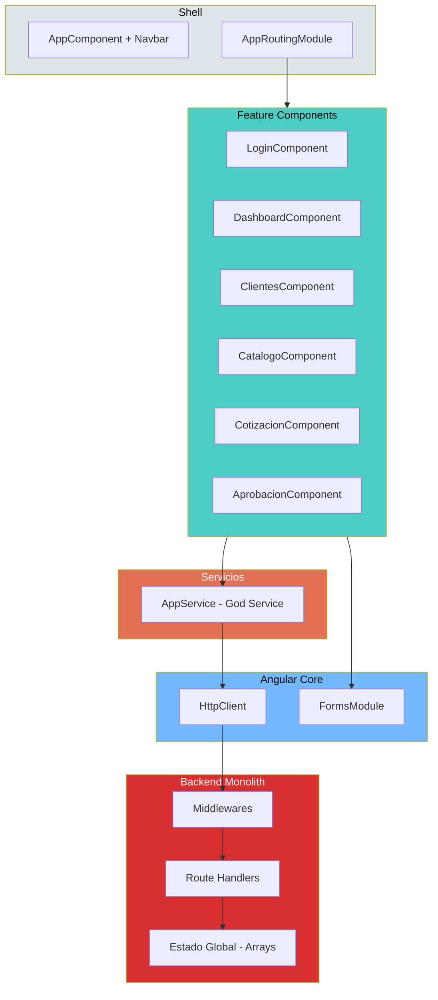

# QuoteFlow — Componentes del Sistema

## Componentes Principales

### Backend

El backend es un **monolito Express** concentrado en un único archivo `backend/src/app.ts` (~700 LOC). Internamente contiene las siguientes responsabilidades (sin separación física):

| Responsabilidad | Líneas aprox. | Descripción |
|----------------|---------------|-------------|
| Configuración y middlewares | 1-140 | Express setup, CORS, body-parser, logging |
| Datos semilla (estado global) | 30-130 | Arrays `CLIENTES`, `PRODUCTOS`, `LISTAS_PRECIOS`, `COTIZACIONES`, `USUARIOS` |
| Auth (login/logout) | 141-175 | Autenticación fake con tokens concatenados |
| CRUD Clientes | 176-240 | 5 endpoints (GET, GET/:id, POST, PUT, DELETE) |
| CRUD Productos | 241-290 | 3 endpoints (GET, POST, PUT) |
| Listas de Precios | 291-310 | 2 endpoints (GET, POST) |
| Cotizaciones | 311-365 | 4 endpoints (GET, GET/:id, POST, PUT estado) |
| Dashboard | 366-420 | 1 endpoint con cálculos estadísticos inline |
| Server startup | 421-430 | `app.listen()` |

### Frontend

El frontend Angular 12 está organizado en 6 componentes funcionales + 1 servicio:

| Componente | Tipo | Función | Complejidad |
|-----------|------|---------|-------------|
| `AppComponent` | Shell | Navbar + router-outlet | Baja |
| `LoginComponent` | Feature | Formulario de login | Baja |
| `DashboardComponent` | Feature | KPIs y actividad reciente | Media |
| `ClientesComponent` | Feature | CRUD completo de clientes | Alta (God Component) |
| `CatalogoComponent` | Feature | CRUD productos + listas precios | Alta (2 entidades) |
| `CotizacionComponent` | Feature | Ciclo completo de cotizaciones | Muy Alta (God Component) |
| `AprobacionComponent` | Feature | Flujo de aprobación | Media-Alta (copy-paste) |
| `AppService` | Service | TODA la lógica de la app | Muy Alta (God Service) |

## Diagrama de Componentes (C4 Nivel 3)

El diagrama muestra la concentración extrema: 6 componentes dependen de 1 servicio, que depende de 1 backend monolítico.

## Interfaces entre Componentes

| De | A | Tipo | Contrato |
|----|---|------|----------|
| Cada Feature Component | AppService | Inyección DI | Métodos públicos (sin interface) |
| AppService | HttpClient | Inyección DI | Angular HttpClient API |
| AppService | localStorage | Acceso directo | Web Storage API |
| HttpClient | Express app.ts | HTTP REST | JSON sin schema definido |

**Hallazgo crítico:** No existe ninguna **interface** TypeScript definida en todo el proyecto. Todo es `any`. Esto impide:
- Autocompletado del IDE
- Validación en tiempo de compilación
- Mocking para tests unitarios
- Documentación de contratos

## Hallazgos Clave

- **Ratio de concentración**: El 75% de la lógica está en 2 archivos (`app.ts` + `app.service.ts`)
- **Ratio componente/entidad**: 6 componentes manejan 4+ entidades de dominio
- **Sin módulos feature**: Imposible hacer lazy loading o tree shaking efectivo
- **Sin interceptors**: No hay manejo centralizado de auth headers ni errores HTTP
- **Sin guards**: Las rutas protegidas son accesibles sin autenticación

## Referencias

- [Arquitectura del Sistema](system-overview.md)
- [Dependencias](dependencies.md)
- [Estructura del Programa](../reference/program-structure.md)
