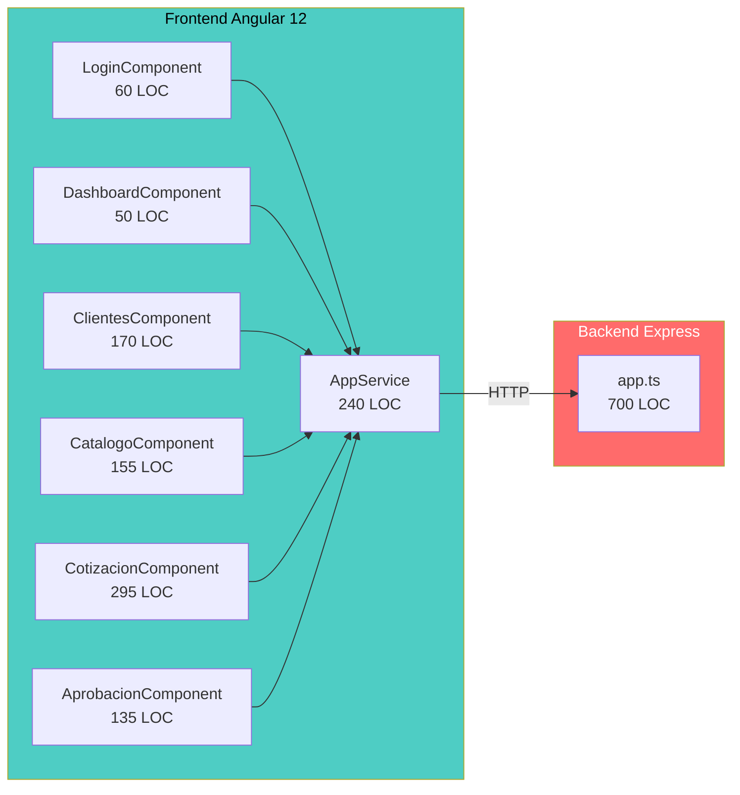
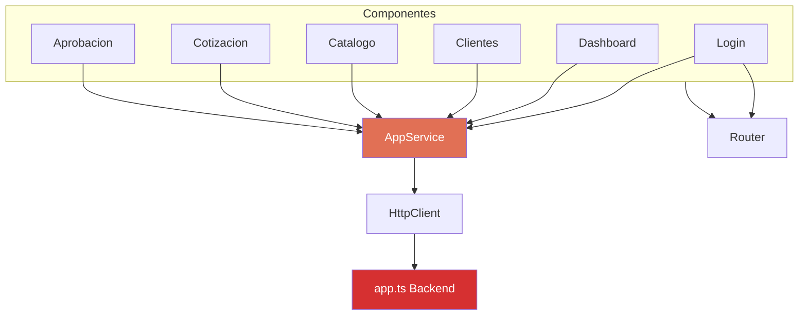

# QuoteFlow — Componentes y Dependencias

## Mapa de Componentes

## Inventario de Componentes

### Backend (1 archivo)

| Componente | Archivo | LOC | Responsabilidades | Anti-patrón |
|-----------|---------|-----|-------------------|-------------|
| **Express Server** | `backend/src/app.ts` | ~700 | Auth, CRUD Clientes, CRUD Productos, CRUD Cotizaciones, Listas de Precios, Dashboard KPIs, Middleware, Datos | **God File** (todo en 1 archivo) |

### Frontend (7 componentes + 1 servicio)

| Componente | Archivo | LOC | Responsabilidades | Anti-patrón |
|-----------|---------|-----|-------------------|-------------|
| **AppService** | `services/app.service.ts` | ~240 | Auth, HTTP clients ×5, estado global, cálculos, formateo | **God Service** |
| **CotizacionComponent** | `cotizacion/cotizacion.component.ts` | ~295 | Lista, crear, detalle, duplicar, acciones estado, PDF, email | **God Component** |
| **ClientesComponent** | `clientes/clientes.component.ts` | ~170 | Lista, crear, editar, detalle, eliminar, filtros | SRP violation |
| **CatalogoComponent** | `catalogo/catalogo.component.ts` | ~155 | CRUD Productos + CRUD Listas Precios | 2 entidades en 1 |
| **AprobacionComponent** | `aprobacion/aprobacion.component.ts` | ~135 | Lista pendientes, aprobar, rechazar, ajustes | Copy-paste de Cotizacion |
| **LoginComponent** | `login/login.component.ts` | ~60 | Login form + submit | Único razonable |
| **DashboardComponent** | `dashboard/dashboard.component.ts` | ~50 | Muestra KPIs | Lógica duplicada |
| **AppComponent** | `app.component.ts` | ~25 | Shell (navbar + router-outlet) | OK |

## Dependencias del Proyecto

### Frontend — Dependencias Directas (`frontend/package.json`)

| Paquete | Versión | Estado | Propósito |
|---------|---------|--------|-----------|
| @angular/core | ~12.2.13 | **EOL** dic-2022 | Framework SPA |
| @angular/common | ~12.2.13 | **EOL** | HttpClientModule, pipes |
| @angular/forms | ~12.2.13 | **EOL** | FormsModule, ReactiveFormsModule |
| @angular/router | ~12.2.13 | **EOL** | Enrutamiento |
| @angular/platform-browser | ~12.2.13 | **EOL** | DOM rendering |
| rxjs | ~6.6.7 | Desactualizado (actual: 7.8+) | Observables |
| zone.js | ~0.11.4 | Desactualizado | Change detection |
| tslib | ^2.3.0 | OK | Helpers TS |

### Frontend — Dependencias Dev

| Paquete | Versión | Estado | Propósito |
|---------|---------|--------|-----------|
| typescript | ~4.3.5 | **EOL** (actual: 5.5+) | Compilador TS |
| @angular/cli | ~12.2.13 | **EOL** | Build tooling |
| @angular-devkit/build-angular | ~12.2.13 | **EOL** | Webpack builder |

### Backend — Dependencias Directas (`backend/package.json`)

| Paquete | Versión | Estado | Propósito |
|---------|---------|--------|-----------|
| express | ^4.16.4 | Desactualizado (~4 minor) | HTTP framework |
| body-parser | ^1.18.3 | **Deprecated** (integrado en Express 4.16+) | Parsing JSON |
| cors | ^2.8.5 | Activo | CORS middleware |

### Backend — Dependencias Dev

| Paquete | Versión | Estado | Propósito |
|---------|---------|--------|-----------|
| typescript | ~3.9.10 | **EOL** (actual: 5.5+) | Compilador TS |
| ts-node | ^8.10.2 | Desactualizado | Ejecución directa TS |
| nodemon | ^2.0.7 | Desactualizado | Hot reload |
| @types/express | ^4.16.1 | Desactualizado | Tipos |
| @types/node | ^12.12.0 | **EOL** | Tipos Node.js |

### Dependencias CDN (no gestionadas por package manager)

| Recurso | Versión | Estado | Evidencia |
|---------|---------|--------|-----------|
| Bootstrap CSS | 4.5.2 | Obsoleto (actual: 5.3+) | `frontend/src/index.html` |
| Font Awesome | 5.15.4 | Desactualizado (actual: 6.5+) | `frontend/src/index.html` |
| jQuery slim | 3.5.1 | Desactualizado + innecesario con Angular | `frontend/src/index.html` |
| Popper.js | 1.16.1 | Obsoleto (actual: 2.x via @popperjs/core) | `frontend/src/index.html` |
| Bootstrap JS | 4.5.2 | Obsoleto | `frontend/src/index.html` |

## Grafo de Dependencias Internas

El diagrama muestra el patrón **estrella** donde TODOS los componentes dependen de un único servicio (`AppService`), que es el cuello de botella absoluto del sistema.

## Métricas de Acoplamiento

| Componente | Fan-in (quién depende de él) | Fan-out (de quién depende) | Instability (I) |
|-----------|------|---------|------|
| `AppService` | 6 componentes | HttpClient, localStorage | 0.25 (muy estable — pero es **God Service**) |
| `app.ts` (backend) | AppService (vía HTTP) | express, cors, body-parser | 0.75 (inestable) |
| `CotizacionComponent` | Router | AppService | 0.50 |
| `AprobacionComponent` | Router | AppService | 0.50 |
| `ClientesComponent` | Router | AppService | 0.50 |
| `CatalogoComponent` | Router | AppService | 0.50 |

## Hallazgos Clave

- **100% de componentes dependen de AppService** — Single Point of Failure en diseño
- **0 interfaces definidas** — Todo usa tipo `any`, imposible mockear para tests
- **0 módulos feature** — Todo declarado en `AppModule` (sin lazy loading posible)
- **5 dependencias CDN no gestionadas** — Sin control de versiones, sin fallback offline
- **body-parser es redundante** — Express 4.16+ incluye `express.json()` nativo

## Referencias

- [Arquitectura del Sistema](system-overview.md)
- [Dependencias — Análisis de Seguridad](../analysis/dependency-security-assessment.md)
- [Patrones Arquitectónicos](patterns.md)
