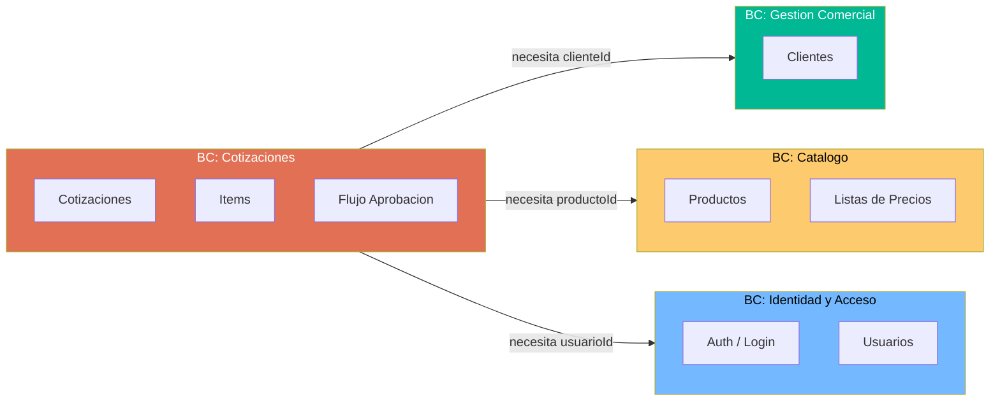
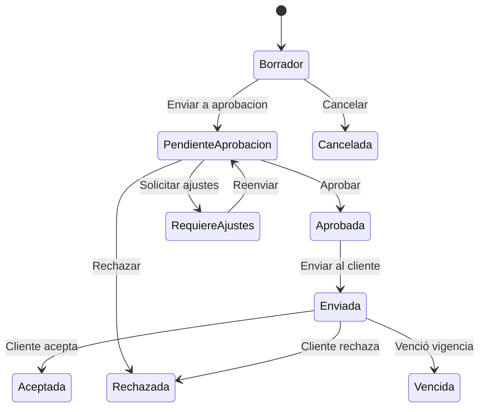

# QuoteFlow — Patrones Arquitectónicos

## Patrones Detectados

| Patrón | Detectado | Evidencia | Implementación |
|--------|-----------|-----------|----------------|
| MVC / Layered | ❌ Parcial | Frontend tiene componentes + servicio, pero no hay capas reales en backend | Solo la separación frontend/backend existe |
| Repository | ❌ No | `app.ts` accede a arrays directamente inline | Sin abstracción de datos |
| Service Layer | ❌ Parcial | `AppService` existe pero es God Service | Sin separación por dominio |
| CRUD Pattern | ✅ Sí | Endpoints GET/POST/PUT/DELETE para cada entidad | Implementación copy-paste |
| State Machine (implícita) | ✅ Parcial | `estadosValidos` array en `app.ts`:287 | Sin validación de transiciones |
| Singleton Service | ✅ Sí | `AppService` con `providedIn: 'root'` | Patrón Angular estándar |
| Proxy Pattern | ✅ Sí | `proxy.conf.json` redirige `/api` → backend | Solo en desarrollo |

## Anti-Patrones Detectados

### 1. God File (Backend)

**Archivo:** `backend/src/app.ts` (~700 LOC)
**Descripción:** Un único archivo contiene: configuración Express, middlewares, autenticación, CRUD de 4 entidades, lógica de dashboard, datos semilla y arranque del servidor.
**Impacto:** Imposible testear, escalar o asignar a múltiples desarrolladores.

### 2. God Service (Frontend)

**Archivo:** `frontend/src/app/services/app.service.ts` (~240 LOC)
**Descripción:** Un único servicio maneja: auth, clientes, productos, listas de precios, cotizaciones, dashboard, cálculos financieros y formateo de moneda.
**Impacto:** Viola ISP — cada componente depende de métodos que no usa. Imposible sustituir una sola preocupación.

### 3. God Components

**Archivos:** `cotizacion.component.ts` (295 LOC), `clientes.component.ts` (170 LOC), `catalogo.component.ts` (155 LOC)
**Descripción:** Componentes que manejan lista + crear + editar + detalle + acciones en un solo archivo.
**Impacto:** Componentes con 20+ propiedades, múltiples estados de vista (`lista`/`nueva`/`detalle`), lógica de filtrado inline.

### 4. Copy-Paste Programming

**Archivos:** `formatearMoneda()` duplicado en 5 lugares; `getBadgeClass()` duplicado en 4 lugares; loop de búsqueda por ID copiado 6 veces en `app.ts`.
**Impacto:** Cambiar la lógica de formateo o badge requiere modificar 5 archivos.

### 5. Anemic Backend (sin dominio)

**Evidencia:** No existen clases de dominio, entidades, value objects ni servicios de dominio. Los handlers HTTP contienen directamente la lógica de negocio.
**Impacto:** Imposible reutilizar lógica fuera del contexto HTTP.

## Evaluación DDD (Domain-Driven Design)

### Bounded Contexts Implícitos

A pesar de que no hay separación formal, se pueden identificar 4 bounded contexts naturales:

### Evaluación de Modelo de Dominio

| Criterio DDD | Evaluación | Evidencia |
|---|---|---|
| **Ubiquitous Language** | ⚠️ Parcial | Nombres en español (correcto para dominio colombiano): `razonSocial`, `condicionTributaria`, `cotizacion` |
| **Bounded Contexts** | ❌ No separados | Todo en 1 archivo backend + 1 servicio frontend |
| **Aggregates** | ❌ No existen | No hay root entities ni invariantes |
| **Anemic vs Rich Model** | ❌ Anémico total | Solo data bags (arrays de objetos planos con `any`) |
| **Anti-Corruption Layer** | N/A | No hay sistemas externos |
| **Domain Events** | ❌ No existen | Sin eventos, solo mutación directa de estado |
| **Value Objects** | ❌ No existen | Moneda, NIT, estados son strings sin validación |

**Clasificación:** ❌ **Big Ball of Mud** — Sin fronteras, todo acoplado, naming técnico/dominio mezclado.

## Evaluación Clean Architecture (Dependency Rule)

| Criterio | Evaluación | Evidencia |
|---|---|---|
| **Dirección de dependencias** | ❌ Violada | No hay capas; todo está en el mismo archivo/módulo |
| **Framework independence** | ❌ No | La lógica está pegada a Express handlers y Angular components |
| **Testabilidad sin infra** | ❌ Imposible | No hay interfaces, no hay inyección, todo es `any` |
| **Boundaries claras** | ❌ No existen | Un solo `AppService` + un solo `app.ts` |

### Métricas de Component Principles

| Componente | Ca (incoming) | Ce (outgoing) | I = Ce/(Ca+Ce) | A (abstractness) | D = \|A+I-1\| |
|-----------|---|---|---|---|---|
| AppService | 6 | 1 | 0.14 | 0 (sin interfaces) | 0.86 (zona de dolor) |
| app.ts | 1 | 3 | 0.75 | 0 | 0.25 |
| CotizacionComponent | 0 | 1 | 1.0 | 0 | 0.0 (en la línea) |
| AppModule | 0 | 7 | 1.0 | 0 | 0.0 |

**Hallazgo:** `AppService` está en la **zona de dolor** (I=0.14, A=0): es extremadamente estable (todo depende de él) pero no tiene abstracción. Cualquier cambio impacta a 6 componentes.

## Máquina de Estados de Cotizaciones

**Evidencia:** `app.ts`:287 define `estadosValidos` pero NO valida transiciones. El endpoint `PUT /api/cotizaciones/:id/estado` acepta CUALQUIER estado sin verificar que la transición sea válida. Esto es un bug de lógica de negocio crítico.

## Hallazgos Clave

- **Big Ball of Mud**: Sin bounded contexts, sin capas, sin abstracciones
- **AppService en zona de dolor**: Alta estabilidad + 0 abstracción = imposible cambiar sin romper todo
- **Máquina de estados sin validación**: Se puede pasar de `Rechazada` a `Aceptada` directamente
- **Sin eventos de dominio**: Los cambios de estado no generan notificaciones ni side effects controlados
- **4 Bounded Contexts naturales identificables** para una posible modernización con microservicios

## Referencias

- [Arquitectura del Sistema](system-overview.md)
- [Componentes y Dependencias](dependencies.md)
- [Lógica de Negocio](../behavior/business-logic.md)
- [Evaluación de Modernización](../analysis/modernization-assessment.md)
