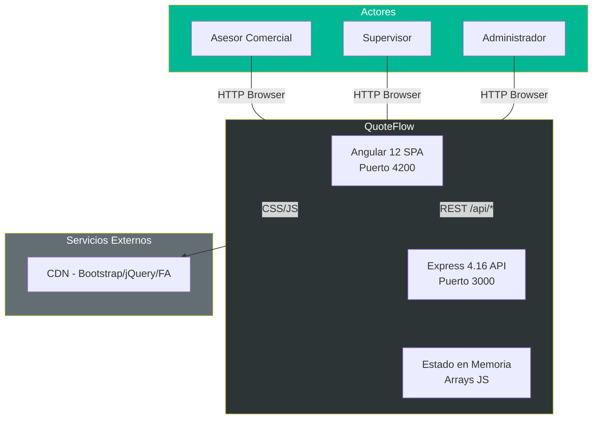
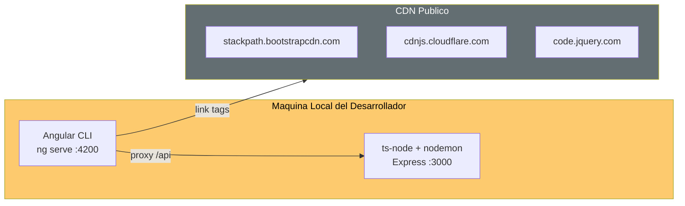

# QuoteFlow — Arquitectura del Sistema

## Visión General

QuoteFlow implementa una arquitectura **monolítica de 2 capas** (frontend SPA + backend REST) extremadamente acoplada. El sistema opera sin persistencia real (estado en memoria), sin seguridad efectiva y con todo el backend concentrado en un único archivo.

## Modelo Arquitectónico

La arquitectura es un **Monolito Simplificado** (no es N-tier genuino porque carece de capa de persistencia):

| Capa | Implementación | Archivos | Estado |
|------|---------------|----------|--------|
| **Presentación** | Angular 12 SPA (6 componentes + 1 servicio) | 15 archivos .ts + 8 .html | God Components |
| **API/Servicios** | Express 4.16 REST | 1 archivo (`app.ts`) | God File |
| **Persistencia** | Arrays JavaScript en memoria | Inline en `app.ts` | Sin BD real |

## Diagrama de Contexto (C4 Nivel 1)

El diagrama muestra que QuoteFlow es un sistema cerrado sin integraciones externas. Los 3 roles de usuario interactúan con el frontend Angular que a su vez consume el backend Express. No hay bases de datos, colas, servicios externos ni proveedores de identidad.

## Modelo de Despliegue

**Evidencia:** `proxy.conf.json` configura el proxy de desarrollo: `"/api": { "target": "http://localhost:3000" }`. `environment.prod.ts` apunta igualmente a `http://localhost:3000/api`, confirmando que no hay despliegue a producción real.

## Decisiones Arquitectónicas Detectadas

| # | Decisión | Evidencia | Impacto |
|---|----------|-----------|---------|
| DA-01 | Monolito en 1 archivo | `backend/src/app.ts` (~700 LOC) | Imposible escalar, testear o mantener |
| DA-02 | Sin base de datos | Arrays `CLIENTES`, `PRODUCTOS`, etc. en `app.ts` | Datos se pierden al reiniciar |
| DA-03 | Sin autenticación real | Token = `'FAKE_TOKEN_' + id + '_' + Date.now()` | Zero seguridad |
| DA-04 | CORS abierto | `cors({ origin: '*' })` en `app.ts`:134 | Cualquier origen puede consumir la API |
| DA-05 | God Service frontend | `AppService` maneja auth + 5 entidades | SRP violado completamente |
| DA-06 | Sin routing guards | `app-routing.module.ts` sin `CanActivate` | Rutas accesibles sin auth |
| DA-07 | CDN para UI libs | `index.html` importa Bootstrap/jQuery vía CDN | Dependencia de internet, sin control de versiones |
| DA-08 | Versiones EOL intencionales | Comentario en `backend/package.json` | Aplicación de demostración/prototipo |

## Comunicación entre Capas

| Origen | Destino | Protocolo | Formato | Auth |
|--------|---------|-----------|---------|------|
| Browser | Angular SPA | HTTP/HTTPS | HTML/JS | Ninguna |
| Angular SPA | Express API | HTTP REST | JSON | Header `Authorization` (token falso) |
| Express API | Estado | In-process | Referencia directa a arrays | N/A |

## Hallazgos Clave

- **Anti-patrón God File**: Todo el backend (~700 LOC) en un único `app.ts` — rutas, lógica de negocio, datos y configuración mezclados
- **Anti-patrón God Service**: `AppService` (~240 LOC) maneja 6 dominios (auth, clientes, productos, listas, cotizaciones, dashboard)
- **Sin separación de concerns**: No hay capas de repositorio, dominio ni aplicación
- **Sin CI/CD**: No se detectan pipelines, Dockerfiles ni scripts de deployment
- **Prototipo/Demo**: Las versiones obsoletas son intencionalmente elegidas (evidencia: comentario explícito en `backend/package.json`)

## Referencias

- [Componentes y Dependencias](components.md)
- [Patrones Arquitectónicos](patterns.md)
- [Visión General del Proyecto](../project-overview.md)
