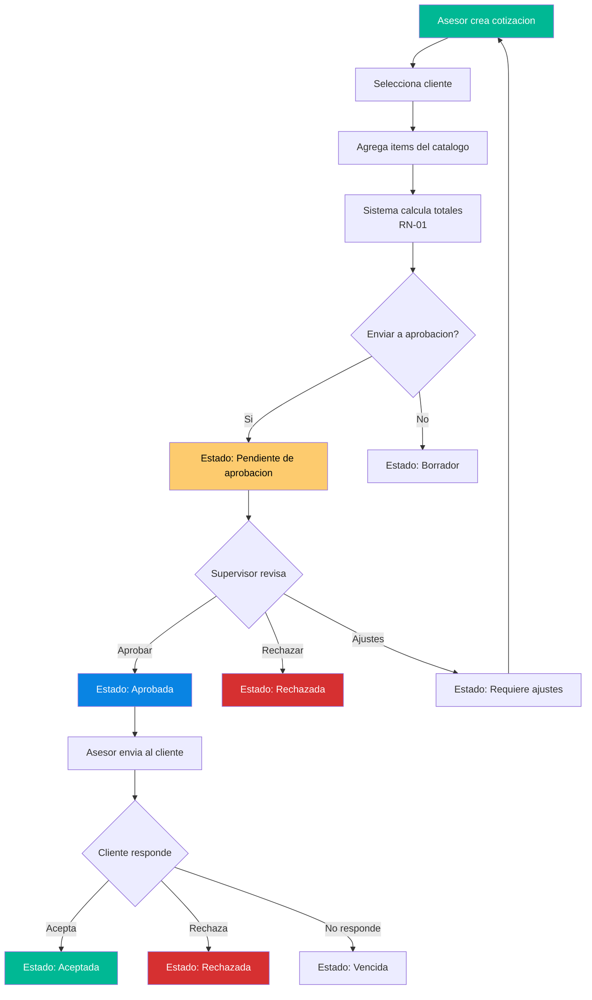

# QuoteFlow — Lógica de Negocio

## Dominios Funcionales

El sistema implementa lógica de negocio para **gestión de cotizaciones comerciales** con los siguientes dominios:

| Dominio | Entidades | Lógica Principal | Ubicación |
|---------|-----------|------------------|-----------|
| **Autenticación** | Usuarios, Sesiones | Login/Logout con tokens falsos | `app.ts`:141-175, `app.service.ts`:47-72 |
| **Gestión de Clientes** | Clientes | CRUD + historial de cotizaciones | `app.ts`:176-240, `clientes.component.ts` |
| **Catálogo** | Productos, Listas de Precios | CRUD productos + precios por segmento | `app.ts`:241-310, `catalogo.component.ts` |
| **Cotizaciones** | Cotizaciones, Items, Estados | Creación, cálculo, aprobación, estados | `app.ts`:311-365, `cotizacion.component.ts` |
| **Dashboard** | Métricas agregadas | KPIs comerciales, tasa conversión | `app.ts`:366-420, `dashboard.component.ts` |

## Reglas de Negocio Detectadas

### RN-01: Cálculo de Totales de Cotización

**Ubicación:** `app.ts`:320-335 (backend) + `app.service.ts`:153-170 (frontend — duplicado)

```
Para cada item:
  descuentoItem = cantidad × precio × (descuento% / 100)
  baseItem = (cantidad × precio) - descuentoItem
  impuestoItem = baseItem × (impuesto% / 100)
  subtotalItem = baseItem

Totales:
  subtotal = Σ baseItem
  descuentoGeneral = subtotal × (descuentoGeneral% / 100)
  total = (subtotal - descuentoGeneral) + Σ impuestoItem
```

**Hallazgo:** Esta lógica está **triplicada** — en el backend (`app.ts`), en `AppService.calcularTotalesCotizacion()` y parcialmente en `CotizacionComponent.calcularItemTemp()`.

### RN-02: Máquina de Estados de Cotización

**Ubicación:** `app.ts`:287 (definición), `app.ts`:288-295 (transición sin validación)

Estados válidos: `Borrador`, `Pendiente de aprobación`, `Requiere ajustes`, `Aprobada`, `Enviada`, `Aceptada`, `Rechazada`, `Vencida`, `Cancelada`

**Bug detectado:** El endpoint acepta CUALQUIER transición de estado sin validar que sea legal. Un `Borrador` puede pasar directamente a `Aceptada`, violando el flujo de negocio.

### RN-03: Permisos por Rol

**Ubicación:** `cotizacion.component.ts`:250-252 (`puedeAprobar()`)

| Rol | Puede crear cotizaciones | Puede aprobar | Puede rechazar |
|-----|-------------------------|---------------|----------------|
| `asesor` | ✅ | ❌ | ❌ |
| `supervisor` | ✅ | ✅ | ✅ |
| `admin` | ✅ | ✅ | ✅ |

**Hallazgo:** La validación de permisos existe SOLO en el frontend (`puedeAprobar()`). El backend NO verifica roles — cualquier token (incluso falso) puede aprobar/rechazar.

### RN-04: Validación de Duplicados

**Ubicación:** `app.ts`:199 (clientes por NIT), `app.ts`:262 (productos por código)

- No se permite crear dos clientes con la misma `identificacion` (NIT)
- No se permite crear dos productos con el mismo `codigo`

### RN-05: Descuento Máximo por Lista de Precios

**Ubicación:** `app.ts`:90-92 (datos de listas: `descuentoMaximo`)

Las listas de precios definen un descuento máximo por segmento (10%, 15%, 25%), pero **no se valida en ningún lugar** que el descuento aplicado no exceda el máximo. El caso de prueba COT-2024-004 (20% de descuento con máximo 25%) se rechazó manualmente por el supervisor, no por el sistema.

### RN-06: Numeración de Cotizaciones

**Ubicación:** `app.ts`:339-340

```
Formato: COT-{AÑO}-{CONSECUTIVO_3_DIGITOS}
Ejemplo: COT-2024-005
```

El consecutivo es un counter global (`cotizacionCounter`) que no persiste entre reinicios.

## Diagrama de Lógica de Negocio Principal



## Validaciones Implementadas

| Validación | Backend | Frontend | Consistente |
|-----------|---------|----------|-------------|
| Cliente requerido en cotización | ✅ `app.ts`:313 | ✅ `cotizacion.component.ts`:173 | ✅ |
| Mínimo 1 item en cotización | ✅ `app.ts`:316 | ✅ `cotizacion.component.ts`:177 | ✅ |
| Razón social requerida (cliente) | ✅ `app.ts`:194 | ✅ `clientes.component.ts`:94 | ✅ |
| Identificación requerida (cliente) | ✅ `app.ts`:197 | ✅ `clientes.component.ts`:98 | ✅ |
| NIT único | ✅ `app.ts`:199 | ❌ No validado | ⚠️ Parcial |
| Código producto único | ✅ `app.ts`:262 | ❌ No validado | ⚠️ Parcial |
| Vigencia requerida | ❌ No validado | ✅ `cotizacion.component.ts`:181 | ⚠️ Parcial |
| Descuento máximo por lista | ❌ No validado | ❌ No validado | ❌ Sin implementar |
| Transiciones de estado válidas | ❌ No validado | ❌ No validado | ❌ **Bug crítico** |

## Hallazgos Clave

- **Lógica de cálculo triplicada** (backend + servicio + componente) — DRY violation masiva
- **Máquina de estados sin validación** — Bug de negocio crítico: cualquier transición es posible
- **Permisos solo en frontend** — El backend no verifica roles, seguridad es cosmética
- **Descuento máximo definido pero no aplicado** — Regla de negocio documentada pero no implementada
- **Sin auditoría real** — Los `historialEstados` se pueden manipular directamente

## Referencias

- [Workflows](workflows.md)
- [Lógica de Decisión](decision-logic.md)
- [Patrones Arquitectónicos](../architecture/patterns.md)
- [API Reference](../reference/api-reference.md)
