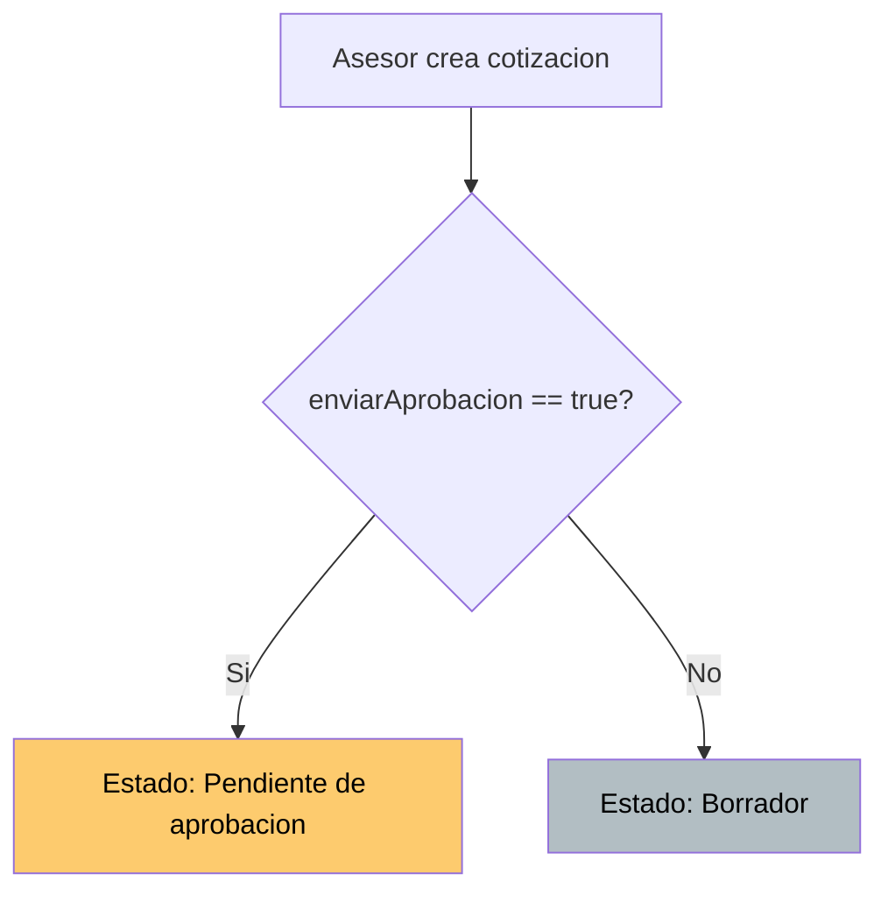

# QuoteFlow — Lógica de Decisión

## Decisiones Condicionales en el Sistema

### D-01: Determinar Estado Inicial de Cotización

**Ubicación:** `backend/src/app.ts`:343
**Regla:** Si el asesor marca "enviar a aprobación" → estado = `Pendiente de aprobación`. Si no → estado = `Borrador`.



### D-02: Determinar Permisos de Aprobación

**Ubicación:** `frontend/src/app/cotizacion/cotizacion.component.ts`:250-252
**Regla:** Solo usuarios con rol `supervisor` o `admin` pueden aprobar/rechazar.

```typescript
puedeAprobar(): any {
  return this.svc.usuarioActual &&
    (this.svc.usuarioActual.rol === 'supervisor' || this.svc.usuarioActual.rol === 'admin');
}
```

**Problema:** Esta validación es SOLO en frontend. El backend no la implementa.

### D-03: Validar Motivo de Rechazo

**Ubicación:** `frontend/src/app/aprobacion/aprobacion.component.ts`:84
**Regla:** Para rechazar una cotización, es obligatorio ingresar un comentario/motivo.

```typescript
if (!this.comentario) {
  this.mensajeError = 'Debe ingresar un motivo de rechazo';
  return;
}
```

**Problema:** Solo validado en frontend `AprobacionComponent`. El backend acepta rechazo sin comentario.

### D-04: Cálculo de Descuento por Item

**Ubicación:** `backend/src/app.ts`:322-327 (duplicado en `app.service.ts`:155-162)
**Regla:** `descuento_item = cantidad × precio × (porcentaje_descuento / 100)`

### D-05: Verificación de Duplicados

**Ubicación:** `backend/src/app.ts`:199 (clientes), `app.ts`:262 (productos)
**Regla:**
- No pueden existir 2 clientes con la misma `identificacion` (NIT)
- No pueden existir 2 productos con el mismo `codigo`

### D-06: Badge Class por Estado

**Ubicación:** Duplicado en 5 archivos (`app.service.ts`:177, `cotizacion.component.ts`:242, `aprobacion.component.ts`:126, `dashboard.component.ts`:31)

| Estado | Clase CSS | Color visual |
|--------|-----------|--------------|
| Borrador | `badge-secondary` | Gris |
| Pendiente de aprobación | `badge-warning` | Amarillo |
| Requiere ajustes | `badge-info` | Azul claro |
| Aprobada | `badge-primary` | Azul |
| Enviada | `badge-info` | Azul claro |
| Aceptada | `badge-success` | Verde |
| Rechazada | `badge-danger` | Rojo |
| Vencida | `badge-warning` | Amarillo |
| Cancelada | `badge-dark` | Negro |

### D-07: Cálculo de Tasa de Conversión

**Ubicación:** `backend/src/app.ts`:397
**Regla:** `tasaConversion = (cotizaciones_aceptadas / total_cotizaciones) × 100` (redondeado)

### D-08: Margen Estimado (Simulado)

**Ubicación:** `frontend/src/app/aprobacion/aprobacion.component.ts`:138
**Regla:** `margen = total × 0.35` (35% hardcodeado — simulación sin datos de costo reales)

## Tabla de Decisiones Consolidada

| ID | Condición | Resultado True | Resultado False | Ubicación |
|----|-----------|----------------|-----------------|-----------|
| D-01 | `enviarAprobacion == true` | Estado "Pendiente" | Estado "Borrador" | `app.ts`:343 |
| D-02 | `rol == 'supervisor' \|\| rol == 'admin'` | Puede aprobar | No puede aprobar | `cotizacion.component.ts`:250 |
| D-03 | `comentario vacío` + acción = rechazar | Error — bloquea rechazo | Permite rechazo | `aprobacion.component.ts`:84 |
| D-04 | `descuento > 0` | Reduce base del item | Base = cantidad × precio | `app.ts`:323 |
| D-05 | `identificacion ya existe` | Error 400 — duplicado | Permite creación | `app.ts`:199 |
| D-06 | `estado de cotización` | Badge class específica | `badge-secondary` (default) | 5 archivos |
| D-07 | `totalCotizaciones > 0` | Calcula % conversión | Retorna 0 | `app.ts`:397 |
| D-08 | Siempre | `total × 0.35` | N/A | `aprobacion.component.ts`:138 |

## Hallazgos Clave

- **0 decisiones con validación completa frontend + backend** — todas tienen gaps de un lado u otro
- **Lógica de permisos solo cosmética** — backend no verifica roles (D-02)
- **Máquina de estados sin validación** — no hay decisión que impida transiciones inválidas
- **Lógica de badge duplicada 5 veces** — violación DRY masiva para una simple tabla de mapeo
- **Margen calculado con magic number** (35%) sin datos reales de costos

## Referencias

- [Lógica de Negocio](business-logic.md)
- [Workflows](workflows.md)
- [Manejo de Errores](error-handling.md)
