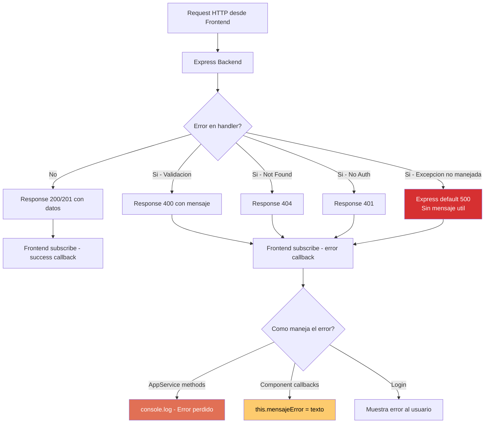

# QuoteFlow — Manejo de Errores

## Estrategia de Manejo de Errores

El sistema **no tiene una estrategia de manejo de errores**. Los errores se manejan de forma ad-hoc en cada punto del código con patrones inconsistentes.

## Patrones de Error Detectados

### Backend (`app.ts`)

| Patrón | Evidencia | Impacto |
|--------|-----------|---------|
| **HTTP 401 sin detalle** | `app.ts`:161 — `{ error: 'Credenciales incorrectas' }` | OK (no revela info) |
| **HTTP 400 genérico** | `app.ts`:195, 198, 263, 313, 316 — mensajes estáticos | Parcialmente útil |
| **HTTP 404 estándar** | `app.ts`:185, 230, 275, 285, 306 — `{ error: 'X no encontrado' }` | OK |
| **Sin try/catch** | No existe ningún `try/catch` en todo `app.ts` | Si Express crashea, el servidor muere |
| **Sin middleware de errores** | No hay `app.use((err, req, res, next) => ...)` | Errores no capturados retornan 500 genérico |
| **console.log como "logging"** | `app.ts`:133, 358 — `console.log` con datos sensibles | No es logging real |

### Frontend (`app.service.ts` + componentes)

| Patrón | Evidencia | Impacto |
|--------|-----------|---------|
| **Error swallowed** | `app.service.ts`:82, 95, 107, 119, 135 — `console.log('Error: ' + error)` | Errores perdidos silenciosamente |
| **Sin HttpErrorResponse tipado** | Todos los `(error: any)` callbacks | No se sabe qué tipo de error es |
| **Alert para "funcionalidades"** | `cotizacion.component.ts`:234, 241 — `alert('PDF generado...')` | Simulación, no manejo de errores |
| **confirm() para acciones destructivas** | `clientes.component.ts`:137 — `confirm('¿Desea eliminar...?')` | UX pobre, no Angular-native |
| **setTimeout sin cleanup** | Múltiples instancias en componentes — `setTimeout(() => {}, 3000)` | Memory leaks, componentes destruidos antes del timeout |
| **Sin interceptor de errores** | No existe `HttpInterceptor` | Sin manejo centralizado |

## Diagrama de Flujo de Errores



## Categorización de Errores

| Tipo de Error | Cantidad de Handlers | Estrategia | Calidad |
|---|---|---|---|
| Validación de entrada | 7 (backend) | HTTP 400 + mensaje | ⚠️ OK pero sin estructura estándar |
| Recurso no encontrado | 5 (backend) | HTTP 404 + mensaje | ⚠️ OK |
| Autenticación | 1 (backend) | HTTP 401 | ⚠️ OK |
| Error de red/servidor | 0 (backend) | Sin manejo | ❌ Crash del servidor |
| Error en Observable (frontend) | 8 callbacks | `console.log` | ❌ Swallowed |
| Error no anticipado (frontend) | 0 | Sin `ErrorHandler` global | ❌ Sin captura |

## Anti-Patrones de Error Handling

### 1. Catch-and-Swallow (más frecuente)

```typescript
// app.service.ts — TODOS los métodos de carga
(error: any) => {
  console.log('Error clientes: ' + error);  // Error perdido para siempre
}
```

**Impacto:** El usuario no sabe que algo falló. La UI muestra datos vacíos sin explicación.

### 2. No Error Boundaries

- Sin `ErrorHandler` personalizado de Angular
- Sin `HttpInterceptor` para errores globales
- Sin `app.use((err, ...) => ...)` en Express
- Sin `process.on('uncaughtException')` o `unhandledRejection`

### 3. Logging de Datos Sensibles

```typescript
// app.ts:133 — Middleware de logging
console.log('Body:', JSON.stringify(req.body)); // Loguea passwords en texto plano
```

```typescript
// app.service.ts:64
console.log('Sesion establecida para: ' + datos.usuario.email + ' token: ' + datos.token);
```

### 4. Silent Recovery

```typescript
// app.service.ts:41-44 — Constructor
try {
  var sesionStr: any = localStorage.getItem('qf_session');
  // ...parse session
} catch (e) {
  console.log('Error recuperando sesion'); // Falla silenciosamente
}
```

## Mensajes de Error al Usuario

| Contexto | Mensaje | Archivo:Línea |
|----------|---------|---------------|
| Login fallido | "Credenciales incorrectas" | `app.ts`:161 |
| Cliente sin razón social | "La razón social es requerida" | `app.ts`:195 |
| Cliente NIT duplicado | "Ya existe un cliente con esa identificación" | `app.ts`:201 |
| Producto sin código | "El código es requerido" | `app.ts`:264 |
| Cotización sin cliente | "El cliente es requerido" / "Debe seleccionar un cliente" | `app.ts`:313 / `cotizacion.component.ts`:174 |
| Cotización sin items | "Debe agregar al menos un item" / "...producto o servicio" | `app.ts`:316 / `cotizacion.component.ts`:178 |
| Rechazo sin motivo | "Debe ingresar un motivo de rechazo" | `aprobacion.component.ts`:85 |
| Error genérico (frontend) | "Error al [crear/actualizar/eliminar]" | Múltiples componentes |

## Hallazgos Clave

- **0 interceptors HTTP** — sin manejo centralizado de auth errors o server errors
- **0 Error Handlers globales** — ni en Angular ni en Express
- **8 instancias de error swallowed** — errores perdidos con `console.log`
- **Datos sensibles en logs** — passwords y tokens logueados en texto plano
- **Sin retry/fallback** — si un request falla, falla permanentemente
- **Sin user-friendly error pages** — no hay componente de error 500/404 en el frontend

## Referencias

- [Lógica de Negocio](business-logic.md)
- [Workflows](workflows.md)
- [Análisis de Seguridad](../analysis/security-patterns.md)
- [Production Readiness](../analysis/production-readiness.md)
