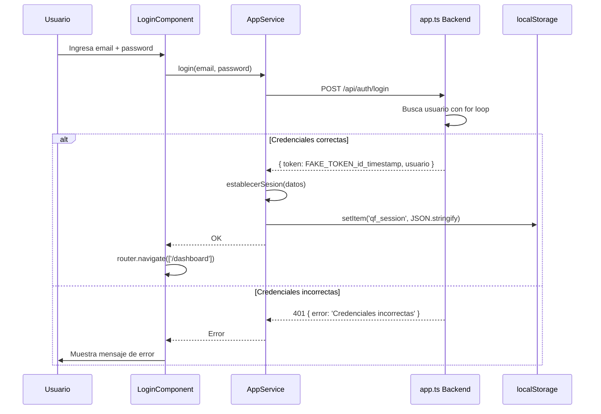
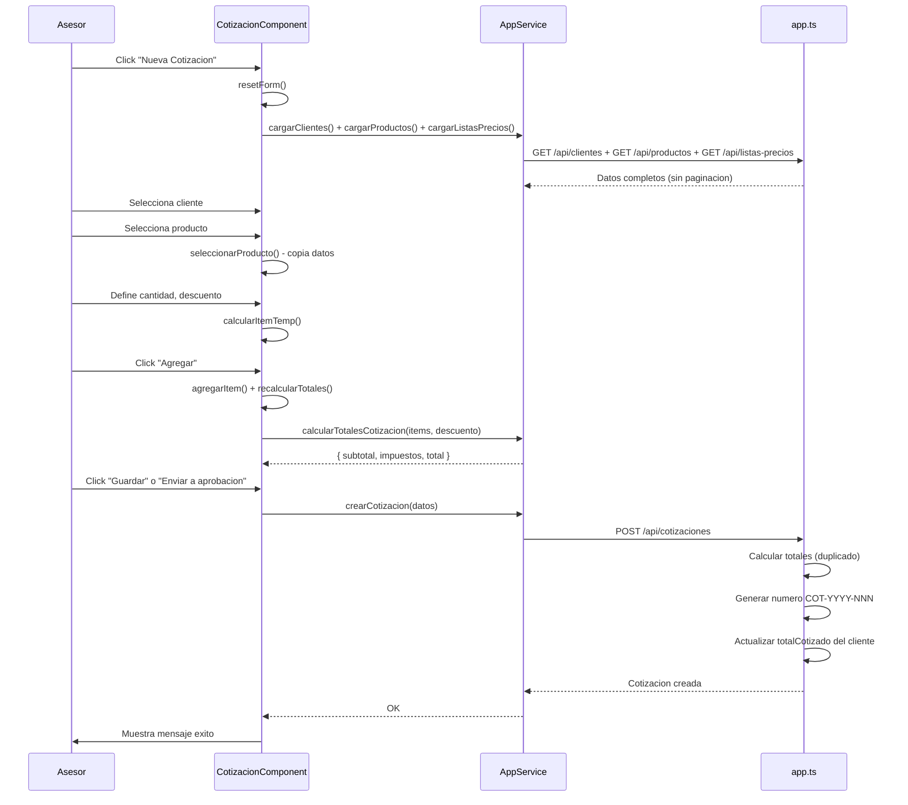
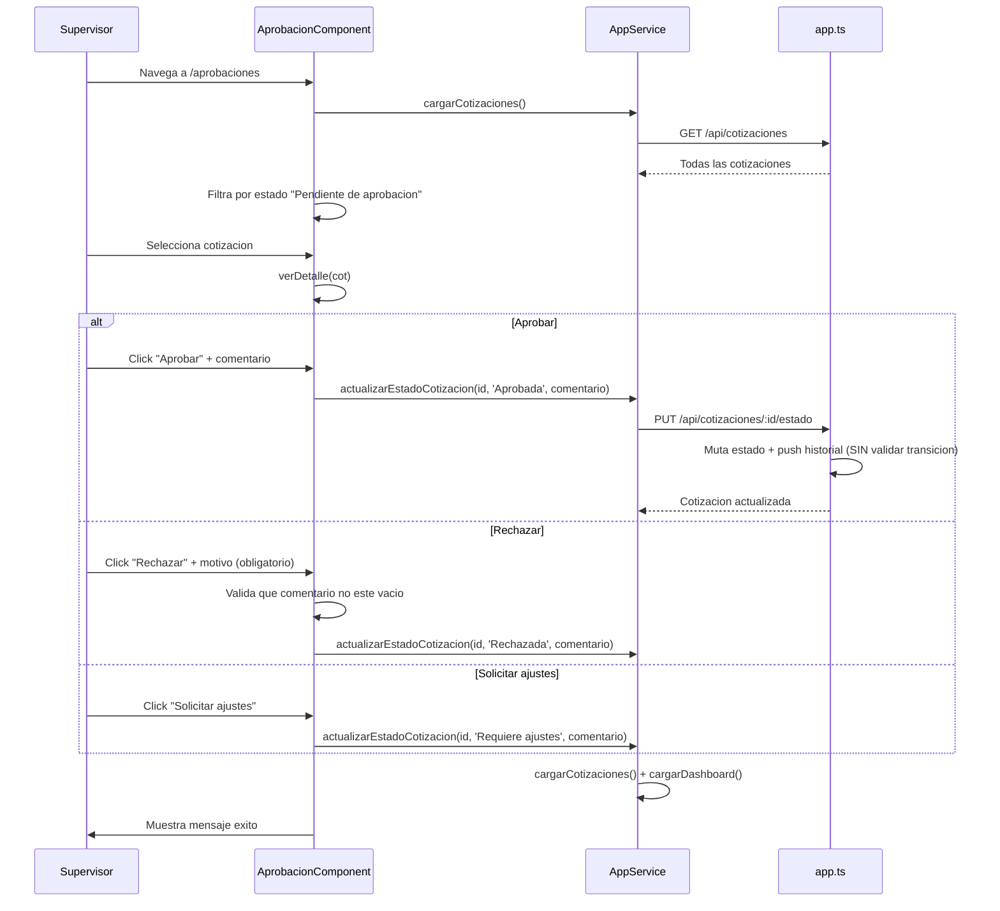

# QuoteFlow — Workflows

## Workflow 1: Login y Establecimiento de Sesión

**Actores:** Asesor, Supervisor, Admin
**Entrada:** Email + Password
**Salida:** Token fake + datos de usuario en localStorage

**Problemas detectados:**
- Password comparado en texto plano (`==` en vez de `===`) — `app.ts`:158
- Token retornado incluye el password del usuario en la respuesta — `app.ts`:168
- Token almacenado en localStorage (vulnerable a XSS) — `app.service.ts`:62

## Workflow 2: Creación de Cotización

**Actor:** Asesor
**Entrada:** Cliente, items del catálogo, condiciones
**Salida:** Cotización con número generado y cálculos

**Problemas detectados:**
- Cálculos duplicados en frontend y backend — inconsistencia posible
- Se cargan TODOS los clientes/productos sin paginación — no escala
- El backend retorna 200 en vez de 201 para creación

## Workflow 3: Flujo de Aprobación

**Actores:** Asesor (solicita), Supervisor (aprueba/rechaza)
**Entrada:** Cotización en estado "Pendiente de aprobación"
**Salida:** Cotización aprobada, rechazada o con ajustes solicitados

**Problemas detectados:**
- El backend NO verifica que el usuario sea supervisor — `app.ts`:288 no valida roles
- Solo el frontend valida que el comentario de rechazo no esté vacío — `aprobacion.component.ts`:84
- El filtrado de "Pendiente de aprobación" se hace en el frontend — se traen TODAS las cotizaciones

## Workflow 4: Dashboard y KPIs

**Actor:** Cualquier usuario autenticado
**Entrada:** Ninguna (automático al navegar)
**Salida:** Métricas agregadas del negocio

**Métricas calculadas** (evidencia: `app.ts`:366-420):
- Total cotizaciones por estado (borrador, pendiente, enviada, aceptada, rechazada, vencida)
- Valor total cotizado (suma de todos los totales)
- Valor total aceptado (suma de totales con estado "Aceptada")
- Tasa de conversión = (aceptadas / total) × 100
- Actividad reciente (últimas 5 cotizaciones ordenadas por fecha)
- Total clientes activos
- Total productos activos
- Próximos a vencer (cotizaciones en estado "Enviada")

**Problemas detectados:**
- Cálculo con múltiples loops innecesarios (2 loops completos sobre el mismo array) — `app.ts`:375-395
- Sin caché — se recalcula en cada request
- Sin filtro por asesor — un asesor ve las métricas de TODOS

## Workflow 5: CRUD de Clientes

**Actor:** Asesor, Supervisor, Admin
**Entrada:** Datos del cliente (NIT, razón social, contacto, etc.)
**Salida:** Cliente creado/actualizado/eliminado

Operaciones:
1. **Listar** — GET /api/clientes (sin paginación, todos los clientes)
2. **Crear** — POST /api/clientes (valida NIT único + razón social requerida)
3. **Editar** — PUT /api/clientes/:id (actualización parcial)
4. **Eliminar** — DELETE /api/clientes/:id (borrado físico permanente)
5. **Detalle** — GET /api/clientes/:id (incluye historial de cotizaciones inline)

**Problemas detectados:**
- Borrado físico en vez de lógico (`DELETE` elimina permanentemente) — `app.ts`:233
- El detalle muta el objeto original del cliente añadiendo `historialCotizaciones` — `app.ts`:189

## Hallazgos Clave

- **5 workflows principales** identificados con lógica de negocio significativa
- **Sin validación de transiciones de estado** — el workflow de aprobación es bypasseable
- **Duplicación de cálculos** entre frontend y backend — riesgo de inconsistencia
- **Sin paginación** — todos los endpoints retornan datasets completos
- **Sin autorización en backend** — cualquier token accede a cualquier operación

## Referencias

- [Lógica de Negocio](business-logic.md)
- [Lógica de Decisión](decision-logic.md)
- [Manejo de Errores](error-handling.md)
- [API Reference](../reference/api-reference.md)
