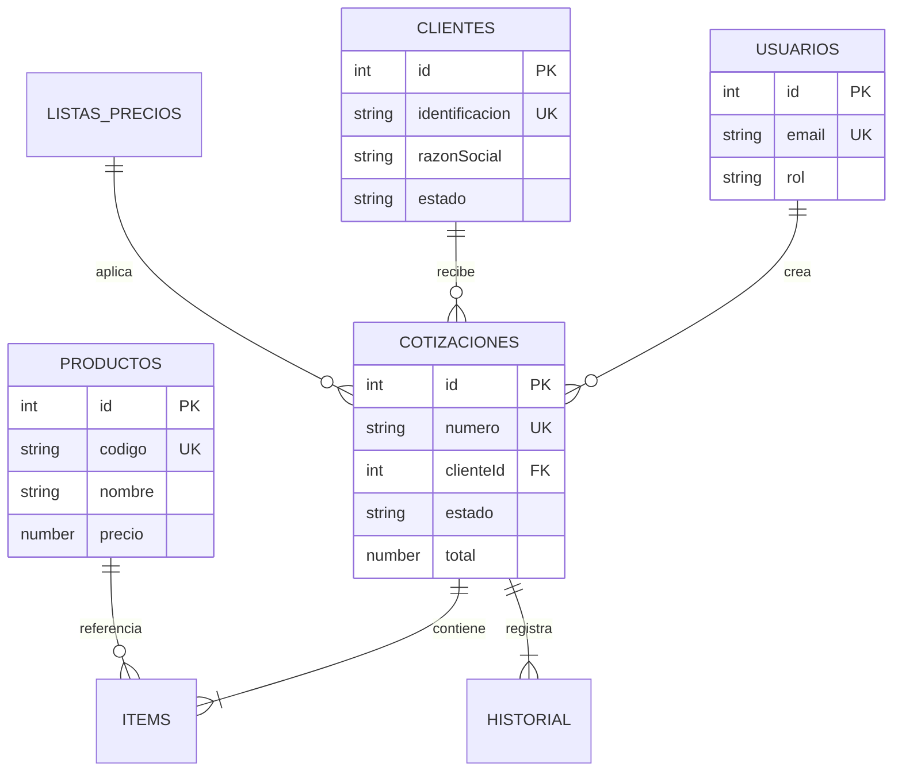

# QuoteFlow — Análisis de Base de Datos (Schema en Memoria)

## Resumen

El sistema **NO tiene base de datos**. Los datos se almacenan en arrays JavaScript globales dentro de `backend/src/app.ts`. Toda la información se pierde al reiniciar el servidor.

**Motor:** In-memory (arrays JS mutables)
**Persistencia:** Ninguna
**Esquemas DDL:** No existen

## Schema Reconstruido desde Código

### Motor: JavaScript In-Memory Arrays
### Confianza: Alta — datos definidos explícitamente en `app.ts`:30-138

| Tabla/Array | Campos Detectados | Fuente | Registros Semilla |
|---|---|---|---|
| `CLIENTES` | id, identificacion, razonSocial, contacto, correo, telefono, direccion, condicionTributaria, estado, totalCotizado | `app.ts`:30-46 | 4 |
| `PRODUCTOS` | id, codigo, nombre, descripcion, precio, impuesto, tipo, estado | `app.ts`:48-55 | 6 |
| `LISTAS_PRECIOS` | id, nombre, segmento, vigenciaDesde, vigenciaHasta, descuentoMaximo, estado | `app.ts`:57-61 | 3 |
| `COTIZACIONES` | id, numero, clienteId, cliente, asesorId, asesor, moneda, vigencia, listaPreciosId, listaPreciosNombre, estado, subtotal, descuento, impuestos, total, condicionesPago, tiempoEntrega, observaciones, items[], historialEstados[], createdAt | `app.ts`:63-128 | 4 |
| `USUARIOS` | id, nombre, email, password, rol | `app.ts`:130-134 | 3 |

## Diagrama ER del Schema Implícito

## Hallazgos de Calidad de Datos

| Hallazgo | Impacto | Evidencia |
|----------|---------|-----------|
| **Sin persistencia** | Datos se pierden al reiniciar | No hay driver de BD, no hay fs write |
| **Sin integridad referencial** | `clienteId` puede apuntar a cliente inexistente | `app.ts`:341 — no valida existencia |
| **IDs con counter global** | Reinicio → IDs se repiten → colisiones | `app.ts`:136-138 |
| **Datos desnormalizados** | `cliente` (nombre) duplicado en cotización | `app.ts`:346 — copia inline |
| **Sin índices** | Búsquedas con `for` loop O(n) | `app.ts`:155, 185, 200, 262, 285, 306 (6 loops idénticos) |
| **Sin transacciones** | Efecto secundario: crear cotización actualiza `totalCotizado` del cliente sin atomicidad | `app.ts`:356-359 |
| **Passwords en texto plano** | Sin hash, visibles en código y respuestas HTTP | `app.ts`:131-134 |

## Impacto en Modernización

| Aspecto | Evaluación |
|---------|-----------|
| **% lógica en "BD"** | 0% — toda la lógica está en handlers HTTP, no en stored procedures |
| **Migración a ORM** | Trivial — los arrays mapean directamente a entidades de TypeORM/Prisma |
| **Migración a BD relacional** | Straightforward — 5 tablas con relaciones claras 1:N |
| **Separación de datos vs lógica** | No existe — datos y lógica mezclados en el mismo archivo |
| **BD recomendada** | PostgreSQL o MySQL — esquema simple, relaciones claras, sin requisitos NoSQL |

## Stored Procedures / Lógica en Datos

No aplica — no hay stored procedures, triggers, views ni funciones de BD. Toda la lógica es código JavaScript inline en los handlers Express.

## Referencias

- [Modelos de Datos](../reference/data-models.md)
- [Lógica de Negocio](../behavior/business-logic.md)
- [Arquitectura del Sistema](../architecture/system-overview.md)
