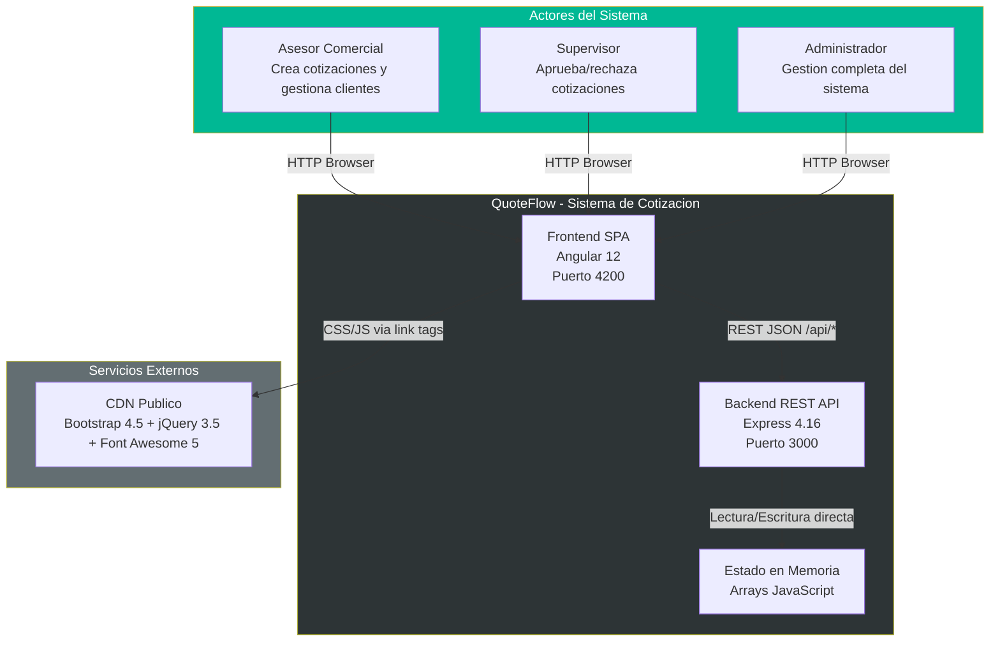
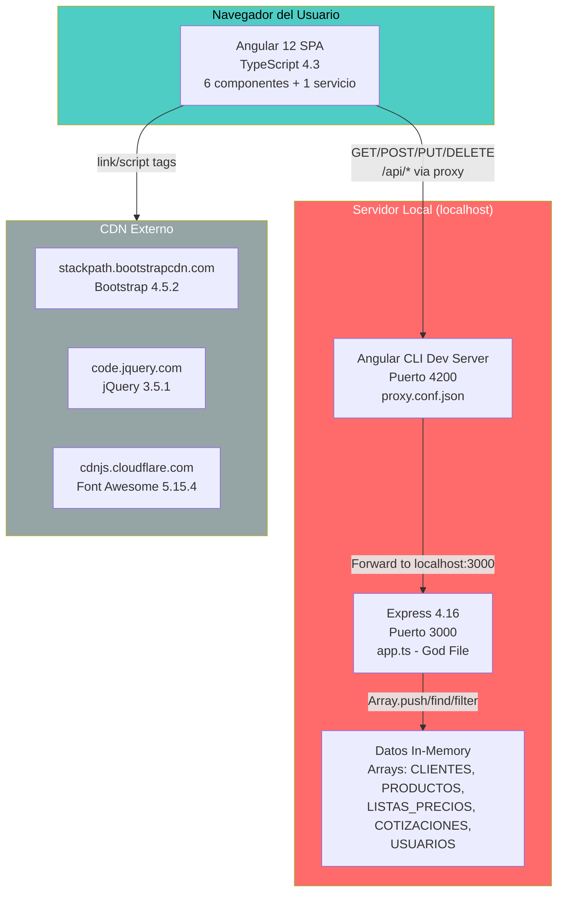
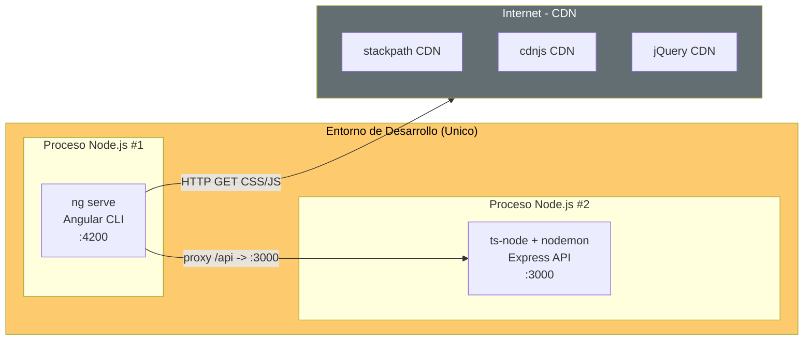
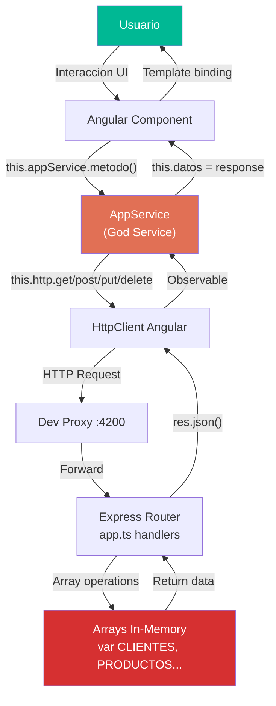

# QuoteFlow — Diagramas de Arquitectura

## Diagrama de Contexto del Sistema (C4 Nivel 1)

Este diagrama muestra que QuoteFlow es un sistema completamente aislado: no integra con bases de datos externas, ERPs, servicios de correo ni proveedores de identidad. Los únicos recursos externos son CDNs públicos para librerías CSS/JS del frontend.

## Diagrama de Contenedores (C4 Nivel 2)

El contenedor Express aloja toda la logica de negocio, datos y rutas en un unico archivo `app.ts`. El frontend Angular opera como SPA con un unico servicio (`AppService`) que centraliza todas las operaciones HTTP.

## Diagrama de Deployment

**Evidencia:** No existe Dockerfile, `docker-compose.yml`, pipeline CI/CD, ni configuración de producción real. `environment.prod.ts` apunta a `localhost:3000` idéntico al entorno de desarrollo (`frontend/src/environments/environment.prod.ts`).

## Diagrama de Flujo de Datos

Este flujo evidencia que los datos viajan sin transformacion de dominio: el JSON del backend se asigna directamente al estado del componente. No hay DTOs, mappers ni capa de dominio intermedia.

## Hallazgos Clave

- **Sistema completamente aislado** — sin integraciones externas ni base de datos
- **Deployment solo en desarrollo** — sin ambiente de produccion real
- **Datos efimeros** — estado in-memory se pierde al reiniciar cualquier proceso
- **Acoplamiento directo** — sin capas intermedias entre la UI y los datos en memoria
- **CDN como unica dependencia externa** — riesgo si el CDN no esta disponible

## Referencias

- [Arquitectura del Sistema](../../architecture/system-overview.md)
- [Componentes](../../architecture/components.md)
- [Dependencias](../../architecture/dependencies.md)
- [Diagramas de Secuencia](../behavioral/sequence-diagrams.md)
