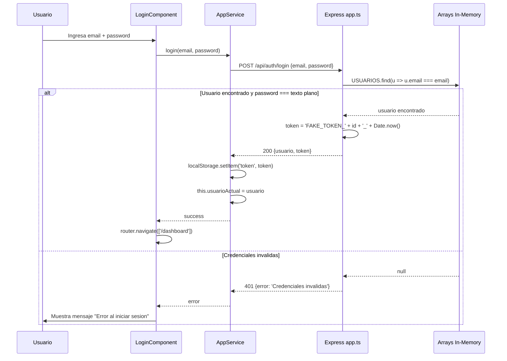
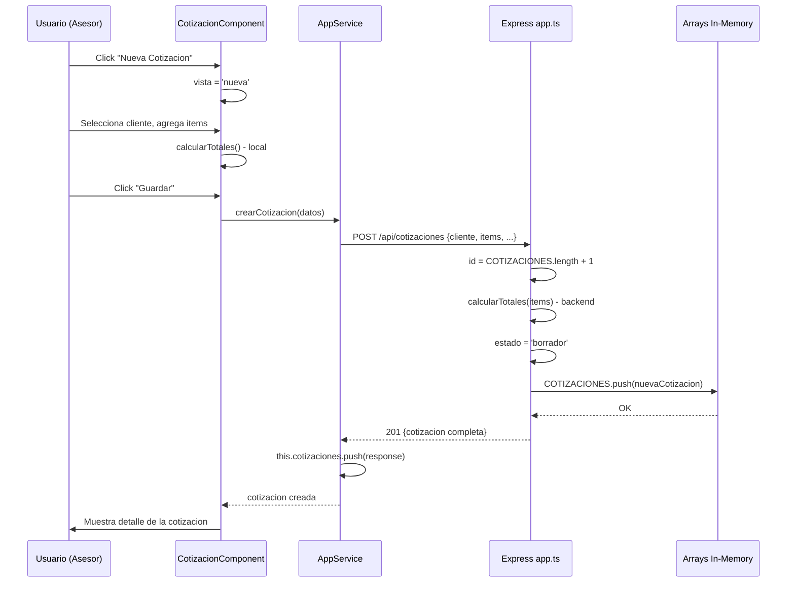
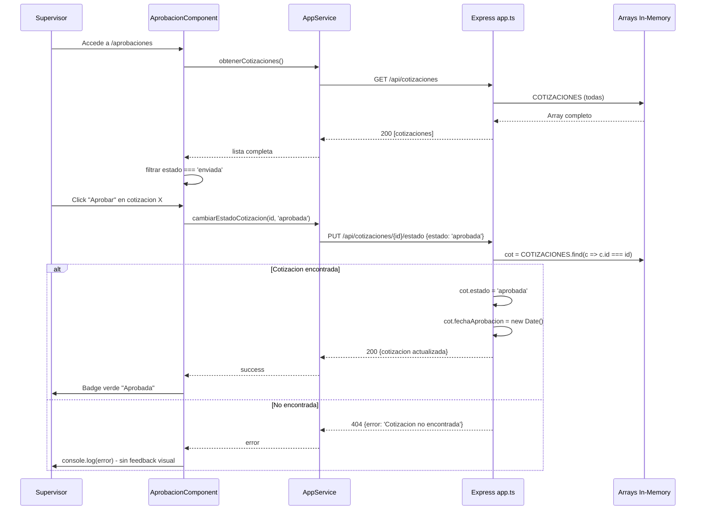
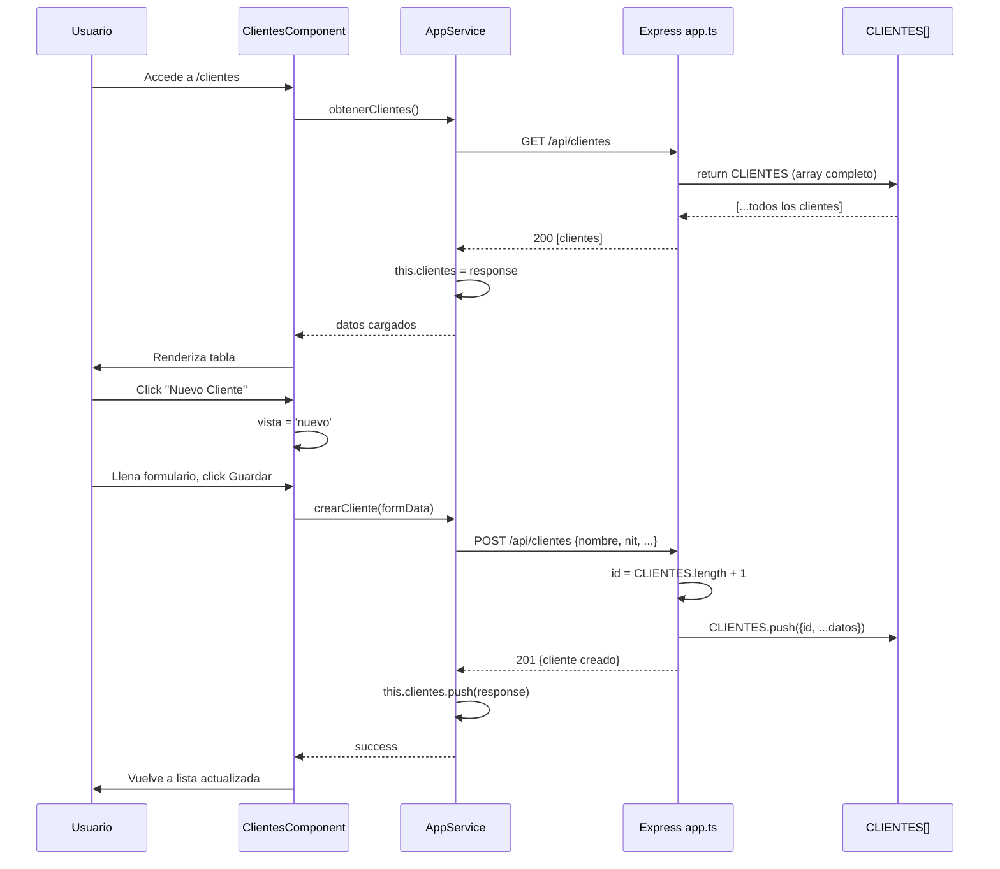

# QuoteFlow — Diagramas de Secuencia

## Flujo 1: Autenticación (Login)

Este diagrama muestra que la autenticación es simulada: el token es una concatenación predecible sin firma criptográfica, y las contraseñas se comparan en texto plano directamente contra arrays en memoria (`app.ts`:165).

## Flujo 2: Crear Cotización

Este flujo evidencia la duplicación de lógica de cálculo: `calcularTotales()` se ejecuta tanto en el frontend (para vista previa) como en el backend (para persistir). Ambas implementaciones son independientes y pueden producir resultados diferentes (`app.service.ts`:208 vs `app.ts`:320).

## Flujo 3: Aprobación de Cotización

Este flujo revela que no hay validación de transición de estados: cualquier estado puede transicionar a cualquier otro (sin verificar que `enviada` → `aprobada` sea válido). La validación es solo por existencia del registro, no por regla de negocio (`app.ts`:287-295).

## Flujo 4: CRUD Clientes

Se evidencia que la generación de IDs es secuencial sin garantía de unicidad (`CLIENTES.length + 1`), lo que puede causar colisiones si se eliminan registros y se crean nuevos.

## Hallazgos Clave de los Flujos

- **Sin validación de estados** — la máquina de estados es implícita y permisiva
- **Lógica duplicada** — cálculos financieros en frontend Y backend independientemente
- **Sin feedback de error real** — errores del backend se loguean en consola sin notificar al usuario
- **Sin paginación** — todas las queries retornan arrays completos sin límite
- **IDs frágiles** — generación basada en `.length + 1` no es robusta

## Referencias

- [Workflows](../../behavior/workflows.md)
- [Lógica de Negocio](../../behavior/business-logic.md)
- [Error Handling](../../behavior/error-handling.md)
- [Diagrama de Arquitectura](../architecture/system-context.md)
