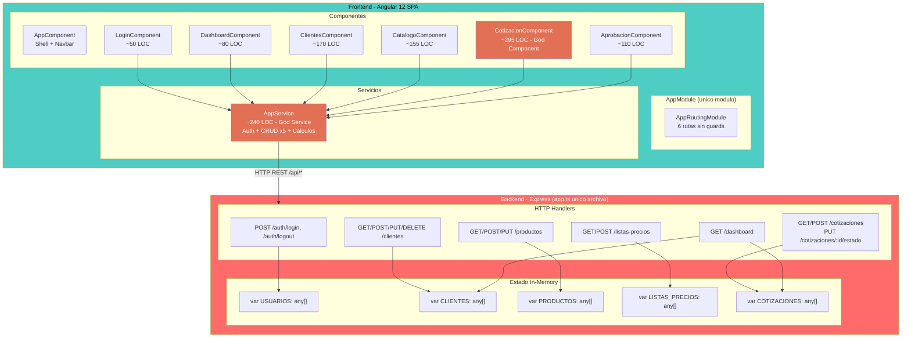
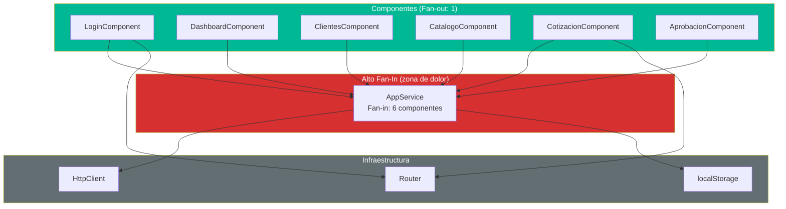
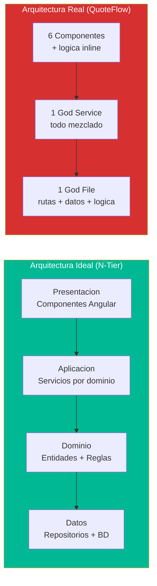
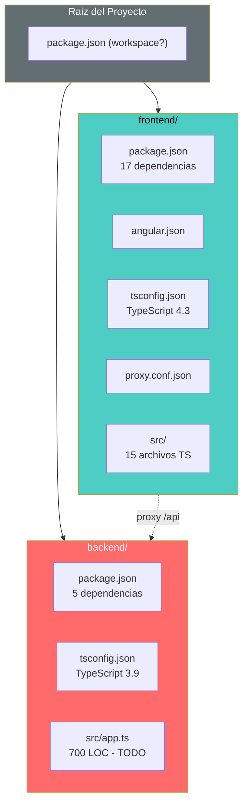

# QuoteFlow — Diagramas Estructurales

## Diagrama de Componentes (C4 Nivel 3)

Este diagrama revela el acoplamiento total: todos los componentes dependen de un unico servicio (`AppService`), y todos los handlers del backend acceden directamente a los arrays de datos sin abstraccion intermedia.

## Diagrama de Dependencias entre Componentes

`AppService` tiene **fan-in = 6** (todos dependen de el) y **fan-out = 2** (HttpClient + localStorage). Esto lo ubica en la **zona de dolor** de las metricas de Robert C. Martin: alta inestabilidad (I=0.25) con abstracciones nulas (A=0), dando una distancia D=0.75 del main sequence.

## Diagrama de Capas (Layered Architecture - Ideal vs Real)

La comparacion muestra que QuoteFlow colapsa 4 capas arquitectonicas en solo 2 (frontend God Service + backend God File), eliminando las capas de dominio y datos como abstracciones independientes.

## Diagrama de Modulos del Proyecto

## Metricas Estructurales

| Metrica | Frontend | Backend | Total |
|---|---|---|---|
| Archivos .ts | 15 | 1 | 16 |
| LOC TypeScript | ~808 | ~700 | ~1,508 |
| Componentes | 7 | 0 | 7 |
| Servicios | 1 | 0 | 1 |
| Interfaces | 0 | 0 | 0 |
| Modulos Angular | 2 | N/A | 2 |
| Endpoints REST | N/A | 12 | 12 |
| Entidades de datos | N/A | 5 arrays | 5 |

## Hallazgos Clave

- **Fan-in critico** en `AppService` — cualquier cambio en el servicio impacta los 6 componentes
- **0 interfaces** — no hay abstraccion ni contrato formal entre capas
- **God File y God Service** son los 2 puntos de mayor riesgo estructural
- **Backend monofichero** impide cualquier practica de desarrollo en equipo
- **Sin lazy loading** — el modulo Angular carga todo en AppModule (7 componentes + 1 servicio)

## Referencias

- [Componentes](../../architecture/components.md)
- [Dependencias](../../architecture/dependencies.md)
- [Analisis de Complejidad](../../analysis/complexity-analysis.md)
- [Diagrama de Arquitectura](../architecture/system-context.md)
