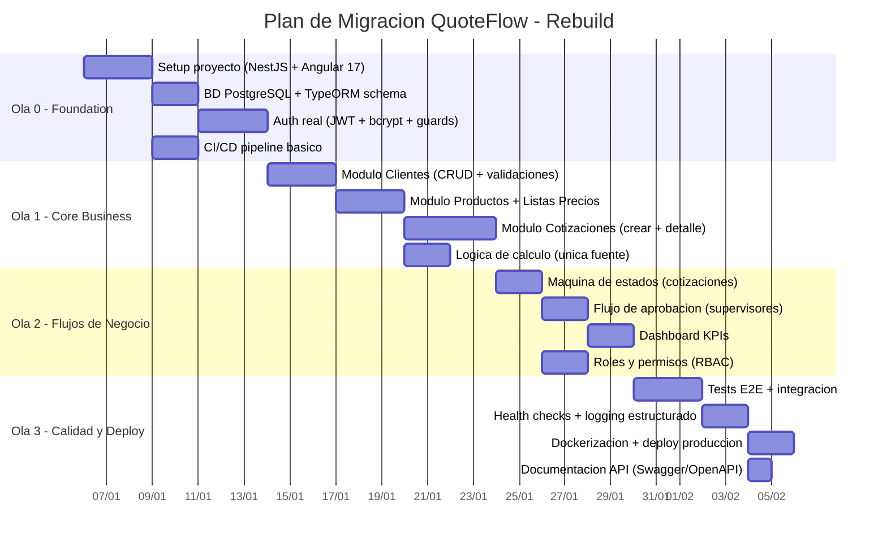
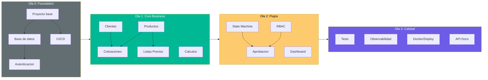

# QuoteFlow — Orden de Migración por Componentes

## Estrategia de Migración Recomendada: Rebuild (7R)

Dado que QuoteFlow es un prototipo/demo con:
- 100% del stack EOL
- ~1,578 LOC de código efectivo (mínimo)
- 0% de tests
- 0 integraciones externas
- Datos in-memory (sin migración de datos necesaria)

La estrategia más eficiente es **Rebuild** — reescribir desde cero con stack moderno, preservando los requisitos funcionales documentados.

[DECISIÓN AUTÓNOMA: Se recomienda Rebuild sobre Refactor porque el costo de refactorizar (agregar tests + migrar Angular 12→17 + migrar Express + agregar BD + agregar auth) supera el costo de reescribir ~1,578 LOC con un stack actual.]

## Olas de Migración

## Detalle por Ola

### Ola 0: Foundation (8 días)

| Componente | Fuente Actual | Target | Dependencias | Prioridad |
|---|---|---|---|---|
| Proyecto base | Angular 12 + Express | Angular 17 + NestJS | Ninguna | P0 |
| Base de datos | Arrays in-memory (`app.ts`:32-156) | PostgreSQL + TypeORM | Proyecto base | P0 |
| Autenticación | Fake tokens (`app.ts`:165) | JWT + bcrypt + Passport | BD | P0 |
| CI/CD | Inexistente | GitHub Actions + Docker | Proyecto base | P1 |

**Building Blocks Target:**
- NestJS (backend modular, DI nativo, decorators)
- Angular 17+ (standalone components, signals)
- PostgreSQL (managed en cloud)
- JWT + bcrypt (autenticación real)
- Docker (containerización)

### Ola 1: Core Business (12 días)

| Componente | Fuente Actual | Target | Dependencias | Prioridad |
|---|---|---|---|---|
| Clientes | `ClientesComponent` + `app.ts` handlers | NestJS Module + Angular Component | Ola 0 | P0 |
| Productos | `CatalogoComponent` (parte 1) | NestJS Module separado | Ola 0 | P0 |
| Listas de Precios | `CatalogoComponent` (parte 2) + `app.ts`:220-260 | Módulo vinculado a Productos | Productos | P1 |
| Cotizaciones | `CotizacionComponent` (God Component) | NestJS Module + Service + Controller | Clientes + Productos | P0 |
| Cálculos | Duplicado en `app.ts`:320 + `app.service.ts`:208 | Shared Domain Service (una sola fuente) | — | P1 |

### Ola 2: Flujos de Negocio (8 días)

| Componente | Fuente Actual | Target | Dependencias | Prioridad |
|---|---|---|---|---|
| Estado de cotización | `app.ts`:287 (array estadosValidos sin validación) | State Machine con guards | Cotizaciones | P0 |
| Aprobación | `AprobacionComponent` | Component + RBAC decorator | State Machine + Auth | P0 |
| Dashboard | `DashboardComponent` + `app.ts`:350 | Queries agregadas en BD | Todos los módulos | P1 |
| RBAC | `app.ts`:175 (verificación básica de rol) | Guards NestJS + Angular route guards | Auth | P0 |

### Ola 3: Calidad y Deploy (8 días)

| Componente | Fuente Actual | Target | Dependencias | Prioridad |
|---|---|---|---|---|
| Tests | 0% (inexistentes) | Jest (backend) + Jasmine (frontend) + E2E | Todo | P1 |
| Observabilidad | `console.log` | Pino/Winston + Health endpoints | Backend | P1 |
| Containerización | Inexistente | Dockerfile + docker-compose | Proyecto completo | P1 |
| Documentación API | Inexistente | Swagger via NestJS decorators | Backend | P2 |

## Aplicabilidad de Herramientas de Transformación

| Herramienta | Aplicable | Justificación |
|---|---|---|
| **Angular Upgrade CLI** | ❌ No | Salto de 5 major versions (12→17) no soportado automáticamente |
| **AWS App2Container** | ❌ No | No hay app containerizable actual |
| **Copilot/Kiro** | ✅ Sí | Ideal para generar specs de los módulos target |
| **Nx Generators** | ✅ Sí | Para scaffold de workspace monorepo NestJS + Angular |
| **TypeORM migrations** | ✅ Sí | Para generar schema desde entidades |

## Diagrama de Dependencias entre Olas

## Estimación de Esfuerzo

| Ola | Duración | Equipo | Complejidad |
|---|---|---|---|
| Ola 0 | 8 días | 1 Tech Lead + 1 Dev | Baja |
| Ola 1 | 12 días | 1 Tech Lead + 2 Devs | Media |
| Ola 2 | 8 días | 1 Tech Lead + 1 Dev | Media |
| Ola 3 | 8 días | 1 DevOps + 1 QA | Baja |
| **Total** | **~36 días (7-8 semanas)** | **4 personas max** | **Media** |

[ESTIMADO: Duración basada en ~1,578 LOC de requisitos funcionales a reimplementar con stack moderno. Un equipo experimentado puede completar en 5-6 semanas.]

## Hallazgos Clave

- **Rebuild es la mejor opción** para un prototipo de 1,578 LOC sin datos ni integraciones a migrar
- **Sin migración de datos** — los arrays in-memory no tienen datos reales que preservar
- **Sin migración de integraciones** — no hay sistemas externos conectados
- **El mayor valor** está en los requisitos funcionales documentados, no en el código existente
- **Riesgo principal** — capturar TODA la lógica de negocio (especialmente cálculos y estados)

## Referencias

- [Deuda Técnica](../analysis/tech-debt.md)
- [Plan de Remediación](../technical-debt/remediation-plan.md)
- [Production Readiness](../analysis/production-readiness.md)
- [Test Specifications](test-specifications.md)
- [Validation Criteria](validation-criteria.md)
