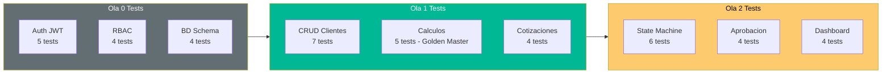

# QuoteFlow — Especificaciones de Test

## Estrategia de Testing para Rebuild

Dado que la estrategia es **Rebuild**, los tests se escriben para el sistema target (no para el legacy). Sin embargo, se documentan **Characterization Tests** del sistema actual para capturar el comportamiento esperado.

## Characterization Tests del Sistema Actual

Estos tests documentan el comportamiento que el sistema nuevo DEBE replicar:

### CT-01: Autenticación

| # | Input | Comportamiento Esperado | Evidencia |
|---|---|---|---|
| CT-01.1 | Email válido + password correcto | Retorna usuario + token, HTTP 200 | `app.ts`:165-175 |
| CT-01.2 | Email inexistente | HTTP 401, `{error: "Credenciales inválidas"}` | `app.ts`:167 |
| CT-01.3 | Password incorrecto | HTTP 401, `{error: "Credenciales inválidas"}` | `app.ts`:167 |
| CT-01.4 | Campos vacíos | HTTP 400, `{error: "Email y contraseña requeridos"}` | `app.ts`:164 |

### CT-02: CRUD Clientes

| # | Input | Comportamiento Esperado | Evidencia |
|---|---|---|---|
| CT-02.1 | GET /api/clientes | Retorna array de todos los clientes | `app.ts`:180 |
| CT-02.2 | POST /api/clientes {nombre, nit, ...} | Crea cliente con ID secuencial, retorna 201 | `app.ts`:185-195 |
| CT-02.3 | PUT /api/clientes/:id {datos} | Actualiza cliente existente, retorna 200 | `app.ts`:200-210 |
| CT-02.4 | DELETE /api/clientes/:id | Elimina de array, retorna 200 | `app.ts`:215 |
| CT-02.5 | PUT /api/clientes/:id (inexistente) | HTTP 404 | `app.ts`:202 |

### CT-03: Cotizaciones — Cálculos

| # | Input | Comportamiento Esperado | Evidencia |
|---|---|---|---|
| CT-03.1 | Items: [{cantidad: 2, precioUnit: 100}] | subtotal=200, iva=38, total=238 | `app.ts`:320-335 |
| CT-03.2 | Items: [{cant: 1, precio: 1000, descuento: 10}] | subtotal=900, iva=171, total=1071 | `app.ts`:325 |
| CT-03.3 | Items vacíos [] | subtotal=0, iva=0, total=0 | `app.ts`:320 |
| CT-03.4 | Múltiples items | Suma de subtotales individuales | `app.ts`:322-328 |

### CT-04: Máquina de Estados

| # | Estado Actual | Acción | Estado Esperado | Evidencia |
|---|---|---|---|---|
| CT-04.1 | borrador | enviar | enviada | `app.ts`:287-295 |
| CT-04.2 | enviada | aprobar | aprobada | `app.ts`:287 (sin validación) |
| CT-04.3 | enviada | rechazar | rechazada | `app.ts`:287 (sin validación) |
| CT-04.4 | aprobada | cualquier | ACEPTA CUALQUIERA | `app.ts`:287 (bug: sin validación de transición) |

### CT-05: Dashboard KPIs

| # | Datos | KPI Esperado | Evidencia |
|---|---|---|---|
| CT-05.1 | 5 cotizaciones (2 aprobadas, 1 rechazada, 2 borrador) | totalCotizaciones=5, aprobadas=2, tasaAprobacion=40% | `app.ts`:350-370 |
| CT-05.2 | 0 cotizaciones | Todos KPIs en 0 | `app.ts`:350 |

## Tests del Sistema Target (por Ola)

### Ola 0 — Tests de Foundation

```markdown
### T-F01: Autenticación JWT
- Login retorna JWT válido (verificable con secret)
- JWT contiene: userId, email, role, exp
- Endpoints protegidos rechazan sin token (401)
- Endpoints protegidos rechazan con token expirado (401)
- Logout invalida el token (blacklist o refresh token)

### T-F02: Autorización RBAC
- Asesor NO puede aprobar cotizaciones (403)
- Supervisor SÍ puede aprobar cotizaciones
- Admin tiene acceso a todo
- Roles se verifican en cada endpoint protegido

### T-F03: Base de Datos
- Schema crea tablas correctamente (migration up)
- Migration down revierte sin pérdida
- Seeds insertan datos de prueba
- Queries con datos de prueba retornan resultados esperados
```

### Ola 1 — Tests de Core Business

```markdown
### T-B01: CRUD Clientes
- Crear cliente con datos válidos → 201
- Crear cliente sin campos obligatorios → 400 con detalle de campo
- Actualizar cliente existente → 200
- Actualizar cliente inexistente → 404
- Eliminar cliente sin cotizaciones → 200
- Eliminar cliente con cotizaciones → 409 (integridad referencial)
- Listar clientes con paginación → metadatos de paginación

### T-B02: Cálculos de Cotización (Golden Master)
- calcularTotales({items: [{cantidad:2, precioUnitario:100, descuento:0}]}) = {subtotal:200, iva:38, total:238}
- Descuento porcentual aplicado correctamente
- IVA = 19% sobre subtotal
- Total = subtotal + iva
- UNA SOLA implementación (backend) — frontend consume el resultado

### T-B03: Creación de Cotización
- Crear con cliente válido + items → 201 con ID, totales calculados, estado='borrador'
- Crear sin cliente → 400
- Crear sin items → 400
- Items con cantidad negativa → 400
```

### Ola 2 — Tests de Flujos de Negocio

```markdown
### T-N01: Máquina de Estados
- borrador → enviada: VÁLIDO (asesor envía)
- enviada → aprobada: VÁLIDO (supervisor aprueba)
- enviada → rechazada: VÁLIDO (supervisor rechaza)
- borrador → aprobada: INVÁLIDO → 400 "Transición no permitida"
- aprobada → borrador: INVÁLIDO → 400 "Transición no permitida"
- rechazada → borrador: VÁLIDO (permite re-editar)

### T-N02: Flujo de Aprobación
- Solo supervisores pueden aprobar/rechazar
- Al aprobar: fechaAprobacion = timestamp actual
- Al rechazar: comentarioRechazo obligatorio
- Notificación al asesor (evento interno)

### T-N03: Dashboard
- Cuenta correcta de cotizaciones por estado
- Tasa de aprobación = aprobadas / (aprobadas + rechazadas)
- Monto total solo de cotizaciones aprobadas
- Top clientes por monto facturado
```

## Diagrama de Cobertura por Ola



## Hallazgos Clave

- **43 tests mínimos** distribuidos en 3 olas para cubrir la funcionalidad documentada
- **Golden Master test** para cálculos financieros es el test más crítico (evita discrepancias frontend/backend)
- **La máquina de estados** del sistema actual es un bug (acepta cualquier transición) — el test del sistema nuevo CORRIGE este comportamiento
- **Sin datos reales que migrar** — los characterization tests documentan COMPORTAMIENTO, no datos

## Referencias

- [Orden de Migración](component-order.md)
- [Criterios de Validación](validation-criteria.md)
- [Lógica de Negocio](../behavior/business-logic.md)
- [Decision Logic](../behavior/decision-logic.md)
