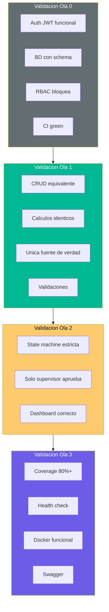

# QuoteFlow — Criterios de Validación

## Criterios Globales de Aceptación (Definition of Done — Rebuild)

La reconstrucción se considera exitosa cuando:

1. ✅ Todos los endpoints del sistema actual están reimplementados con equivalencia funcional
2. ✅ Los cálculos financieros producen resultados idénticos (Golden Master tests pasan)
3. ✅ La máquina de estados CORRIGE el bug de transiciones abiertas
4. ✅ Autenticación real (JWT) reemplaza tokens fake
5. ✅ Datos persisten en PostgreSQL (no se pierden al reiniciar)
6. ✅ Cobertura de tests ≥80% en backend
7. ✅ CI/CD pipeline ejecuta tests en cada push
8. ✅ La aplicación es deployable a un ambiente cloud (Docker)

## Criterios por Ola

### Ola 0 — Foundation: PASS cuando

| # | Criterio | Métrica | Verificación |
|---|---|---|---|
| V-F01 | Auth real funciona | Login retorna JWT verificable | Test T-F01 pasa |
| V-F02 | BD operativa | CRUD sobre tablas creadas | Migration up + seed + query OK |
| V-F03 | RBAC implementado | Roles bloquean acceso no autorizado | Test T-F02: 403 para asesor en endpoints de supervisor |
| V-F04 | Pipeline CI | Tests corren automáticamente | GitHub Actions green en PR |
| V-F05 | No hay secrets hardcoded | Passwords hasheados, JWT secret en env var | Grep de "password" no muestra texto plano |

### Ola 1 — Core Business: PASS cuando

| # | Criterio | Métrica | Verificación |
|---|---|---|---|
| V-B01 | CRUD Clientes equivalente | Todas operaciones del sistema actual funcionan | Tests T-B01 (7 tests) pasan |
| V-B02 | Cálculos exactos | Mismos resultados que characterization tests CT-03 | Golden Master test T-B02 pasa |
| V-B03 | Una sola fuente de cálculo | El frontend NO calcula — solo muestra lo que backend retorna | Grep: frontend no tiene fórmula de IVA |
| V-B04 | Validaciones de input | Campos obligatorios, tipos correctos, rangos | Tests de 400 con body inválido pasan |
| V-B05 | Paginación implementada | GET /clientes, /productos aceptan page + limit | Response incluye metadata de paginación |

### Ola 2 — Flujos de Negocio: PASS cuando

| # | Criterio | Métrica | Verificación |
|---|---|---|---|
| V-N01 | Máquina de estados estricta | Solo transiciones definidas son aceptadas | Test T-N01: transiciones inválidas → 400 |
| V-N02 | Supervisor aprueba/rechaza | Solo rol supervisor puede cambiar estado a aprobada/rechazada | Test T-N02 pasa con distintos roles |
| V-N03 | Dashboard correcto | KPIs calculados desde BD (queries agregadas) | Test T-N03 con datos semilla conocidos |
| V-N04 | Rechazo con motivo | Al rechazar se exige comentario | POST sin comentario → 400 |

### Ola 3 — Calidad y Deploy: PASS cuando

| # | Criterio | Métrica | Verificación |
|---|---|---|---|
| V-Q01 | Cobertura ≥80% | Lines covered / total lines ≥ 0.80 | Jest coverage report |
| V-Q02 | Health check responde | GET /health retorna 200 + status up | curl localhost:PORT/health |
| V-Q03 | Logging estructurado | Logs en JSON con timestamp + level + context | grep en stdout durante test |
| V-Q04 | Docker funcional | `docker-compose up` levanta frontend + backend + BD | Container health checks pasan |
| V-Q05 | Swagger disponible | GET /api/docs retorna documentación | URL accesible con todos los endpoints |
| V-Q06 | No console.log | 0 instancias de console.log en código producción | Lint rule `no-console` activa |

## Diagrama de Validación por Ola

## Criterios de Regresión

| Aspecto | Sistema Actual (Bug) | Sistema Nuevo (Corrección) |
|---|---|---|
| Transición de estados | Acepta cualquier transición | Solo transiciones definidas |
| Cálculos duplicados | Frontend y backend calculan independientemente | Solo backend calcula |
| IDs | `array.length + 1` (colisión posible) | UUID o secuencia de BD |
| Auth | Token predecible sin firma | JWT con secret + expiración |
| Datos | Se pierden al reiniciar | Persisten en PostgreSQL |
| Errores | `console.log(error)` — silenciosos | Error responses + logging + alerting |

## Hallazgos Clave

- **19 criterios de validación** concretos distribuidos en 4 olas
- **Golden Master test** es el criterio más crítico — garantiza equivalencia funcional en cálculos
- **La máquina de estados** se CORRIGE intencionalmente (no es regresión, es mejora)
- **La validación final** es: `docker-compose up` + todos los tests pasan + Swagger accesible

## Referencias

- [Orden de Migración](component-order.md)
- [Especificaciones de Test](test-specifications.md)
- [Lógica de Negocio](../behavior/business-logic.md)
- [Production Readiness](../analysis/production-readiness.md)
