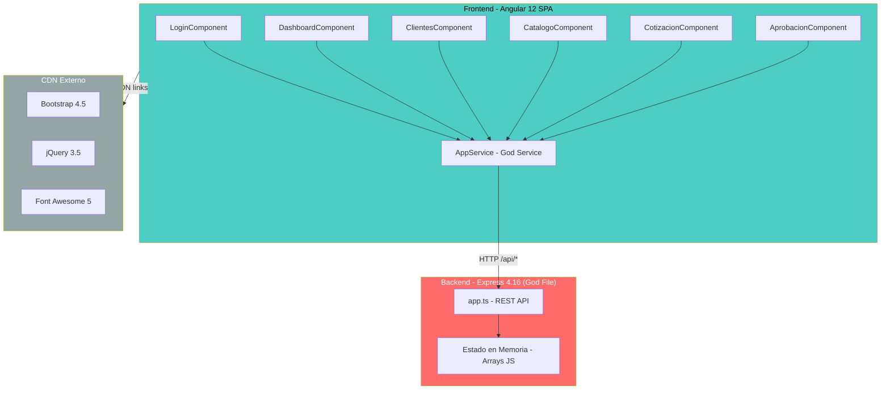

# QuoteFlow — Visión General del Proyecto

## Propósito del Sistema

QuoteFlow es una **aplicación de cotización y gestión comercial** que permite a equipos de ventas crear, gestionar y aprobar cotizaciones para clientes corporativos. El sistema soporta el ciclo completo de vida de una cotización: desde el borrador hasta la aceptación o rechazo, con flujo de aprobación por supervisores.

## Stack Tecnológico

| Capa | Tecnología | Versión | Estado |
|------|-----------|---------|--------|
| **Frontend Framework** | Angular | 12.2.13 | **EOL** (diciembre 2022) |
| **Frontend Language** | TypeScript | ~4.3.5 | **EOL** (2 major behind) |
| **CSS Framework** | Bootstrap (CDN) | 4.5.2 | Obsoleto (2020) |
| **Iconos** | Font Awesome (CDN) | 5.15.4 | Desactualizado |
| **Backend Runtime** | Node.js + Express | 4.16.4 | Desactualizado (~4 major behind) |
| **Backend Language** | TypeScript | ~3.9.10 | **EOL** (4 major behind) |
| **Base de Datos** | In-memory (arrays JS) | N/A | Sin persistencia real |
| **Autenticación** | Fake tokens (no JWT) | N/A | Sin seguridad real |
| **Build Tool Frontend** | Angular CLI | ~12.2.13 | EOL |
| **Build Tool Backend** | tsc + nodemon | ts-node 8.10 | Obsoleto |

## Integraciones Externas

No se detectaron integraciones con sistemas externos. El backend opera completamente con datos en memoria (estado global mutable). No hay conexiones a bases de datos, servicios SOAP/REST externos ni colas de mensajería.

## Ambientes de Despliegue

| Indicador | Evidencia |
|-----------|-----------|
| Desarrollo local | `proxy.conf.json` configura proxy de Angular CLI → `http://localhost:3000` |
| Producción | `environment.prod.ts` apunta a `http://localhost:3000/api` (idéntico a dev) |
| Docker/Container | No detectado |
| CI/CD | No detectado |

[SUPUESTO: La aplicación opera exclusivamente en entorno de desarrollo local. No hay evidencia de despliegue a producción real.]

## Estructura de la Solución

```
quoteflow/
├── frontend/                    ← Angular 12 SPA
│   ├── package.json             ← Dependencias frontend
│   ├── angular.json             ← Configuración Angular CLI
│   ├── tsconfig.json            ← TypeScript config
│   ├── proxy.conf.json          ← Proxy dev → backend:3000
│   └── src/
│       ├── app/
│       │   ├── app.module.ts         ← Módulo raíz (todo declarado aquí)
│       │   ├── app-routing.module.ts ← Rutas sin guards
│       │   ├── app.component.*       ← Shell con navbar
│       │   ├── services/app.service.ts ← God Service
│       │   ├── login/                ← Login component
│       │   ├── dashboard/            ← Dashboard component
│       │   ├── clientes/             ← CRUD clientes
│       │   ├── catalogo/             ← Productos + Listas precios
│       │   ├── cotizacion/           ← CRUD cotizaciones (God Component)
│       │   └── aprobacion/           ← Flujo de aprobación
│       ├── environments/             ← Configs por ambiente
│       ├── styles.css                ← CSS global
│       └── index.html                ← CDN Bootstrap + jQuery
└── backend/                     ← Express API (God File)
    ├── package.json             ← Dependencias backend
    ├── tsconfig.json            ← TypeScript config
    └── src/
        └── app.ts               ← TODO el backend en 1 archivo (~700 LOC)
```

## Módulos Funcionales

| Módulo | Componente Frontend | Endpoints Backend | Descripción |
|--------|-------------------|-------------------|-------------|
| **Autenticación** | `LoginComponent` | `POST /api/auth/login`, `POST /api/auth/logout` | Login con credenciales en texto plano |
| **Dashboard** | `DashboardComponent` | `GET /api/dashboard` | KPIs comerciales y actividad reciente |
| **Clientes** | `ClientesComponent` | `GET/POST/PUT/DELETE /api/clientes` | CRUD de clientes corporativos |
| **Catálogo** | `CatalogoComponent` | `GET/POST/PUT /api/productos`, `GET/POST /api/listas-precios` | Productos, servicios y listas de precios |
| **Cotizaciones** | `CotizacionComponent` | `GET/POST /api/cotizaciones`, `PUT /api/cotizaciones/:id/estado` | Creación, detalle, cambio de estado |
| **Aprobaciones** | `AprobacionComponent` | (usa endpoints de cotizaciones) | Flujo de aprobación por supervisores |

## Roles de Usuario

| Rol | Permisos detectados |
|-----|-------------------|
| `asesor` | Crear cotizaciones, gestionar clientes, enviar a aprobación |
| `supervisor` | Todo lo anterior + aprobar/rechazar cotizaciones |
| `admin` | Todo lo anterior (sin diferencia funcional detectada con supervisor) |

## Multi-Tenancy

No se detectó multi-tenancy. La aplicación opera para una sola organización sin discriminación de tenant.

## Metodología de Conteo LOC

| Métrica | Valor | Fuente |
|---------|-------|--------|
| **LOC Total (oficial)** | **19,544** | `_cloc-report.txt` (línea SUM, columna code) |
| Archivos totales | 33 | `_cloc-report.txt` |
| JSON (configs + lock) | 16,398 LOC | Incluye package-lock.json (~609KB) |
| HTML (templates) | 1,568 LOC | 8 archivos de template Angular |
| TypeScript (código) | 1,508 LOC | 15 archivos (.ts) |
| CSS | 70 LOC | 2 archivos de estilos |
| **LOC Código Efectivo** | **~1,578** | TypeScript (1,508) + CSS (70) |

> **Nota**: El 84% del LOC reportado (16,398) corresponde a archivos JSON, dominados por `package-lock.json`. El código fuente efectivo (TypeScript + CSS) representa solo ~1,578 LOC.

## Diagrama de Arquitectura de Alto Nivel



El diagrama muestra la arquitectura monolítica de dos capas: un frontend Angular SPA que se comunica vía HTTP con un backend Express. Toda la lógica de negocio, datos y rutas están concentradas en un solo archivo `app.ts` del backend. El frontend usa un "God Service" (`AppService`) que centraliza todas las operaciones.

## Hallazgos Clave

- **Aplicación de demostración/prototipo**: Las versiones obsoletas son intencionalmente seleccionadas (evidencia: comentario en `backend/package.json`: "VERSIONES OBSOLETAS intencionalmente")
- **Anti-patrón God File**: Todo el backend (~700 LOC) vive en un solo archivo `app.ts`
- **Anti-patrón God Service**: `AppService` del frontend maneja auth, clientes, productos, cotizaciones y dashboard
- **Sin persistencia real**: Los datos se pierden al reiniciar el servidor (arrays en memoria)
- **Sin seguridad real**: Tokens falsos, passwords en texto plano, CORS `*`
- **Duplicación masiva**: `formatearMoneda()` y `getBadgeClass()` copiados en 4+ componentes
- **Stack completamente EOL**: Angular 12 (EOL dic-2022), TypeScript 3.9/4.3, Express 4.16

## Referencias

- [Estructura del Programa](reference/program-structure.md)
- [Documentación Especializada](specialized/specialized-documentation.md)
