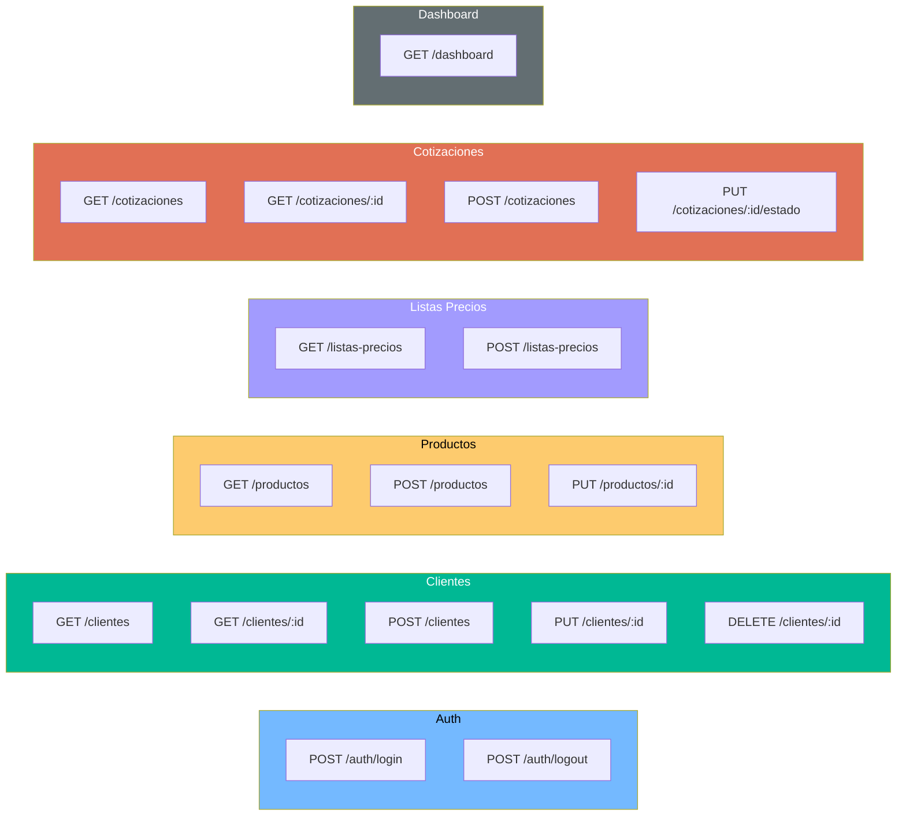

# QuoteFlow — Referencia de API

## Resumen

El backend expone **15 endpoints REST** organizados en 5 grupos funcionales. Todos operan sobre datos en memoria sin persistencia.

**Base URL:** `http://localhost:3000/api`
**Autenticación:** Header `Authorization` con token fake (no verificado realmente)
**Formato:** JSON (request y response)

## Catálogo de Endpoints

### Auth (2 endpoints)

| Método | Ruta | Descripción | Auth | Evidencia |
|--------|------|-------------|------|-----------|
| `POST` | `/api/auth/login` | Login con email + password | No | `app.ts`:148 |
| `POST` | `/api/auth/logout` | Cierra sesión (elimina token del mapa) | Sí | `app.ts`:171 |

### Clientes (5 endpoints)

| Método | Ruta | Descripción | Auth | Evidencia |
|--------|------|-------------|------|-----------|
| `GET` | `/api/clientes` | Lista todos los clientes (sin paginación) | No* | `app.ts`:180 |
| `GET` | `/api/clientes/:id` | Detalle cliente + historial cotizaciones | No* | `app.ts`:184 |
| `POST` | `/api/clientes` | Crear nuevo cliente | No* | `app.ts`:193 |
| `PUT` | `/api/clientes/:id` | Actualizar cliente | No* | `app.ts`:213 |
| `DELETE` | `/api/clientes/:id` | Eliminar cliente (borrado físico) | No* | `app.ts`:231 |

*El middleware `verificarAuth` existe (`app.ts`:176) pero NO está aplicado a ninguna ruta.

### Productos (3 endpoints)

| Método | Ruta | Descripción | Auth | Evidencia |
|--------|------|-------------|------|-----------|
| `GET` | `/api/productos` | Lista todos los productos | No | `app.ts`:242 |
| `POST` | `/api/productos` | Crear nuevo producto | No | `app.ts`:246 |
| `PUT` | `/api/productos/:id` | Actualizar producto | No | `app.ts`:272 |

### Listas de Precios (2 endpoints)

| Método | Ruta | Descripción | Auth | Evidencia |
|--------|------|-------------|------|-----------|
| `GET` | `/api/listas-precios` | Lista todas las listas de precios | No | `app.ts`:283 |
| `POST` | `/api/listas-precios` | Crear nueva lista de precios | No | `app.ts`:287 |

### Cotizaciones (3 endpoints)

| Método | Ruta | Descripción | Auth | Evidencia |
|--------|------|-------------|------|-----------|
| `GET` | `/api/cotizaciones` | Lista todas las cotizaciones | No | `app.ts`:301 |
| `GET` | `/api/cotizaciones/:id` | Detalle de una cotización | No | `app.ts`:305 |
| `POST` | `/api/cotizaciones` | Crear nueva cotización (calcula totales) | No | `app.ts`:314 |
| `PUT` | `/api/cotizaciones/:id/estado` | Cambiar estado de una cotización | No | `app.ts`:282 |

### Dashboard (1 endpoint)

| Método | Ruta | Descripción | Auth | Evidencia |
|--------|------|-------------|------|-----------|
| `GET` | `/api/dashboard` | KPIs agregados del negocio | No | `app.ts`:366 |

## Detalle de Endpoints Principales

### POST /api/auth/login

**Request:**
```json
{ "email": "asesor@quoteflow.com", "password": "1234" }
```

**Response 200:**
```json
{
  "token": "FAKE_TOKEN_1_1706000000000",
  "usuario": { "id": 1, "nombre": "Asesor Demo", "email": "...", "password": "1234", "rol": "asesor" }
}
```

⚠️ **Vulnerabilidad:** Retorna el password del usuario en la respuesta.

### POST /api/cotizaciones

**Request:**
```json
{
  "clienteId": 1,
  "moneda": "COP",
  "vigencia": "2024-12-31",
  "listaPreciosId": 1,
  "listaPreciosNombre": "Lista Estándar 2024",
  "descuento": 0,
  "condicionesPago": "30 días",
  "tiempoEntrega": "15 días hábiles",
  "observaciones": "Notas",
  "items": [
    { "productoId": 1, "codigo": "PROD-001", "nombre": "Software ERP", "cantidad": 1, "precio": 5000000, "descuento": 0, "impuesto": 19 }
  ],
  "enviarAprobacion": true
}
```

**Response 200:**
```json
{
  "id": 5,
  "numero": "COT-2024-005",
  "estado": "Pendiente de aprobación",
  "subtotal": 5000000,
  "impuestos": 950000,
  "total": 5950000,
  "items": [...],
  "historialEstados": [...]
}
```

### PUT /api/cotizaciones/:id/estado

**Request:**
```json
{ "estado": "Aprobada", "comentario": "Margen adecuado", "usuario": "Supervisor Demo" }
```

⚠️ **Bug:** Acepta CUALQUIER estado sin validar transición válida.

## Diagrama de Endpoints por Entidad



## Hallazgos de API

| Hallazgo | Severidad | Evidencia |
|----------|-----------|-----------|
| Middleware `verificarAuth` existe pero no se aplica a ninguna ruta | **Crítica** | `app.ts`:176-179 (definido), no usado en `app.get/post/put/delete` |
| Retorna password en respuesta de login | **Crítica** | `app.ts`:168 |
| Sin paginación en ningún endpoint GET lista | **Alta** | `app.ts`:180, 242, 283, 301 |
| POST retorna 200 en vez de 201 | **Baja** | `app.ts`:210, 270, 297, 355 |
| Sin validación de content-type | **Media** | No hay middleware que verifique `Content-Type: application/json` |
| Sin rate limiting | **Alta** | No hay middleware de throttling |
| Sin versionado de API | **Media** | Rutas `/api/` sin `/v1/` |
| CORS abierto a todos los orígenes | **Crítica** | `app.ts`:134 — `cors({ origin: '*' })` |

## Referencias

- [Lógica de Negocio](../behavior/business-logic.md)
- [Modelos de Datos](data-models.md)
- [Análisis de Seguridad](../analysis/security-patterns.md)
