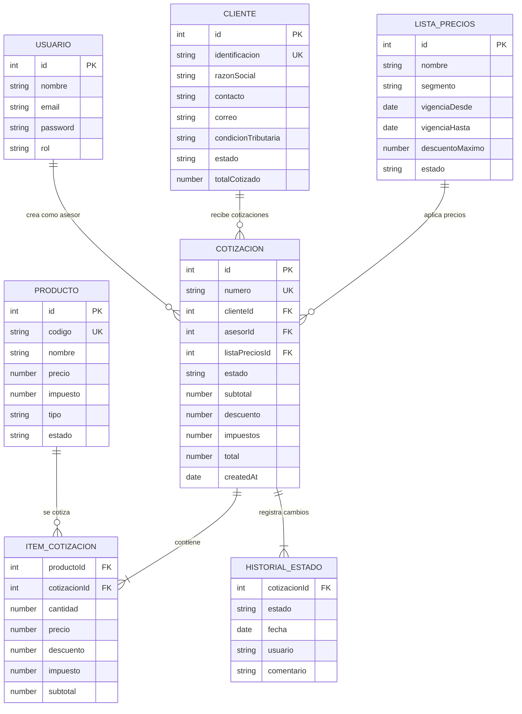

# QuoteFlow — Interfaces y Modelos de Datos

## Estado de Interfaces

**El proyecto NO define ninguna interface TypeScript.** Todo el código usa tipo `any` explícita o implícitamente. Los modelos de datos se infieren de los objetos literales en el backend (`app.ts`).

## Modelos de Datos Inferidos

### Cliente

**Fuente:** `backend/src/app.ts`:30-46 (array `CLIENTES`)

| Campo | Tipo Inferido | Obligatorio | Descripción |
|-------|------|-------------|-------------|
| `id` | number | Sí (auto) | Identificador único |
| `identificacion` | string | Sí | NIT colombiano (formato: 900123456-1) |
| `razonSocial` | string | Sí | Nombre legal de la empresa |
| `contacto` | string | No | Nombre persona de contacto |
| `correo` | string | No | Email del contacto |
| `telefono` | string | No | Teléfono del contacto |
| `direccion` | string | No | Dirección física |
| `condicionTributaria` | enum string | No | `RESPONSABLE_IVA` \| `NO_RESPONSABLE` \| `GRAN_CONTRIBUYENTE` |
| `estado` | enum string | No | `activo` \| `inactivo` |
| `totalCotizado` | number | No | Suma acumulada de cotizaciones (efecto secundario) |

### Producto

**Fuente:** `backend/src/app.ts`:48-55 (array `PRODUCTOS`)

| Campo | Tipo Inferido | Obligatorio | Descripción |
|-------|------|-------------|-------------|
| `id` | number | Sí (auto) | Identificador único |
| `codigo` | string | Sí | Código producto (PROD-001, SERV-001) |
| `nombre` | string | Sí | Nombre del producto/servicio |
| `descripcion` | string | No | Descripción detallada |
| `precio` | number | No | Precio unitario en COP |
| `impuesto` | number | No | Porcentaje de IVA (default: 19) |
| `tipo` | enum string | No | `Producto` \| `Servicio` |
| `estado` | enum string | No | `activo` \| `inactivo` |

### Lista de Precios

**Fuente:** `backend/src/app.ts`:57-61 (array `LISTAS_PRECIOS`)

| Campo | Tipo Inferido | Obligatorio | Descripción |
|-------|------|-------------|-------------|
| `id` | number | Sí (auto) | Identificador único |
| `nombre` | string | Sí | Nombre de la lista |
| `segmento` | string | No | `General` \| `Corporativo` \| `PYME` |
| `vigenciaDesde` | string (date) | No | Fecha inicio vigencia |
| `vigenciaHasta` | string (date) | No | Fecha fin vigencia |
| `descuentoMaximo` | number | No | % máximo de descuento permitido |
| `estado` | enum string | No | `activa` \| `inactiva` |

### Cotización

**Fuente:** `backend/src/app.ts`:63-128 (array `COTIZACIONES`)

| Campo | Tipo Inferido | Obligatorio | Descripción |
|-------|------|-------------|-------------|
| `id` | number | Sí (auto) | Identificador único |
| `numero` | string | Sí (auto) | Formato: COT-YYYY-NNN |
| `clienteId` | number | Sí | FK al cliente |
| `cliente` | string | Sí | Nombre del cliente (desnormalizado) |
| `asesorId` | number | No | FK al usuario asesor |
| `asesor` | string | No | Nombre del asesor (desnormalizado) |
| `moneda` | string | No | `COP` (default) |
| `vigencia` | string (date) | No | Fecha de expiración |
| `listaPreciosId` | number | No | FK a lista de precios |
| `listaPreciosNombre` | string | No | Nombre lista (desnormalizado) |
| `estado` | enum string | Sí | 9 estados posibles |
| `subtotal` | number | Sí | Suma de items |
| `descuento` | number | No | % descuento general |
| `impuestos` | number | Sí | Suma de impuestos calculados |
| `total` | number | Sí | Total final |
| `condicionesPago` | string | No | Ej: "30 días", "Contado" |
| `tiempoEntrega` | string | No | Ej: "15 días hábiles" |
| `observaciones` | string | No | Notas adicionales |
| `items` | ItemCotizacion[] | Sí | Array de líneas |
| `historialEstados` | HistorialEstado[] | Sí | Auditoría de cambios |
| `createdAt` | string (date) | Sí (auto) | Fecha de creación |

### Item de Cotización (sub-documento)

| Campo | Tipo Inferido | Descripción |
|-------|------|-------------|
| `productoId` | number | FK al producto |
| `codigo` | string | Código producto (desnormalizado) |
| `nombre` | string | Nombre producto (desnormalizado) |
| `cantidad` | number | Cantidad solicitada |
| `precio` | number | Precio unitario |
| `descuento` | number | % descuento del item |
| `impuesto` | number | % impuesto del item |
| `subtotal` | number | Calculado: (qty × price) - discount |

### Historial de Estado (sub-documento)

| Campo | Tipo Inferido | Descripción |
|-------|------|-------------|
| `estado` | string | Estado al que transicionó |
| `fecha` | string (date) | Fecha de la transición |
| `usuario` | string | Nombre del usuario que realizó el cambio |
| `comentario` | string | Comentario/motivo del cambio |

### Usuario

**Fuente:** `backend/src/app.ts`:130-134 (array `USUARIOS`)

| Campo | Tipo Inferido | Descripción |
|-------|------|-------------|
| `id` | number | Identificador único |
| `nombre` | string | Nombre completo |
| `email` | string | Email (usado como login) |
| `password` | string | **TEXTO PLANO** — sin hash |
| `rol` | enum string | `asesor` \| `supervisor` \| `admin` |

## Diagrama ER (Modelo Inferido)

## Hallazgos de Modelo de Datos

| Hallazgo | Impacto | Evidencia |
|----------|---------|-----------|
| **Sin interfaces TypeScript** | No hay contratos tipados, todo es `any` | Búsqueda en 33 archivos: 0 `interface` declarations |
| **Datos desnormalizados** | `cliente`, `asesor`, `listaPreciosNombre` duplicados en cotización | `app.ts`:65-68 |
| **Sin FKs reales** | Solo `clienteId`, `productoId` como números sin validación referencial | `app.ts`:63-128 |
| **Passwords en texto plano** | Visibles en el array y retornados en login response | `app.ts`:131-134, 168 |
| **IDs generados con counter global** | No persisten, se reinician, posible colisión | `app.ts`:136-138 |
| **Fechas como strings** | Sin tipo `Date`, sin validación de formato | Todos los campos `vigencia`, `createdAt`, `fecha` |

## Referencias

- [Lógica de Negocio](../behavior/business-logic.md)
- [API Reference](api-reference.md)
- [Análisis de BD](../database/schema-analysis.md)
