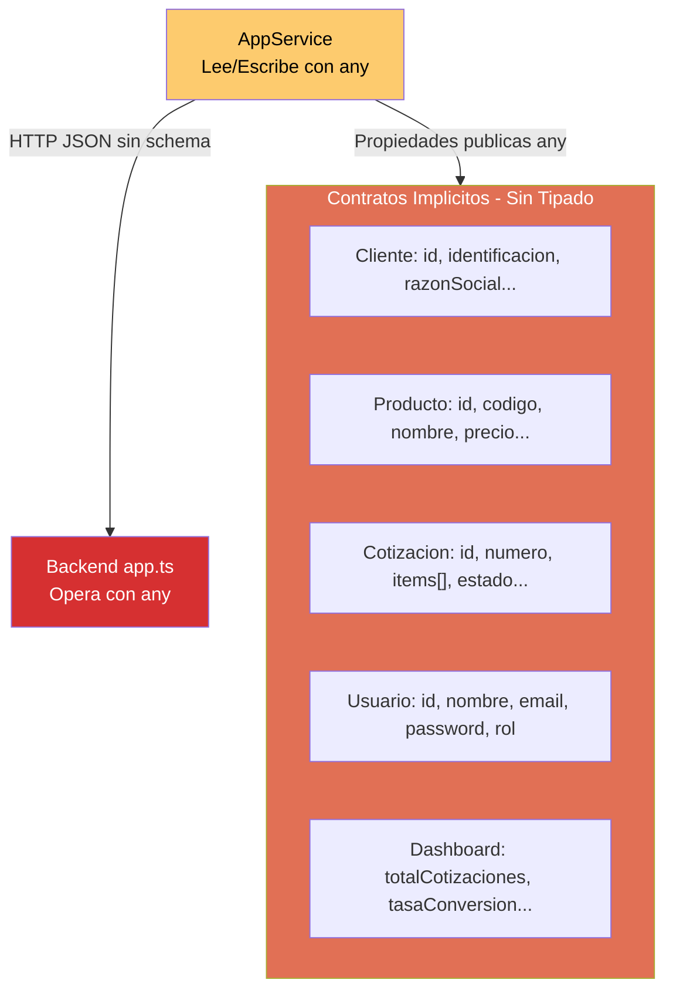

# QuoteFlow — Interfaces del Sistema

## Estado de Interfaces

**El proyecto NO define interfaces TypeScript formales.** No se detectaron archivos `*.interface.ts`, `*.model.ts`, `*.type.ts` ni declaraciones `interface` o `type` en ninguno de los 33 archivos del proyecto.

Todo el código usa `any` como tipo universal — tanto en el frontend como en el backend.

## Contratos Implícitos

Los contratos entre frontend y backend se establecen implícitamente por la forma de los objetos JSON que fluyen entre ellos. No hay schema validation, no hay OpenAPI spec, no hay DTOs tipados.

### Contrato: AppService ↔ Backend

| Método del Servicio | Endpoint Backend | Request Shape | Response Shape |
|---|---|---|---|
| `login(email, password)` | `POST /api/auth/login` | `{ email, password }` | `{ token, usuario }` |
| `cargarClientes()` | `GET /api/clientes` | — | `Cliente[]` |
| `crearCliente(cliente)` | `POST /api/clientes` | `Cliente` (sin id) | `Cliente` (con id) |
| `actualizarCliente(id, cliente)` | `PUT /api/clientes/:id` | `Partial<Cliente>` | `Cliente` |
| `eliminarCliente(id)` | `DELETE /api/clientes/:id` | — | `{ mensaje }` |
| `cargarProductos()` | `GET /api/productos` | — | `Producto[]` |
| `crearProducto(producto)` | `POST /api/productos` | `Producto` (sin id) | `Producto` (con id) |
| `cargarListasPrecios()` | `GET /api/listas-precios` | — | `ListaPrecios[]` |
| `crearCotizacion(cot)` | `POST /api/cotizaciones` | `NuevaCotizacion` | `Cotizacion` |
| `actualizarEstadoCotizacion(id, estado, comentario)` | `PUT /api/cotizaciones/:id/estado` | `{ estado, comentario, usuario }` | `Cotizacion` |
| `cargarDashboard()` | `GET /api/dashboard` | — | `DashboardData` |

### Contrato: Componentes ↔ AppService

| Componente | Propiedades públicas leídas de AppService |
|---|---|
| `LoginComponent` | `usuarioActual` (para redirect si ya logueado) |
| `DashboardComponent` | `dashboardData`, `cotizaciones`, `cargando` |
| `ClientesComponent` | `clientes` |
| `CatalogoComponent` | `productos`, `listasPrecios` |
| `CotizacionComponent` | `cotizaciones`, `clientes`, `productos`, `listasPrecios`, `usuarioActual` |
| `AprobacionComponent` | `cotizaciones`, `usuarioActual` |

## Diagrama de Interfaces Implícitas

## Impacto de la Ausencia de Interfaces

| Problema | Consecuencia | Mitigación posible |
|----------|--------------|-------------------|
| Sin autocompletado IDE | Desarrollo más lento, más errores | Definir interfaces por entidad |
| Sin validación de compilación | Errores en runtime que TS debería prevenir | `strict: true` en tsconfig |
| Sin documentación de contratos | Cada dev debe leer el código para entender la API | OpenAPI spec o interfaces compartidas |
| Imposible mockear para tests | No se pueden crear mocks tipados de servicios | Interfaces + inyección via token |
| Sin API versioning | Cambios breaking no se detectan | Schema validation middleware |

## Hallazgos Clave

- **0 interfaces** en 33 archivos y ~1,578 LOC de TypeScript
- **`strict: false`** en ambos `tsconfig.json` (frontend y backend) — TypeScript en modo JavaScript
- **6 shapes de datos implícitos** (Cliente, Producto, ListaPrecios, Cotización, ItemCotización, Usuario)
- **Sin DTOs de request/response** — los objetos fluyen sin transformación entre capas
- **Sin validación de schema** — ni Joi, ni class-validator, ni JSON Schema

## Referencias

- [Modelos de Datos](data-models.md)
- [API Reference](api-reference.md)
- [Componentes](../architecture/components.md)
