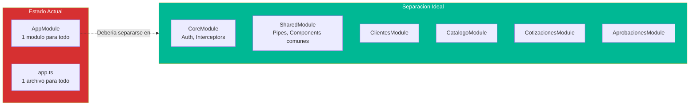

# QuoteFlow — Módulos del Sistema

## Módulos Angular

El sistema tiene un **único módulo** (`AppModule`) sin feature modules, shared modules ni lazy loading.

### AppModule (`frontend/src/app/app.module.ts`)

| Categoría | Elementos | Evidencia |
|-----------|-----------|-----------|
| **Declarations** | 7 componentes | `app.module.ts` — todo declarado en un solo módulo |
| **Imports** | BrowserModule, FormsModule, ReactiveFormsModule, HttpClientModule, AppRoutingModule | 5 módulos Angular |
| **Providers** | AppService (vía `providedIn: 'root'`) | `app.service.ts`:14 |
| **Bootstrap** | AppComponent | Único punto de entrada |

### Módulo de Routing (`AppRoutingModule`)

| Ruta | Componente | Guard | Lazy |
|------|-----------|-------|------|
| `/` | Redirect → `/login` | ❌ | ❌ |
| `/login` | LoginComponent | ❌ | ❌ |
| `/dashboard` | DashboardComponent | ❌ | ❌ |
| `/clientes` | ClientesComponent | ❌ | ❌ |
| `/catalogo` | CatalogoComponent | ❌ | ❌ |
| `/cotizaciones` | CotizacionComponent | ❌ | ❌ |
| `/aprobaciones` | AprobacionComponent | ❌ | ❌ |
| `**` | Redirect → `/login` | ❌ | ❌ |

## Módulos Backend

El backend **no tiene módulos** — es un único archivo `app.ts` sin separación.

### Responsabilidades dentro de `app.ts`

| Sección lógica | Líneas aprox. | Debería ser módulo |
|---|---|---|
| Configuración y middleware | 1-140 | `config/` + `middleware/` |
| Auth handlers | 141-179 | `routes/auth.ts` + `services/auth.ts` |
| Clientes handlers | 180-240 | `routes/clientes.ts` + `services/clientes.ts` |
| Productos handlers | 241-282 | `routes/productos.ts` + `services/productos.ts` |
| Listas de precios handlers | 283-300 | `routes/listas-precios.ts` |
| Cotizaciones handlers | 301-365 | `routes/cotizaciones.ts` + `services/cotizaciones.ts` |
| Dashboard handler | 366-420 | `routes/dashboard.ts` + `services/dashboard.ts` |
| Datos semilla | 30-138 | `data/seeds.ts` o BD real |
| Server startup | 421-430 | `server.ts` |

## Diagrama de Módulos (Actual vs Ideal)

## Dependencias entre Módulos/Componentes

| Componente | Depende de | Tipo de dependencia |
|-----------|-----------|---------------------|
| LoginComponent | AppService, Router | DI + Navegación |
| DashboardComponent | AppService | DI (acceso estado público) |
| ClientesComponent | AppService | DI (CRUD + estado) |
| CatalogoComponent | AppService | DI (CRUD + estado) |
| CotizacionComponent | AppService | DI (CRUD + cálculos + estado) |
| AprobacionComponent | AppService | DI (lectura + cambio estado) |
| AppService | HttpClient | DI (Angular) |
| AppService | localStorage | Acceso directo (Web API) |

## Cohesión y Acoplamiento

| Métrica | Valor | Interpretación |
|---------|-------|----------------|
| **Módulos totales** | 1 (frontend) + 0 (backend) | Monolito absoluto |
| **Acoplamiento afferente (Ca) de AppService** | 6 | Todos dependen de él |
| **Cohesión de AppService** | Muy baja | 6 dominios en 1 servicio |
| **Cohesión de app.ts** | Muy baja | 5 entidades + auth + dashboard en 1 archivo |
| **Index de separabilidad** | 0/10 | No se puede extraer ningún módulo sin reescribir |

## Hallazgos Clave

- **Sin feature modules**: Imposible hacer lazy loading (todo carga eagerly ~100KB+)
- **Sin shared module**: `formatearMoneda()` y `getBadgeClass()` se copian en 5 archivos
- **Sin core module**: No hay interceptors, guards, ni servicios singleton centralizados
- **Backend sin módulos**: Un solo archivo para 5 entidades — opuesto a Clean Architecture
- **Monorepo sin beneficios**: Frontend y backend comparten directorio pero sin configuración de monorepo (nx, lerna, turborepo)

## Referencias

- [Componentes](../architecture/components.md)
- [Estructura del Programa](program-structure.md)
- [Patrones Arquitectónicos](../architecture/patterns.md)
